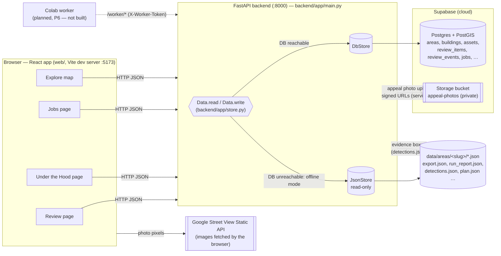
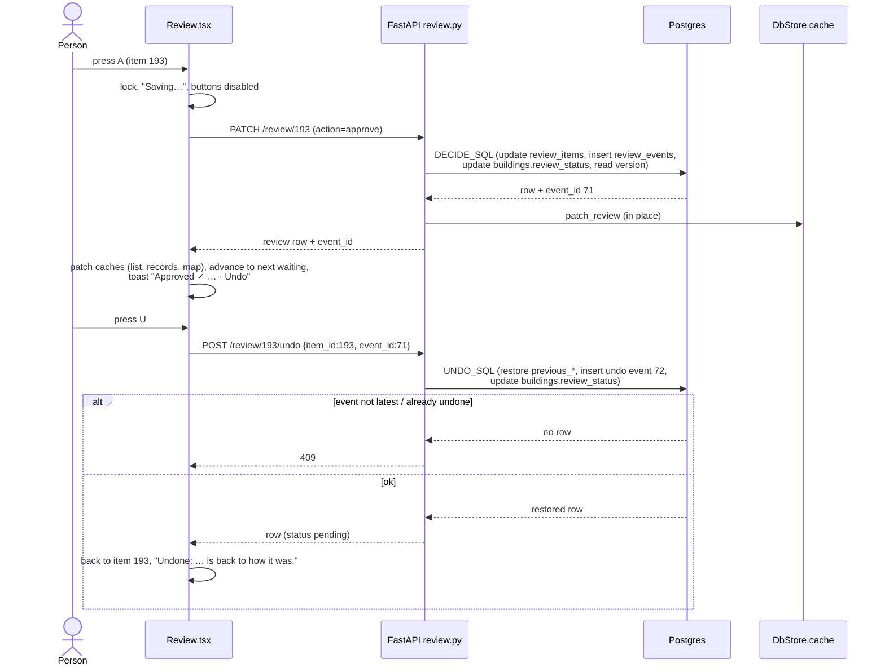
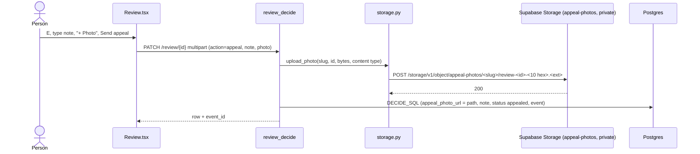
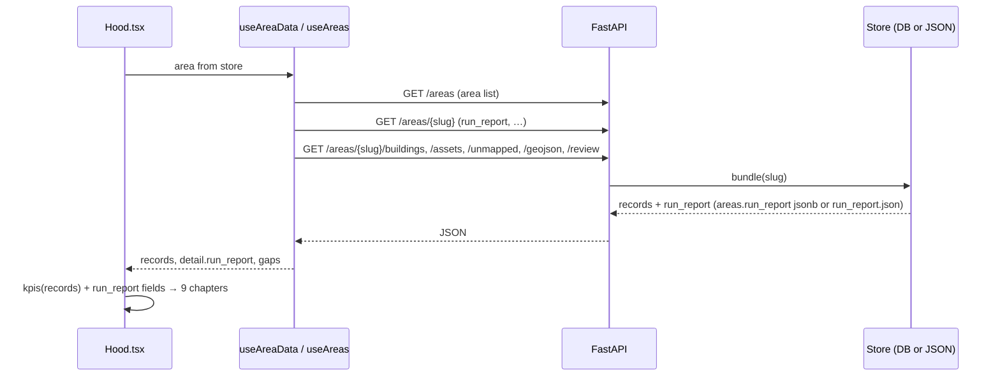
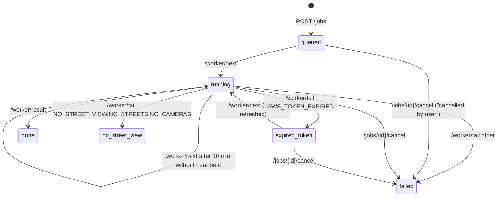
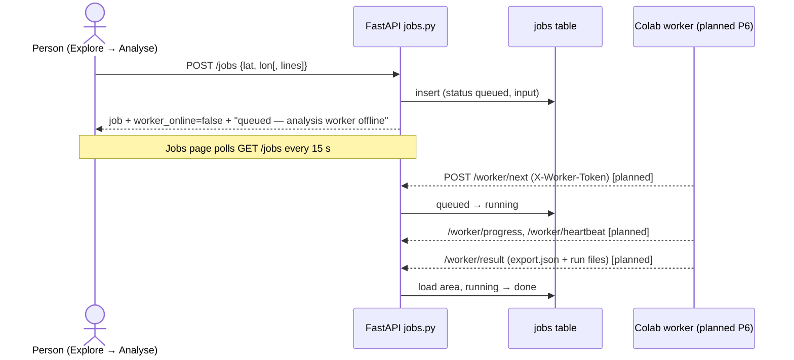

# Review, Under the Hood and Jobs — how these pages work

This document describes the three secondary pages of the GEO-CASCADIA web app **as they are implemented today**
(commit `505c9bc` plus the uncommitted working tree of 26 Sep 2026). The source of truth is the code. Every claim cites
the file and the function or component. Where the code differs from the written specs (`CLAUDE.md`, `docs/DESIGN.md`,
`docs/DECISIONS.md`), the code is described and the difference is listed in [Spec vs code](#spec-vs-code).

Numbers quoted as examples are from the **Ward 29, Coimbatore** area (`data/areas/ward29/`) unless stated otherwise.

---

## Contents

1. [Overview](#overview)
2. [Architecture](#architecture)
3. [Glossary](#glossary)
4. [Shared plumbing](#shared-plumbing)
5. [Review page](#review-page)
6. [Under the Hood page](#under-the-hood-page)
7. [Jobs page](#jobs-page)
8. [Where data lives](#where-data-lives)
9. [Spec vs code](#spec-vs-code)
10. [Known limitations / not implemented](#known-limitations--not-implemented)
11. [Open questions](#open-questions)

---

## Overview

GEO-CASCADIA is a prototype for city officials. A finished Python pipeline (`pipeline/geo_cascadia/`, not changed by
the app) analyses Google Street View images of a street. Its steps:
- It finds buildings, utility poles, streetlights and shop signs, with a local YOLO detector and OCR.
- It sends uncertain cases to a vision-language model.
- It places everything on a map.
- It compares the results with property and asset registers.

The **product layer** stores the pipeline's output in a database and shows it in a map-first web app. It consists of a
FastAPI backend (`backend/app/`) and a React app (`web/src/`).

The map page ("Explore") is the home screen. Three other pages sit on the left rail:
- **Review:** a person confirms or rejects the findings the models were unsure about.
- **Under the Hood:** explains, step by step, what the pipeline did for an area.
- **Jobs:** lists the pre-computed areas and any new analyses requested from the app.

## Architecture

- **One store per request.** `Data.read(fn)` in `backend/app/store.py` runs `fn` on the database store (`DbStore`). If
  the database is unreachable, it runs `fn` on the JSON store (`JsonStore`) instead and marks the response
  `"offline": true`. After a failure it keeps serving JSON for 30 s (`Settings.offline_retry_s`), then tries the
  database again.
- **Writes never fall back.** `Data.write(fn)` raises `OfflineError`, which the API turns into HTTP 503
  (`main.py` `_offline` handler).
- **Stale connections.** A failure on a reused idle connection (the Supabase pooler closes idle connections) is retried
  once on a fresh connection before anything is marked offline (`Data._db`).
- **Street View pixels never pass through the backend.** The browser loads the Static API image directly with the
  referrer-restricted browser key returned by `GET /config/public` (`web/src/components/EvidencePhoto.tsx`
  `staticUrl`). The backend only sends the box coordinates.
- **Connection string.** The backend reads `DATABASE_URL` from `backend/.env`, e.g.
  `postgresql://<user>:<password>@<pooler-host>:5432/postgres`. It is never logged (`backend/app/db.py`).

## Glossary

| Term | Meaning in this project |
|---|---|
| **Area** | One analysed region, identified by a *slug* (e.g. `ward29`, `trichy_bharathidasan_salai`, `tiruppur_uthukuli_road`). Rows in table `areas`; files in `data/areas/<slug>/`. |
| **Pipeline** | The finished Python package `pipeline/geo_cascadia/`. The app imports parts of it but never changes it. |
| **export.json** | The pipeline's main output per area: buildings, assets, streetlight gaps, review queue, run metadata. |
| **run_report.json** | Pipeline-internal counts per area (imagery, detection, signs, cost/time), built by `tools/build_run_report.py` from the run files. |
| **Panorama** | One 360° Street View photo sphere, identified by a `pano_id`. |
| **User photosphere** | A panorama uploaded by a member of the public rather than Google's car. The pipeline does not use its camera geometry for positions. |
| **Camera stop / view** | The pipeline does not grab all 12 headings at every panorama. It plans *camera stops* that face the frontage, and 1–N *views* per stop. A view is one 640×640 image at a stored heading/pitch/fov (`plan.json`). |
| **Detection / box** | A YOLO bounding box in one view: class `building`, `pole`, `lamp_head` or `signboard`, a confidence 0–1, and pixel coordinates `x1,y1,x2,y2` in the 640×640 image (`detections.json`). |
| **geom_ok** | A flag on a detection: `true` if it was usable for positioning. Boxes from tilted views and user photospheres are excluded. |
| **Asset** | A located pole or streetlight (`assets[]` in export.json, table `assets`). |
| **Triangulated** | An asset whose position was solved from two or more camera positions (`method = "triangulated"`). The UI calls it "Pinpointed". |
| **Approximate** | An asset positioned from a single camera direction (`method = "rough_mean"`), with larger uncertainty. The UI calls it "Approximate position". |
| **Asset confidence** | Set by the pipeline (`geometry.py`): `high` if ≥ 2 cameras were used, `medium` if ≥ 2 detections but < 2 cameras, `low` if a single detection. |
| **Dark stretch** | A stretch of road with no streetlight detected within 60 m ("streetlight gap"). Records in `streetlight_gaps[]`. |
| **Synthetic register** | There is no open municipal data. The pipeline *generates* a fake property register and asset register (`match.py`, seeded, about 22% planted errors). Every place that shows register data says "synthetic register". |
| **Match status** | Building vs synthetic register: `matched`, `discrepancy` (the record differs), or `no_record` (the building is not in the register). |
| **Discrepancy types** | `location_shift` (the record pin is more than 15 m from the building), `area_understated` (recorded area below 75% of the footprint), `use_change` (recorded use ≠ observed use), `extra_floor` (more floors observed than recorded), `missing_record`. Thresholds: `pipeline/geo_cascadia/config.py` `match_m=15`, `area_tol=0.25`. |
| **Severity** | Per building (`match.py` `match_properties`): `high` if there is no record, or at least 2 geometry discrepancies, or 1 geometry discrepancy plus another; `medium` for any other discrepancy; `none` otherwise. |
| **Router: local / VLM** | Building use is decided either by a **local** classifier (CLIP embedding + logistic regression, route `tier1_local_clip`) or by the **VLM**, a vision-language model (Amazon Nova Lite, route `tier3_vlm`). Shop names: OCR (`tier2_ocr`) or VLM. |
| **Review item** | One entry in the review queue: a building or an asset a person should check. Table `review_items`. |
| **Priority, "P1"…"P6"** | Review urgency, 1 = most urgent (see [How the queue is built](#how-the-queue-is-built-and-ordered)). The list shows it as a badge `P1`. Not to be confused with the **build phases P0–P7** in `CLAUDE.md` §11 (P5 = these pages, P6 = worker and jobs). |
| **review_events** | Append-only history table (decision D24): one row per decision or undo (see [Undo](#undo)). |
| **Decision (D-number)** | An entry in `docs/DECISIONS.md` (D1…D24) recording a design or data rule. |
| **Resumed run** | The stored pipeline runs were restarted from checkpoints. Their stage timings and minute totals are therefore not real full-run values (D1). |
| **model_card** | `data/model_card.json`: the only source of measured accuracy and cost figures (shown on the Trust page, not on these three pages). |
| **Offline mode** | The backend cannot reach Supabase and serves read-only data from the JSON files (D4). The UI shows "Offline — read-only". |
| **Job** | A request to analyse a new street or area. Table `jobs`. |
| **Worker** | A process on Google Colab (GPU) that would claim jobs and run the pipeline. **Not built yet (P6).** |
| **USER / VERIFIER pages** | D16: Explore, Review and Analyse use plain language. Under the Hood and Trust are for checking the method. |

## Shared plumbing

| Concern | Where |
|---|---|
| Page switch | `web/src/App.tsx` `Pages`. The map (`MapView`) stays mounted under every page; Review, Hood and Jobs are drawn over it as an opaque layer (`surface absolute inset-0 z-40`). Hash routes `#/review`, `#/hood/<section>`, `#/jobs`. |
| Left rail and Review badge | `web/src/components/Rail.tsx`. The badge = number of review items with `status === 'pending'` in the current area. |
| Current area | Zustand store `web/src/store/ui.ts` `area` (persisted in `localStorage` key `gc.area`). All three pages follow it. |
| Data fetching | TanStack Query hooks in `web/src/api/queries.ts`. Area records are loaded once per area by `web/src/lib/useAreaData.ts` `useAreaData` and shared by every page. |
| Offline flag | `web/src/api/client.ts` `api()` reads `offline` from every JSON response into the store (`setOffline`). |

---

## Review page

Component: `web/src/pages/Review.tsx` (default export `Review`). Route `#/review`.

### What it is for

A person works through the items the pipeline flagged as uncertain or suspicious. For each one they look at the Street
View evidence and record a decision: approve (the finding is right), reject (the finding is wrong) or appeal (it needs
more, with a note and an optional photo). Decisions are stored in the database, logged in `review_events`, reflected on
the map, and can be undone one at a time.

### Layout

Three columns (`grid-cols-[330px_minmax(0,1fr)_320px]`): **queue** (left) | **evidence** (middle) | **decision**
(right).

### How the queue is built and ordered

**1. The pipeline builds the queue.** `pipeline/geo_cascadia/match.py` `review_queue(results, assets)`:

| Reason string (pipeline) | Triggered when | Priority |
|---|---|---|
| `high-severity discrepancy` | building `severity == "high"`: no register record, or ≥ 2 geometry discrepancies, or 1 geometry + 1 other | **1** |
| `attribute discrepancy — verify on imagery` | building discrepancies include `use_change` or `extra_floor` | **2** |
| `name read by VLM only (not supported by OCR)` | the shop name came from the VLM and OCR did not confirm it (`name_review`) | **3** |
| `floor count low confidence (roofline not visible)` | `floors_status == "low_confidence"`: the VLM said the roofline was not visible or it was not confident (`vlm.py`) | **4** |
| `building seen from one view only` | the building had ≤ 1 view **and** at least one discrepancy | **5** |
| `single-detection asset` | a pole or streetlight with `confidence == "low"` (seen in a single detection) | **6** |

- A building gets all reasons that apply. Its **priority is the smallest (most urgent) of them**:
  `min(PRI[x] for x in reasons)`.
- Assets always get priority 6.
- The queue is sorted by priority. Ward 29 has 260 items: P1 24, P2 61, P3 3, P4 2, P5 13, P6 157 (from
  `run_report.json` `review.by_priority`).

**2. The loader copies it into the database.** `backend/app/loader.py` `load_area` (run by `backend/load_area.py`):
- One row in `review_items` per queue entry, with `ord` = the position in export.json.
- Asset entries have no id in export.json. They are joined to assets by rounded lat/lon + type (D7).
- **Reloading an area never overwrites a decision.** `on conflict … do update` refreshes street, geometry, priority,
  reasons, discrepancies and `ord`, but not `status`.
- Only *pending* items that vanished from the export are deleted.

**3. The API lists it.** `GET /review?area=<slug>&page_size=500` (`backend/app/review.py` `review_list`):
- Builds one row per item with `views.review_row`: the item plus an `object` summary. For buildings: use, floors,
  floors_status, match_status, name, severity. For assets: type, confidence, method, register_status.
- Sorts by priority, 1 first; a missing priority sorts last.
- `page_size` is capped at 500 (`views.page`).
- Optional filters: `status`, `item_type`, `street`, `priority` (the UI uses none).

**4. The page sorts again and may filter.** `Review.tsx` sorts by priority (stable, so export order is kept within a
priority). If the page was opened from Explore with **"Send N to Review"**, only those ids are shown (store
`reviewFocus`, set by `useUi.sendToReview`).

### Left column: the queue

| Element | Shows | Source |
|---|---|---|
| Eyebrow "Review · most urgent first" | fixed text | — |
| Title "**N waiting**" | number of listed items with `status === 'pending'` | `/review` rows, patched in the cache after each decision, so it updates immediately |
| Title when opened from Explore | "**N sent from Explore · M waiting**" + the question text + link "show the whole queue" (clears `reviewFocus`) | store `reviewFocus` |
| Offline line | "Offline — read-only. Decisions can't be saved until the database is back." | store `offline` |
| List row, line 1 left | the display name (`title()`): building → name if read, else use ("Residential", "Shop + home"…), else "Building", then "· street". Asset → "Pole · street" or "Streetlight · street" | row `object.name`, `object.use`, `street`, `asset_cls` |
| List row, line 1 right | **`P<n>`** in the accent colour while waiting; otherwise the status word in grey (`approved`, `rejected`, `appealed`) | `priority`, `status` |
| List row, line 2 | the reasons in plain words, joined with "·" | `reviewReasons()` (below) |
| Selected row | highlighted background | local state `i` |
| Footer | "J / K next · A approve · R reject · E appeal · U undo" | fixed |

Empty states: "Loading…" while fetching; "Nothing to review." in the middle column when the list is empty.

### "Why a person should check": the reasons in plain words

`web/src/lib/labels.ts` `reviewReasons(reasons, {match_status, discrepancies})` rewrites the pipeline strings so the
wording fits the finding. Duplicates are removed.

| Pipeline reason | Shown as | Condition |
|---|---|---|
| high-severity discrepancy | "Not in the register" | building `match_status == no_record` |
| high-severity discrepancy | one line per difference: "Extra floor vs register", "Use differs from register", "Register pin in the wrong place", "Bigger than recorded", "Recorded as a different type" | building has discrepancies |
| high-severity discrepancy | "Differs from the register" | otherwise |
| attribute discrepancy — verify on imagery | "Extra floor vs register" / "Use differs from register" | for each `extra_floor` / `use_change` |
| name read by VLM only … | "Shop name read by the AI model only" | — |
| floor count low confidence … | "Floor count is an estimate (roof not visible)" | — |
| building seen from one view only | "Seen from one camera position only" | — |
| single-detection asset | "Seen in one photo only" | — |
| anything else | the text, capitalised, with "— verify on imagery" removed | — |

The plain meaning: the register disagrees with what the photos show, or the models were not sure (name, floors), or
there was too little imagery (one view, one detection) to trust the finding.

### Middle column: the evidence photo

Component `web/src/components/EvidenceViews.tsx` `EvidenceViews`. Explore's evidence drawer uses the same component,
so both views behave identically.

**Header.** A micro-label ("Building" / "Pole or streetlight") and the display name in large type.

**Which image.** The page calls `GET /areas/<slug>/evidence/<kind>/<id>` (`main.py` `evidence_boxes` →
`backend/app/evidence.py` `evidence()`), which returns a list of *views*. Buildings:
- **"Front"**: `evidence.attribute_view`, the planned view the pipeline used to judge use and floors.
- **"Sign"**: `evidence.sign_view`, the view in which the shop sign was read.
- **"Nearest camera"**: `evidence.views[0]`, used only if neither of the above exists.

Assets:
- One view per entry in `evidence.views`, labelled "Camera 1", "Camera 2" (plus "(user photo)" for a user
  photosphere).
- These views are **re-aimed** at the asset with fov 60°. They are not planned views.

The browser then loads the image from the **Street View Static API**: 640×640 at that `pano_id`, `heading`, `pitch`
and `fov` (`EvidencePhoto.tsx` `staticUrl`). The caption shows "<view label> · <heading>°" and "Imagery © Google".
If Google returns an error, the photo shows "No Street View image for this view".

**The boxes** are drawn in an SVG over the image, in the same 640×640 coordinate space (`EvidenceViews.tsx` `Boxes`):

- **Default ("user") view:** only the object's own box (the *target*): orange, 4 px, faint orange fill, labelled
  **"This building"** / "This pole" / "This streetlight".
- **"How do we know? (all detections)"** (a toggle below the photo, `HowWeKnow.tsx`):
  - Every YOLO detection on that view is drawn. Colours by class: building pale blue-grey, pole white, lamp orange,
    sign teal. Each is labelled `<class> <confidence>`, e.g. `building 0.43`.
  - The target's label becomes `this building · building 0.43`.
  - The number is the detector's confidence, 0–1, from `detections.json` `conf`.
  - A **dashed** box has `geom_ok = false`: it was not used for positioning (tilted view or user photosphere).
  - Chips toggle each class on/off and show counts per class.
  - Facts explain the source:
    - *This photo*: "the pipeline's own view …" or "aimed at the object; boxes projected from … headings".
    - *Match*: degrees off centre, for assets.
    - *Panorama*: the pano id.
  - The toggle is remembered for the browser tab (`sessionStorage`) and applies to every evidence photo.
- **Label placement:** labels stay inside the photo and above the caption strip, and never overlap. Text widths are
  measured with the real font (`web/src/lib/labelLayout.ts` `placeLabels`, `web/src/lib/textWidth.ts`
  `measureText`).

**How a box is linked to the object** (`evidence.py`):

| Object | Rule |
|---|---|
| Building, "Front" view | The stored box (`attribute_view.x1..y2`, saved by the pipeline) is matched to the detection of class `building` with **IoU ≥ 0.5**. That detection is the target. No match: the stored box itself is drawn as the target and a note says so (`target: "record_box"`). |
| Building, "Sign" view | The signboard detection whose OCR text (from `ocr.json`) equals the building's recorded OCR text. |
| Fallback | A detection flagged `footprint_faced == <building id>`, highest confidence. |
| Asset | Boxes from the same panorama's planned views are **projected** into the aimed view (pinhole camera, same centre; `project_box`). The pole (or, for a streetlight, lamp head then pole) box whose centre is closest to the aimed direction, within 6° (pole) or 12° (lamp), is the target. If none: a **crosshair** marks where the camera was aimed, with the text "No box was found in the aimed direction: the cross marks where the camera was aimed, not a detection." |

When no detections are stored for a view, the saved box alone is drawn ("No detections are stored for this view; the
box is the one saved with the finding.").

**Clicking the image or a box does nothing.** The SVG has `pointer-events-none`; boxes are not interactive. The only
controls are:
- the **view tabs** ("Front" / "Sign" / "Camera N"), which switch the photo;
- the **"How do we know?"** toggle and its class chips;
- **"Live 360°"**. It sets `ui.dive`, which turns the shared map into Google's interactive panorama at the same
  pano and heading. *On the Review page this panorama is behind the page overlay and not visible* (see
  [limitations](#known-limitations--not-implemented)).

Error / empty: "No Street View evidence stored for this item." when the endpoint returns an error or no view.

### Right column: decision

| Element | Shows | Source |
|---|---|---|
| "Why a person should check" | the plain reasons (above), as a bullet list | `reviewReasons` |
| "What we saw", building | `<use> · <N floor(s)> · <register match>` + "(synthetic register)". Use via `useLabel` ("Use not known" if absent). Floors from `attributes.floors.value` ("floors not known" if absent). Match: "Matches the register" / "Differs from the register" / "Not in the register". | building record `attributes.use.value`, `attributes.floors.value`, `match_status` from `GET /areas/<slug>/buildings` |
| "What we saw", asset | "Pinpointed" (triangulated) or "Approximate position", then the asset-register status: "In the register" / "Differs from the register" / "Not in the register" / "Seen in one photo only: needs a second look". Plus "(synthetic register)". | asset record `method`, `register.status` from `GET /areas/<slug>/assets` |
| Status line | "Status: Waiting for review / Approved / Rejected / Appealed" + "· note: …" if a note is stored | review row `status`, `note` |
| Offline line | "Offline — read-only" above the buttons | store `offline` |
| Buttons | **Approve: the finding is right** (A) · **Reject: the finding is wrong** (R) · **Appeal with a note or photo** (E). Disabled while offline or saving. The pressed button shows a spinner and "Saving…". | — |
| Appeal box (after E or the Appeal button) | textarea "Why? (required)", "+ Photo (optional)" (jpeg/png/webp), **Send appeal** (disabled until a note is typed) | local state |
| **Show on the map** | switches to Explore and selects the object (opens its evidence drawer; the map flies to it) | `propsFor` + `ui.select` |
| Status area (live region) | "Saving…" / "Undoing…"; after a decision **"Approved ✓ <display name> · Undo [U]"**; after an undo **"Undone: <display name> is back to how it was."** (only while that item is on screen); errors | local state |

### Interactions

| Input | Effect |
|---|---|
| Click a list row | Shows that item (ignored while a save is in progress). Closes the appeal box. |
| **J** / **K** | Next / previous item in the list (clamped at the ends; no skipping). Ignored while saving and while typing in a text field. |
| **A** / Approve button | Decision `approve` on the current item. |
| **R** / Reject button | Decision `reject`. |
| **E** / Appeal button | Opens the appeal box (the button toggles it). The decision is sent by **Send appeal**. |
| **U** or **Ctrl/⌘+Z** / "Undo" link | Undoes the decision named in the toast. |
| "+ Photo" | Picks a file (accept `image/jpeg, image/png, image/webp`). Sent with the appeal. |
| "show the whole queue" | Leaves the Explore-sent filter. |

Keys are handled by a `keydown` listener on `window` in `Review.tsx`. They are ignored when focus is in a `textarea`
or `input`.

#### Approve / Reject / Appeal, end to end

1. **Lock.**
   - `decide(action)` returns at once if there is no item id (offline data has no ids), if offline, or if a save is
     running (`lock` ref). So each key press acts on exactly one item, and presses during a save are dropped.
   - An appeal without a note just opens the appeal box.
2. **UI.** The pressed button shows "Saving…"; all decision buttons are disabled; the status area says "Saving…".
3. **Request.** `PATCH /review/{id}` with `multipart/form-data` (`web/src/lib/review.ts` `saveDecision`):
   - `action`: `approve` | `reject` | `appeal`;
   - `note`: optional, required for appeal, ≤ 2000 characters;
   - `reviewer`: optional, ≤ 120 characters; **the UI never sends it**;
   - `photo`: optional file, appeal only.
4. **Server** (`backend/app/review.py` `review_decide`):
   - Validates the action (anything else → 422, e.g. the old `reset`) and requires a note for an appeal (422).
   - If a photo is attached, uploads it first (see [Appeal photos](#appeal-photos)).
   - Runs `DECIDE_SQL`: **one SQL statement** that does four things:

     | Change | Table | Columns |
     |---|---|---|
     | The decision | `review_items` | `status` ← approved/rejected/appealed; `reviewer` ← `coalesce(new, old)`; `note` ← `coalesce(new, old)`; `appeal_photo_url` ← `coalesce(new path, old)`; `updated_at` ← `now()` |
     | One history row | `review_events` | `action`, new `status`, `previous_status`, `previous_reviewer`, `previous_note`, `previous_photo`, `reviewer`, `note`, `created_at` |
     | The object's status (used by the map and records) | `buildings` or `assets` | `review_status` ← the new status |
     | Cache version | read only | returns the area's new version for the cache |

   - `DbStore.patch_review` then updates the in-memory area bundle in place (no reload of all records).
   - Response: the review row plus **`event_id`** (the new `review_events.id`).
5. **Client after success.**
   - `patchReviewCaches` updates the cached `/review` list, the building/asset records and the GeoJSON feature's
     `review_status`, then invalidates only that object's detail query.
   - The waiting count, the list badge, the rail badge and the map update at once.
   - The page moves to the **next item still waiting** after the current one, skipping items decided in this session.
     It moves only after the save succeeded.
   - The toast shows "<Approved|Rejected|Appealed> ✓ <display name> · Undo".
6. **Errors.**
   - 503 (offline): "Offline — read-only. Nothing was saved."
   - Other errors: the server's message (e.g. "an appeal needs a note", a storage error).
   - The page does not advance.

Measured on 26 Sep 2026 (item 193, a Sathy Main Road building, `reviewer='test'`, restored afterwards):
- **Before:** `review_items` `(193, 'pending', reviewer NULL, note NULL, photo NULL, updated_at 2026-09-25 06:06)`;
  no events; `buildings.review_status = 'pending'`.
- **After approve:** `(193, 'approved', 'test', NULL, NULL, 2026-09-26 12:24:38)`; event
  `(71, 'approve', 'approved', previous 'pending', 'test')`; `buildings.review_status = 'approved'`.
- **Visible effects:** the waiting count went 258 → 257 and the map feature's `review_status` became `approved`.
- **Timing:** this PATCH took 3.3 s. Earlier timings on warm connections were 0.3–0.5 s (D23).

#### Undo

- **Request.** `POST /review/{item_id}/undo` with JSON body `{"item_id": <same id>, "event_id": <the decision>}`
  (`backend/app/review.py` `review_undo`, `web/src/lib/review.ts` `undoDecision`). The toast keeps both ids, so Undo
  always targets the item and decision it names.
- **Refused with 422:**
  - no `item_id`, or `item_id` in the body ≠ the path (Pydantic / explicit check);
  - `event_id` is not a decision on that item, or is itself an undo.
- **Refused with 409:**
  - the decision was already undone;
  - a **later** decision on the same item is still in effect. Undo steps back one decision at a time, newest first.
- **Effect** (`UNDO_SQL`, one statement):
  - `review_items` gets back exactly the `previous_status`, `previous_reviewer`, `previous_note` and `previous_photo`
    stored in that event. `updated_at` becomes `now()`.
  - A new `review_events` row is written: `action 'undo'`, `undoes = <event id>`.
  - `buildings/assets.review_status` is set to the restored status.
  - Nothing else is touched. The uploaded photo file, if any, stays in the bucket.
- **UI.**
  - Shows "Undoing…".
  - On success, moves to the undone item and shows "Undone: <name> is back to how it was." until another item is shown.
  - The waiting count goes back up.

The same measured run:
- **After undo:** `(193, 'pending', NULL, NULL, NULL, 2026-09-26 12:24:52)`; events 71 (approve) and
  `(72, 'undo', 'pending', previous 'approved', undoes 71)`; `buildings.review_status = 'pending'`; waiting count back
  to 258.
- **Refusals seen:** undo without `item_id` → 422; with a wrong `item_id` → 422; a second undo of event 71 → 409
  "this decision was already undone, or a later decision on this item must be undone first".

#### Appeal photos

- **Upload** (`backend/app/storage.py` `upload_photo`):
  - Types: jpeg, png, webp. Max **8 MB** (`MAX_BYTES`). Violations → HTTP 502 with a plain message
    (`main.py` `_storage` handler).
  - Path: `<area slug>/review-<item id>-<10 random hex>.<ext>`. `x-upsert: false`, so it never overwrites.
  - Uses the Supabase **service-role key** on the server only. The browser never sees it.
- **Storage.** Only the **path** is stored, in `review_items.appeal_photo_url` (despite the column name) and in the
  event's `previous_photo` for undo.
- **Viewing.** `GET /review/{id}/photo` returns a **signed URL valid for 600 s** (`storage.signed_url`). The bucket is
  private: without a signed URL the file cannot be read.
  - **The UI never calls this endpoint.** There is no appeal-photo viewer (not implemented).
  - The API has no user authentication, so anyone who can reach the API can request a signed URL.
- **Order of operations.** The upload happens *before* the database update. If the database write then fails, the file
  stays in the bucket unreferenced.

#### Per-item history panel

**Not implemented in the UI.**
- The API provides `GET /review/{id}/events`, newest first. Fields: `id`, `action`, `status`, `previous_status`,
  `reviewer`, `note`, `undoes`, `created_at`.
- The table is append-only: trigger `review_events_no_change` in `backend/migrations/004_review_events.sql` refuses
  UPDATE and DELETE.
- It has no foreign keys, so history outlives items and areas.
- Test runs also write events there. They cannot be removed without dropping the trigger.

#### Offline mode on the Review page

- `GET /review` is served from `data/areas/<slug>/export.json` `review_queue`.
- Statuses are the export's (all "pending") and **ids are null**.
- The list still shows, and the photos and reasons work.
- Decisions are impossible: the buttons are disabled, keys do nothing (`decide` needs an id), and the header says
  "Offline — read-only".

### What a decision changes elsewhere — and what it does not

| Changes | Where |
|---|---|
| Rail "Review" badge (pending count) | `Rail.tsx` |
| Explore findings table "Review" column ("waiting" / approved / …) | `FindingsTable.tsx`, from the patched building/asset records |
| Explore map: dashed chalk outline on buildings **waiting** for review (layer toggle "Review") — a decided building loses it | `web/src/map/layers.ts` layer `bld-review` (`review_status === 'pending'`) |
| Explore "Waiting for review" list (KPI click) and the Explore evidence drawer's review section | `derive.ts` `matchBuilding` (`review.status === 'pending'`), `EvidenceDrawer.tsx` `ReviewActions` |
| `buildings.review_status` / `assets.review_status` columns and the GeoJSON `review_status` property | database, `GET /areas/<slug>/geojson` |

| Does **not** change |
|---|
| The finding itself: `match_status`, discrepancies, severity, attributes, positions, the dashboard/KPIs computed from them. Rejecting a "not in the register" finding does not make it matched. |
| The **"Waiting for review" KPI number** in Explore: `derive.ts` `kpis().low_confidence_observations` counts **all** queue items regardless of status. Ward 29 always shows 260. |
| `export.json`, `run_report.json`, `data/model_card.json`, the Trust page, the pipeline's outputs or thresholds. Decisions are never fed back into the pipeline. |
| The review queue's membership or priorities. Reloading an area keeps decisions. |

---

## Under the Hood page

Component: `web/src/pages/Hood.tsx` (default export `Hood`). Route `#/hood` or `#/hood/<chapter id>`.

### What it is for

A "verifier" page (D16). It tells, as a scrolling story, what the pipeline did for one area: panoramas → camera stops →
views → detections → buildings → poles and lights → dark stretches → signs → review items. For each step it shows what
was kept and what was dropped. Pipeline-internal counts come from `run_report.json`. Anything countable in the records
is counted from the records instead (D2).

### Data flow

- The page renders when both `detail.run_report` and the records are loaded. Before that it says "Loading…".
- If an area has no run report, it says "This area has no run report yet (tools/build_run_report.py)."

### Elements, top to bottom

1. **Header.** "Under the hood" and "How <area> was analysed". A paragraph says the counts come from
   `run_report.json`, every countable finding is counted from the records, and "No timings: the stored runs were
   resumed."
2. **Area tabs.** One button per area, sorted by building count. Clicking one calls `setArea`, which changes the area
   for the **whole app**, Explore included.
3. **Nine chapters** (`Step`). Each has:
   - a number `01`–`09`;
   - a large figure that counts up once the chapter scrolls into view (skipped with reduced motion);
   - a unit and one sentence;
   - for most chapters, a horizontal **kept-vs-dropped bar**: solid accent = kept, hatched = dropped, red = VLM share
     in chapter 08. Hovering a segment shows its label and count; a legend with counts sits underneath;
   - sometimes a grey note.

   A chapter is at 15% opacity until it is 30% visible (IntersectionObserver).

| # | id | Figure (Ward 29) | Bar / sentence data | Source and calculation |
|---|---|---|---|---|
| 01 | `imagery` | **733** panoramas | 731 Google car (kept) · 2 user photospheres (dropped) | `run_report.imagery.panoramas_found`, `.google_car`, `.user_photospheres` ← counts of `panos.json` by `source` |
| 02 | `stops` | **203** camera stops | 203 planned · 13 dropped: camera inside footprint | `imagery.cameras_planned` (= entries in `plan.json`), `imagery.cameras_dropped` ← `plan_anomalies.json` by reason |
| 03 | `views` | **1,154** views | 1,043 face a mapped building · 111 face no building outline. Note: "Map coverage verdict: full: footprints on most frontages." | `imagery.views_planned`, `views_facing_mapped_building`, `views_facing_no_mapped_building` (views in `plan.json` with / without a `footprint`); `maps.verdict` |
| 04 | `detection` | **5,554** detections | Sentence: 2,411 building, 2,065 sign, 958 pole, 120 lamp boxes. Bar: 4,617 usable for positioning · 839 excluded: tilted view · 98 excluded: user photosphere | `detection.boxes_total`, `.by_class`, `.used_for_geometry` (`geom_ok`), `.excluded_from_geometry` ← `detections.json` |
| 05 | `buildings` | **381** buildings (records) | Sentence: 266 had a usable view; the quality gate rejected 152 boxes. Bar: 221 use classified · 160 not. Note: 19 no record, 102 with a discrepancy (synthetic register). | Figure, bar and note from the records (`kpis()`: `buildings_analysed`, `use_not_classified`, `unmatched_properties`, `buildings_with_discrepancy`). `usable_view` and the gate total (sum of `buildings.box_rejected_by_quality_gate`: 88 sliver, 49 roof cut, 10 base cut, 4 too tall, 1 full frame) from run_report |
| 06 | `assets` | **268** poles & streetlights | Sentence: 38 streetlights and 230 poles with no lamp seen. Bar: 20 triangulated · 248 approximate. Note (only when they differ): the run report says 29 "seen by 2+ cameras", the records say 20 triangulated; the records are shown. | Records: `assets`, `streetlights`, `poles`, `assets_triangulated` (`method == 'triangulated'`); `run_report.assets.triangulated_2plus_cameras` for the note |
| 07 | `streetlights` | **11** dark stretches | Sentence: "… 2,019 m in total (recorded lengths)". Note on straight-line lengths. | Count and total length of the `streetlight_gap` features in `GET /areas/<slug>/geojson` (recorded `length_m`) |
| 08 | `signs` | **2,065** sign crops | Bar: 807 read by OCR (Tier 2) · 180 escalated to VLM (Tier 3) · 1,065 no readable text · 13 Google watermark. Sentence: 116 buildings got a good name; 23 also on Google Maps. Note: 84 signs on unmapped frontage checked, 30 kept as businesses not on the map, VLM said 23 were not businesses. | `signs.crops`, `signs.tiers` (from `ocr.json` tier codes); names from records (`named_businesses` = name quality "good", `names_confirmed_by_google`); `unmapped_businesses.sign_candidates_checked_by_vlm`, `.vlm_said_not_business` from run_report; kept = records `unmapped_businesses` |
| 09 | `review` | **260** items for a person | Sentence only | Records: number of review items (all statuses) |

Other areas, for comparison:

| Area | Panoramas | Stops | Views (no outline) | Detections | Buildings | Assets (triangulated) | Dark stretches | Sign crops | Review items |
|---|---|---|---|---|---|---|---|---|---|
| Trichy | 177 | 102 | 338 (113) | 2,403 | 66 | 87 (2) | 8 | 1,267 | 77 |
| Tiruppur | 75 | 36 | 77 (69) | 333 | 1 | 20 (0) | 3 | 132 | 13 |

Chapter anchors (`id`) are the targets of "How do we know?" links elsewhere (e.g. `#/hood/detection`). The page
scrolls to the section named in the route (`ui.section`).

### Timings and "resumed runs"

- **The page shows no timings at all.** There is no stage timeline, and nothing is greyed out.
- The reason is D1: every stored run was resumed from checkpoints. So `stage_seconds` and `total_minutes` in
  `run_report.cost_time` do not describe a real full run. Ward 29 says 3.3 minutes in total, with 187 s in the VLM stage.
- The page states this in its intro line. The `cost_time` section of the run report is loaded but not used by this
  page.
- D1 describes a greyed-out timeline with a "resumed run, not representative" badge. That is **not implemented** (see
  Spec vs code).

### The "story" sentences

- `run_report.json` contains a `story[]` list of plain-English sentences, written by `tools/build_run_report.py`
  `build`.
- **The page does not render `story[]`.** It builds its own chapter sentences from the fields above, so countable facts
  come from the records.
- Example: the story says "Located 268 poles/streetlights; 29 triangulated … 239 approximate". The page says 20 / 248
  and explains the 29.

### Interactions

| Input | Effect |
|---|---|
| Scroll | Chapters fade in; figures count up; bars grow. |
| Hover a bar segment | Native tooltip "<label>: <count>". |
| Click an area tab | Switches the app's current area (all pages). |
| Arrive via `#/hood/<id>` | Smooth-scrolls to that chapter. |

No writes, and no API calls beyond the reads above. Offline mode works the same: all data comes from the JSON files,
and `run_report` is loaded from `run_report.json` by `JsonStore`.

---

## Jobs page

Component: `web/src/pages/Jobs.tsx` (default export `Jobs`). Route `#/jobs`.

### What it is for

It lists what the app can show:
- the **pre-computed runs** (areas already in the database);
- the **analyses started from this app** (jobs created with "Analyse" on the map), with their status and whether an
  analysis worker is online.

It is read-only. Jobs are created and cancelled from Explore's Analyse panel.

### Elements, top to bottom

| Element | Shows | Source |
|---|---|---|
| Header | "Jobs", "Analyses" | — |
| Worker line | "Analysis worker: **online** / **offline**". When offline: "— new streets stay queued until the Colab worker is running". When the API is in offline mode: "Offline data mode: jobs need the database." | `GET /jobs` → `worker_online` (a worker id seen within the last **90 s** in memory: `jobs.py` `worker_online`, `Settings.worker_online_s`); `offline` |
| "Pre-computed runs" list | Per area: short name; "N building(s) · N pole(s) & lights · N dark stretch(es)", and "· few buildings on the map here" when coverage is partial. Buttons **Open on the map** (Explore) and **Under the hood**. | `GET /areas` → `views.area_card`: `counts.buildings`, `counts.assets`, `counts.streetlight_gaps_60m` (computed from records); `coverage.level` (from `meta.run.coverage.verdict`) |
| "Started from this app" list | Per job: street name (or "New street"); created time (Indian locale), stage and message; the status label in its colour; **Open** for done jobs. | `GET /jobs` (most recent first, up to 50) → table `jobs` joined to `areas` for `area_slug` |
| Empty state | "No analyses started from this app yet. Use Analyse on the map to pick a street." | — |

The list refreshes every 15 s (`refetchInterval`). On 26 Sep 2026 the table held two jobs, both "Sanganur Road",
both cancelled.

### Job lifecycle and statuses

Stored in `jobs.status`. The column only allows `queued`, `running`, `done`, `failed`, `expired_token` and
`no_street_view` (check constraint, `backend/migrations/001_init.sql`). Labels and colours come from
`web/src/lib/labels.ts` `jobStatus`.

| Shown as | Stored | Set by | Colour |
|---|---|---|---|
| **Queued** | `queued` | `POST /jobs` (`jobs.py` `job_create`), from the Analyse confirm sheet | accent (orange) |
| **Running** | `running` | `POST /worker/next`: the worker claims the oldest claimable job (sets `started_at`, `heartbeat_at`, `worker_id`) | accent |
| **Done** | `done` | `POST /worker/result`: files saved, run report built, area loaded (`area_id`, `finished_at`) | teal (matched) |
| **Failed** | `failed` | `POST /worker/fail` with an unknown code | red (no record) |
| **Cancelled** | `failed` **+** `message = 'cancelled by user'` | `POST /jobs/{id}/cancel` (allowed from queued, running, expired_token) | grey (neutral) |
| **No Street View** | `no_street_view` | `/worker/fail` with `NO_STREET_VIEW`, `NO_STREETS` or `NO_CAMERAS` | amber |
| **Paused: key expired** | `expired_token` | `/worker/fail` with `AWS_TOKEN_EXPIRED`; the job can be claimed again after the keys are refreshed | accent |
| *interrupted* | **no such status** | A `running` job whose heartbeat is older than **10 minutes** (`STALE_RUNNING`) can be claimed again by `/worker/next`. Until then it stays "Running". | — |

Other job columns: `kind` (`street_click` | `polygon`), `input` (jsonb), `stage`, `done`, `total`, `message`,
`area_id`, `created_at`, `started_at`, `finished_at`, `heartbeat_at`, `worker_id`.

`input` holds the click or polygon, the resolved street, the OSM way ids, the job polygon (a 45 m buffer around the
street, possibly trimmed), the length and the output slug.

### Today, with no worker

- Jobs can be created, from Explore's Analyse mode or directly via `POST /jobs`, and they stay **Queued**.
- The Analyse job card says "Queued — the analysis worker is offline. It starts when the Colab worker comes online."
  (`AnalysePanel.tsx` `JobCard`).
- The Jobs page shows "offline" for the worker. The job can be cancelled from the job card in Explore; the Jobs page
  has no cancel button.
- All `/worker/*` endpoints exist and are tested (`backend/tests/test_writes.py`):
  - `next`: claim a job;
  - `heartbeat`;
  - `progress`: stage, done, total;
  - `fail`;
  - `result`: multipart upload of `export.json` + run JSONs → saved under `data/areas/<slug>/`, `run_report.json`
    built, loaded into the database.
- They require the header `X-Worker-Token`. Its value is set in `backend/.env` and compared in constant time. Missing
  or wrong → 401; not configured → 503.

**Planned (P6), not built:**
- `worker/colab_worker.py`. Only `worker/README.md` exists: a Colab cell that polls the endpoints through a cloudflared
  tunnel and runs `run_area`.
- Live progress on the map.
- Durations and costs on the Jobs page.

### Offline mode

- `GET /jobs` returns an empty list when served from JSON (`job_list`: `if s.source == "json": return []`), and the page
  shows the offline sentence.
- Creating a job needs the database: `POST /jobs` → 503 "offline data mode — read only (jobs need the database)".

---

## Where data lives

| Data | Stored in | Written by | Read by |
|---|---|---|---|
| Buildings, assets, gaps, unmapped businesses (the findings) | `data/areas/<slug>/export.json` → tables `buildings`, `assets`, `streetlight_gaps`, `unmapped_businesses` (each row keeps the original record in `record` jsonb) | pipeline (Colab); `backend/load_area.py` / `loader.load_area` | `DbStore._load` → all pages; `JsonStore` offline |
| Review queue (membership, priority, reasons) | `export.json` `review_queue` → `review_items` (`item_type`, `ref_id`, `priority`, `reasons`, `discrepancies`, `ord`, geometry) | pipeline; loader | `GET /review` → Review page, rail badge, Explore |
| Review decision (current) | `review_items.status`, `reviewer`, `note`, `appeal_photo_url` (a path), `updated_at` | `PATCH /review/{id}`, `POST /review/{id}/undo` | `GET /review`, detail endpoints |
| Review status on objects | `buildings.review_status`, `assets.review_status`; GeoJSON `review_status` | the same SQL statements; loader (initial) | map layers, findings table |
| Review history | `review_events` (append-only) | same SQL statement as each decision / undo | `GET /review/{id}/events` (no UI) |
| Appeal photos | Supabase Storage bucket `appeal-photos` (private), path `<slug>/review-<id>-<hex>.<ext>` | `storage.upload_photo` (service key) | `GET /review/{id}/photo` → signed URL, 600 s (no UI) |
| Evidence boxes | `data/areas/<slug>/detections.json`, `ocr.json` (files only, not in the DB) | pipeline | `evidence.Detections` → `GET /areas/<slug>/evidence/...` |
| Street View pixels | Google (never stored) | — | browser, Static API |
| Pipeline counts for Under the Hood | `data/areas/<slug>/run_report.json` → `areas.run_report` jsonb | `tools/build_run_report.py` (also run by `/worker/result`); loader | `GET /areas/{slug}` → Hood page |
| Area list and counts | `areas` table + records | loader | `GET /areas` → Jobs page, area switcher |
| Jobs | `jobs` table | `POST /jobs`, `/jobs/{id}/cancel`, `/worker/*` | `GET /jobs`, `GET /jobs/{id}` |
| Worker online flag | API process memory (`app.state.workers`), lost on restart | `/worker/*` calls | `GET /jobs` |
| Accuracy / cost figures | `data/model_card.json` | project owner | Trust page, Analyse estimate (not these three pages) |
| UI preferences | `localStorage` (`gc.area`, `gc.mode`, …), `sessionStorage` ("How do we know?" toggle) | browser | browser |

## Spec vs code

| Topic | Spec says | Code does |
|---|---|---|
| Review filters | CLAUDE.md §9.4: "full-screen queue (priority, reasons, filters)" | No filter controls. The only filter is the set sent from Explore ("Send N to Review"). The API supports `status`, `item_type`, `street`, `priority` filters, but the UI doesn't use them. |
| Review decisions API | CLAUDE.md §7: `PATCH /review/{id}` (approve / reject / appeal + note + optional photo) | As specified, plus `event_id` in the response, `POST /review/{id}/undo`, `GET /review/{id}/events` and table `review_events` (D24). The earlier `action=reset` was removed (422). |
| `appeal_photo_url` | CLAUDE.md §6: a URL | Stores the storage **path**; URLs are signed on request. |
| Reviewer | CLAUDE.md §6 `reviewer` column | Column exists, but the UI never sends a reviewer (no login), so UI decisions have `reviewer = NULL`. Only API callers (tests) set it. |
| Under the Hood contents | CLAUDE.md §9.4: animated `story[]` timeline, Sankey, sign funnel, stage Gantt, cost waterfall, model-route donut, coverage verdict banner, per-street table, "what got dropped" list, Compare runs | Nine chapters with a figure, sentence and kept/dropped bar (DESIGN.md "scroll story", which lists seven chapters). Not implemented: `story[]` rendering, Sankey, Gantt, cost waterfall, donut, per-street table, compare-runs cards. Coverage verdict appears only as a note in chapter 03. |
| Resumed-run timings | D1: stage timings shown greyed out with a "resumed run, not representative" badge | No timings are shown at all; the intro sentence explains why. |
| Hood chapters | DESIGN.md: 7 chapters; chapter 06 includes "11 dark stretches" | 9 chapters: dark stretches (07) and signs (08) are separate chapters. |
| Jobs page | CLAUDE.md §9.4: "history of analyses with status, duration, cost, link to area and to Under the Hood" | Status, stage, message, created time, "Open" for done jobs. No duration, no cost, no "Under the hood" link for jobs (only for pre-computed areas). |
| Job statuses | Task text mentions "cancelled" and "interrupted" | "Cancelled" is stored as `failed` + message "cancelled by user" and shown grey. "Interrupted" does not exist: stale running jobs are re-claimable after 10 min and show as Running. |
| Worker | CLAUDE.md §8: `worker/colab_worker.py` | Not built (P6). Backend endpoints exist. |
| "Waiting for review" KPI | — (label implies pending only) | Counts all review items regardless of status (`kpis().low_confidence_observations`). |

## Known limitations / not implemented

**Review page**
1. **No history panel** in the UI (API only). **No appeal-photo viewer** in the UI (API only).
2. **"Live 360°" on the Review page** opens the panorama on the shared map, which is hidden behind the page. The button
   flips to "Back to map", but nothing is visible until you go to Explore.
3. **No authentication.** Anyone who can reach the API can decide, undo, or request signed photo URLs. Reviewer
   identity is not recorded from the UI.
4. **Undo goes one step back at a time, newest first.** An older decision can't be undone while a later one on the same
   item is still in effect (409). The undo event's `reviewer` records the restored reviewer, not who pressed Undo.
5. **The undo target lives only in page memory.** After a reload, the toast (and with it the event id needed for undo
   from the UI) is gone. The API still allows the undo with the event id from `/review/{id}/events`.
6. **An orphaned photo stays in the bucket** if the database write fails after a successful upload, or after an appeal
   is undone.
7. **A typed note is sent with any decision.** If a note is typed in the appeal box and Approve or Reject is clicked,
   the note is sent with that decision.
8. **Keys:** J/K move through the whole list (decided items included). After a save, the page auto-advances to the next
   *waiting* item.
9. **The list loads at most 500 items per area** (`page_size` cap). Ward 29 has 260.
10. **`review_events` also holds test rows**, which can't be deleted (append-only by design).
11. **Latency:** decisions usually take 0.3–0.5 s. The first write after an idle period can take several seconds
    (3.3 s measured).

**Under the Hood**

12. Shows no timings or costs, does not render `story[]`, and has no charts beyond the bars (see Spec vs code). The area
    tabs change the global area.

**Jobs page**

13. No worker yet, so jobs stay queued. No cancel button on the page. No durations or costs. The worker-online flag
    resets when the API restarts.

## Open questions

These could not be confirmed from the code or data. They are listed, not guessed:

1. **Supabase row-level security.** Every table has RLS enabled and no policies are created in the migrations. Whether
   any policies were added in the Supabase dashboard (e.g. for the anon key) is not visible from the repository.
2. **Bucket access rules.** `tools/verify_setup.py` reports the bucket `appeal-photos` as private. Any bucket policies
   beyond that are not in the repository.
3. **Who made the existing decisions on review items #94 and #97** (approved, reviewer NULL). No history exists from
   before `review_events` was added on 26 Sep 2026.
4. **The intended layout of the Hood "Sankey / Gantt / Compare runs" sections.** CLAUDE.md lists them, but no mock-up or
   component exists.
5. **What the P6 worker will report** as stages and messages. The backend accepts any `stage` string ≤ 40 characters;
   the list the UI shows (`AnalysePanel.tsx` `STAGES`) was written before the worker exists.
