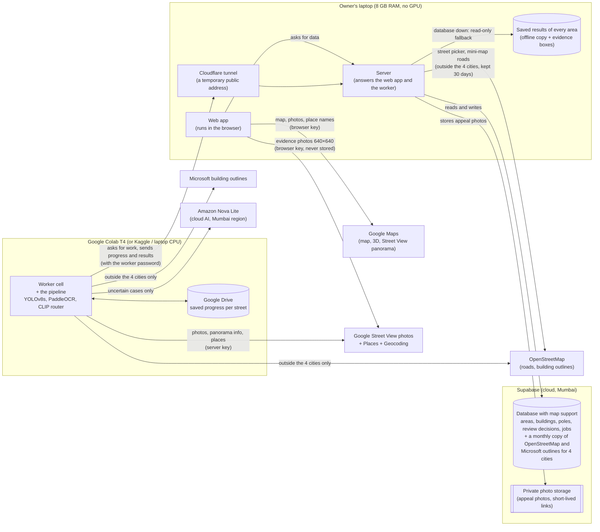

# GEO-CASCADIA explainer · 01 — What and why

**What's in this file**
- The task, Gate 1 and the FarmwiseAI guidance ([§2](#2-context-the-task-gate-1-and-the-organisers-guidance)), and the architecture with one click told as a story ([§3](#3-system-overview)).
- The tech stack, with why each tool was chosen and what was rejected ([§4](#4-tech-stack)).
- Every data source: Street View, OSM, Microsoft, Google Places, the model card and the synthetic register ([§5](#5-data-sources-in-detail)).

[← 00 Start here](00_START_HERE.md) · [Start here](00_START_HERE.md) · [02 Pipeline and accuracy →](02_PIPELINE_AND_ACCURACY.md)

---

## 2. Context: the task, Gate 1 and the organiser's guidance

### 2.1 The task
- The official requirements ask for:
  - detection of buildings, poles, streetlights and signs from Street View;
  - building attributes (use, visible floors);
  - positions on a map;
  - **matching against at least one property or infrastructure reference dataset** (one of the seven mandatory capabilities; history chat 1 §9 quotes this line);
  - a discrepancy table, "unmatched properties" KPIs and plain-English queries such as *"Show commercial buildings with more than two visible floors that do not have a matching property record"*.
- The team: Praga (owner, pipeline + product). The history files mention Sriram as a teammate who was not delivering (history chat 1).
- Hardware: a Windows laptop with a Ryzen 3 7320U and 8 GB RAM, no NVIDIA GPU. Models never run on the laptop. The GPU is Google Colab (T4, 2–3 h a day) (project brief §2).

### 2.2 Gate 1: building position within 3.5 m
- FarmwiseAI's Gate 1 asks for a **predicted building position** with an error of **≤ 3.5 m**.
- Early history (chat 1 §8): one hand-checked building ("House 87, Ganapathy") was 1.30 m off from hand-read pixels. That test was closed at n=2 and replaced by larger studies.
- The first large study scored against the *nearest* footprint and reported a flattering 1.12 m. It was caught by eye and replaced by per-detection scoring: median 3.91 m (history chat 1, "Accuracy measurement").
- D25–D28 built a real position rule; D33 changed it after organiser guidance (below).

### 2.3 Organiser guidance: the FarmwiseAI doubt session, 27 Sep 2026 (owner, D41; also D33 and the model card's Gate 1 section)
- **OpenStreetMap footprints are accepted as the reference.**
- **A building's position is the centre of the building's front as seen from the street**, which is about the midpoint of its front wall.
- **FarmwiseAI may provide property register data later.** Until then the registers stay synthetic. The repository already says why: no open municipal data exists (project brief §2), and FarmwiseAI confirmed generated data may be used (history chat 1 §4.6). What changes when a real register arrives is in [§5.6](#56-the-synthetic-register-synthetic).

### 2.4 What was built, and when (from the decision log)

| Phase | Dates | What |
|---|---|---|
| Pipeline (Colab notebooks) | mid–late Sep 2026 | Detector training, OCR, VLM, geometry, register, matching (history chats) |
| P0 | 25 Sep | Project skeleton, data, data types, run reports (D1–D8) |
| P1 | 25 Sep | Database and the loader that fills it (D9–D10) |
| P2 | 25 Sep | Server (D11) |
| P3 | 25 Sep | Map foundation (D12–D13) |
| P4 | 25 Sep | Explore page (D14) |
| Design pass B | 26 Sep | "Night Survey" design system, two audiences, query UX, evidence, picker, drive (D15–D24) |
| P4.5 | 26–27 Sep | Building positions for Gate 1 (D25–D28, D33) |
| P5 | 27 Sep | Review, Under the Hood, Trust, Jobs (D29–D31) |
| Pipeline fix | 27 Sep | Building use from a shop sign (D32) |
| P6 | 27–28 Sep | Worker, live jobs, real Colab runs and their fixes (D34–D40) |
| P7a | 1 Oct | The four findings of this explainer, fixed in the pipeline (D42–D45) |
| P7 | not started | Polish ([§18](05_EXPLAIN_AND_DEFEND.md#18-still-to-do-p7)) |

---

## 3. System overview

### 3.1 Architecture

### 3.2 One click, told as a story
You click a pink point on Korathottam Road in Explore.

1. **Browser:** the point is drawn from map data the app already loaded for Ward 29. The map layer reports which object was under the mouse.
2. **Browser:** the app stores the selection, flies the camera down to object zoom (≥ 19, tilted 42°) and opens the right-hand drawer.
3. **Browser → server:** the drawer asks the server for this building's record (is it in the review queue?) and for its evidence (which photos, which boxes).
4. **Server:** reads the building from the area's data (the database, or the saved results if the database is down). Then it looks up the detector's boxes and the sign readings for that photo, and marks the building's own box.
5. **Server → browser:** a list of photos, each with its panorama, heading, pitch, field of view, camera position and boxes.
6. **Browser → Google:** the browser fetches the 640×640 Street View image itself with the browser key. It draws the orange "This building" box over it.
7. **Browser → Google:** if the name was confirmed on Google, the browser looks up the Google listing live.
8. You read "What we saw", "What the register says (synthetic)" and the review section. "How do we know?" opens the technical detail.

### 3.3 The two halves
- **Perception pipeline** (Python). It is finished and validated. The app imports it but never changes its logic. Exceptions are owner-approved changes recorded in D25–D28, D32–D34, D37, D38 and D42–D45.
- **Product layer**: the database, the server, the worker and the web app.

---

## 4. Tech stack

| Layer | Tool | What it does here | Why chosen | Alternatives considered, and why not |
|---|---|---|---|---|
| Map | Google Maps JavaScript API, vector map with a Map ID, quarterly release | Base map, tilt/3D, Street View panorama, Places search | Street View may only be shown through Google's APIs with attribution (project brief §2) | Mapbox/Leaflet base maps: not allowed with Street View content |
| Map data layers | deck.gl 9.4, drawn as a separate layer over Google's map | Buildings in 3D, poles, lamps, dark stretches, rings | GPU layers over Google's map | Drawing inside Google's own map layer showed nothing with these versions (D12) |
| UI | React 18.3, Vite 8, TypeScript 5.9, Tailwind + shadcn/Radix, Framer Motion | Pages, panels, animation | Fast dev on a small laptop | — |
| State / data | Zustand (one store), TanStack Query + Table + Virtual, zod 4 | One selection/filter store; cached server answers; a check that the data has the expected shape | One store keeps map, KPIs, table and charts in step (D14) | — |
| Charts | Recharts 3 + own SVG (Sankey-style bars, donuts, mini-maps) | Charts, Hood visuals, mini-maps | Light; no second Google map (D3, D39) | Nivo Sankey, named in the project brief, not used |
| Fonts | Anek Tamil (Latin + Tamil), Martian Mono, self-hosted | Text and numbers | Sign text is often Tamil; Inter has no Tamil glyphs (design notes) | Inter (first choice in the project brief) |
| Server | FastAPI (Python) with a small database connection pool of our own | Every answer the web app and the worker get, the offline fallback | Python like the pipeline; can reuse its question engine | A heavier database toolkit, dropped as unused (D11) |
| Database | Supabase Postgres + PostGIS (EPSG:4326, GiST indexes) | Areas, objects, review decisions, history, jobs | Free tier, PostGIS, storage bucket, no Docker on the laptop | Local Postgres: heavier on 8 GB; plain files: no safe concurrent writes |
| File storage | Supabase Storage, a private folder | Appeal photos, opened through links that expire after 10 minutes | Same account; private by default | Public URLs: would expose photos |
| Offline fallback | the saved results of each area | Read-only app when the database is paused | Demo day safety (D4) | — |
| Worker tunnel | Cloudflare quick tunnel | Lets Colab reach the laptop's server | No account, no port forwarding | Hosting the API: not planned ([§18](05_EXPLAIN_AND_DEFEND.md#18-still-to-do-p7)) |
| GPU | Google Colab T4 (Kaggle and laptop CPU also work) | Runs the pipeline for new streets | Free GPU | — |
| Detector | Ultralytics YOLOv8s at 640 px, 4 classes | Poles, lamp heads, signs, buildings | Best recall on poles and lamps ([§8.1](02_PIPELINE_AND_ACCURACY.md#81-detector)) | YOLOv8n, YOLO11n, YOLO26n/s, stock COCO YOLO, YOLO-World |
| Sign reading (OCR) | PaddleOCR 3.x, English + Tamil models | Reads shop signs, in its own process on the worker | Reads Tamil; 3.4× more reads than EasyOCR on the same crops (history chat 1) | EasyOCR (Tamil model broken upstream) |
| Local AI router | CLIP ViT-B/32 picture summary + logistic regression | Decides building use without the cloud when confident | Same accuracy with fewer cloud calls ([§8.3](02_PIPELINE_AND_ACCURACY.md#83-building-use)) | Sending every building to the cloud model |
| Cloud AI (VLM) | Amazon Nova Lite on AWS Bedrock (Mumbai region) | Unclear signs, building use when the router is unsure, floor counts | Available on the team's AWS role; cheap | Claude / Nova Pro were visible on the account but unused (history chat 2) |
| Map references | OpenStreetMap + Microsoft Global ML Building Footprints (where OSM is sparse): a monthly copy in the database for Coimbatore, Trichy, Tiruppur and Madurai (D53); OpenStreetMap's public servers elsewhere (answers kept 30 days) | Roads, building outlines, shop points | OSM outlines have stable IDs; Microsoft fills gaps. The copy removes the wait on public servers: downloading Microsoft's tile was 441 of the 466 s of "Reading the map" for one street | Google Open Buildings: tile crashed Colab RAM twice (history chat 1); asking the public servers every time (slow, often busy) |
| Google cross-check | Places API (New) Nearby Search; Geocoding API | "Also on Google Maps"; names for unnamed roads | Independent check of sign names | Google Places type as the building use: 66%, rejected ([§8.3](02_PIPELINE_AND_ACCURACY.md#83-building-use)) |
| Tests | pytest (about 360 server and pipeline cases), plus data and screen checks for the web app | Recount every number, offline parity, review, jobs, worker | — | — |

---

## 5. Data sources in detail

### 5.1 Google Street View (GOOGLE)
- **What we use:** the Static API (640×640 photos at a chosen heading, pitch and field of view) and the Metadata API (does a panorama exist here, where is its camera, when was it taken, who took it).
- **How panoramas are found:** a 20 m grid inside the area polygon. At each grid point the pipeline asks for the nearest outdoor panorama within 15 m. Ward 29 gave **733** unique panoramas: **731** from Google's car and **2 user photospheres** (uploaded by the public).
- **User photospheres** are kept for photos but never used for positions: their camera height is unknown, so their boxes are marked "not usable for positions". In Ward 29, 98 boxes came from them.
- **Stored:** for each panorama, its Google ID, camera position, date, source and copyright. Photos are **never stored** on the server. The worker keeps only sign crops and building crops for the models.
- **In the browser:** evidence photos are fetched live from Google with the browser key (referrer-restricted), with "Imagery © Google" shown.
- **Errors Google owns:** the camera position of a panorama (GPS). 13 Ward 29 cameras stood *inside* a building outline, which is bad GPS or a bad outline, so they were dropped (and listed as plan anomalies). Also old photos and wrong panorama dates.

### 5.2 OpenStreetMap (OSM)
- **Roads:** every OSM road in the box around the area. Road types kept: residential, primary, secondary, tertiary, unclassified, living street, trunk, road and their slip roads. Bridges and tunnels are dropped.
  - Example: Sakthi Main Road shrank from 178 m to 155 m because way 1303123647 is a bridge (history chat 1).
- **Building outlines:** every OSM building outline, simple or multi-part. The OSM ID becomes the building ID (w… for a simple outline, r…_k for one part of a multi-part one).
- **Ward 29 today:** 3,715 outlines are saved around the cameras. **2,044** of them have their centre inside the Ward 29 study-area polygon (1.12 km²). The notebook era counted 2,183 "in the ward" with a different fetch ([Appendix B](05_EXPLAIN_AND_DEFEND.md#appendix-b-conflicts-found)).
- **Names:** OSM names come first. Unnamed roads get a Google Geocoding name in the pipeline or a rule-based "Unnamed road between A and B" in the app's picker (D36).
- **How the app gets it (D53):** for **Coimbatore, Trichy, Tiruppur and Madurai** a copy is kept in the app's database: every road (name, type, bridge / tunnel), every building outline and every shop / amenity / office point inside each city box (the city boundary + 550 m; Tiruppur, which has no city boundary on OpenStreetMap, a 16 × 16 km box). It comes from Geofabrik's daily extract of southern India and is refreshed by hand once a month (snapshot used now: **2 Oct 2026**, shown on Under the Hood). Clicking a street, the small plans, the cost estimate and the analysis computer's "Reading the map" step all read this copy. Anywhere else the app asks OpenStreetMap's public servers (Overpass) as before and keeps each answer 30 days.
  - Size: 37,778 + 10,865 + 11,273 + 19,630 roads and 160,390 + 92,545 + 551 + 36,077 outlines (Coimbatore, Trichy, Tiruppur, Madurai).
  - A street edited on OpenStreetMap after the snapshot is seen only after the next refresh.
- **Errors OSM owns:** missing outlines, outlines that merge a whole compound, and missing street names.
  - Example: the one Tiruppur building w344655428 is a single 4,866.8 m² outline with a 123.4 m "front".
  - Example: Tiruppur has 1 OSM outline on 662 m of road, which is why 14 of its businesses had to become "businesses with no analysed building" (no outline) (model card, generalisation).

### 5.3 Microsoft Global ML Building Footprints
- Used **only when OSM is sparse**: when OSM outlines cover under 8% of the area.
- A Microsoft outline that overlaps an OSM one by more than 30% is skipped.
- IDs look like ms_9.923249_78.117358: the outline's centre. These IDs are **not stable** across Microsoft releases (history chat 1).
- **Real example:** the live run of **Vadakku Masi Veethi, Madurai** found 1 OSM outline and 105 Microsoft outlines. 48 of its 49 analysed buildings are Microsoft outlines (the run's coverage summary).
- Ward 29, Trichy and Tiruppur used OSM only (no Microsoft outlines).
- **The app's copy (D53):** Microsoft's India release dated **23 Feb 2026**, kept in the database for the four cities like the OpenStreetMap copy (Coimbatore 280,995 outlines, Trichy 97,038, Madurai 183,610). The analysis still uses them only where OpenStreetMap is sparse (the same 8% rule). Before the copy, one street in Coimbatore spent 441 s downloading Microsoft's 35.6 MB tile and its 7.2 MB index.
- **Microsoft has no outlines around Tiruppur:** its India release stops near longitude 77.15, east of Coimbatore. Tiruppur (77.3) therefore stays OpenStreetMap-only, whichever way the data is fetched.
- Notebook comparison (history chat 1): OSM 2,183 vs Microsoft 1,942 outlines in Ward 29, ray-hit coverage 79.0% vs 79.5%. OSM was chosen for its stable IDs.

### 5.4 Google Places (GOOGLE)
- **In the pipeline:** Places API (New) Nearby Search along the camera plan (one search per 50 m, radius 40 m, split into quarters when 20 results come back, at most 300 calls). Each business gets a category (home / institutional / commercial).
- **What it produces:**
  - "Also on Google Maps": the sign name matched a Google business within 40 m by a strict name matcher. Ward 29: **25** of the named buildings.
  - Two Google flags: "sign name not on Google within 40 m" (71 in Ward 29) and "Google lists a business, the photo shows a home" (58).
- **In the browser:** a confirmed name is shown by looking up the Google listing live (Google terms: no stored copies shown).
- **In Gate 1 evaluation:** Places Text Search found pins for 24 Ward 29 buildings (D26). Pins are placed by owners or by geocoding and sit a median 7.7 m from the road-facing OSM wall, so they are not a precise reference.

### 5.5 The model card
- The **only** source of accuracy, benchmark and cost figures in the app (D2). Trust quotes it and says where in it every number sits.
- It holds: detector per-class precision and recall (n = 209 poles, 49 lamp heads, 104 signs, 296 buildings on 150 hand-labelled Ward 29 images), the benchmark of four detectors, building-use accuracy, floors, names, OCR, streetlights, positions, planted-error matching, withheld results, generalisation, cost and time, the single-camera pole error by distance, and the Gate 1 tables.

### 5.6 The synthetic register (SYNTHETIC)

**Why synthetic.** No open municipal property or streetlight register exists for these areas. CCMC has no bulk export, and OSM records the number of floors on 4 of 5,143 buildings (history chat 2). FarmwiseAI allowed generated data (history chat 1). Every place that shows register data says "synthetic register (demo)".

**How it is made (D42)**: the same code for every area and every live street, seeded by the
area's name (so the same buildings always get the same records).
1. Take the building register: the OSM outlines the camera plan faces ([§7.3](02_PIPELINE_AND_ACCURACY.md#73-camera-plan-and-building-register)). Ward 29: 381.
2. For each building, a record **copies what the photos and the map show**:
   - use = the observed use (commercial, residential, …), or **empty** when the use is not known;
   - floors = the observed floor count, or **empty** when not known;
   - area = the outline area;
   - the pin = the building's predicted position (the centre of its front, D33);
   - plus filler: a property ID (P-0001…), an assessment number, an owner ("Owner 0001"), a tax status and a last survey year.
3. With probability 22%, **plant one mistake**, chosen among those that can be checked for this building:
   - record missing: the record is deleted;
   - pin in the wrong place: the pin is moved 15–40 m (and more than 15 m from the outline centre too);
   - area too small: the area × 0.55–0.70;
   - wrong use: commercial ↔ residential (only when the use is known);
   - too few floors: one floor fewer recorded (only with ≥ 2 measured floors).
4. Empty fields are **not compared**, so a building whose use is unknown can never "differ" on use.
5. Saved per area: the list of what was planted, and the records themselves, with the true building ID kept aside only
   for checking the pairing.

**Ward 29 register:** 354 records for 381 buildings, **78 planted mistakes**: 27 missing record, 20 area understated,
17 pin moved, 8 too few floors, 6 wrong use.

**Three real Ward 29 records** (the street is the raw OSM name, as generated; every record is marked "SYNTHETIC"):

| Property | Building | Assessment no. | Owner | Street | Use | Floors | Area | Tax | Last survey | Pin |
|---|---|---|---|---|---|---|---|---|---|---|
| P-0001 | w1252504515 | 9/940 | Owner 0001 | (unnamed residential #134792895) | residential | 2 | 625.7 m² | paid | 2018 | 11.0315389, 76.9749454 |
| P-0002 | w1252504250 | 8/767 | Owner 0002 | (unnamed residential #134792895) | residential | 2 | 587.8 m² | arrears | 2021 | 11.0310435, 76.9716507 |
| P-0004 | w1252505716 | 7/923 | Owner 0004 | (unnamed residential #134792895) | residential | 2 | 419.6 m² | paid | 2018 | 11.0310271, 76.9725584 |

(P-0003 is missing: a planted missing record.)

**How records are paired with buildings (D43)**: never by the building ID.
- Each record's pin is compared with every building within 50 m (its predicted front position and its outline centre,
  whichever is nearer). The cost is the distance in metres, plus a penalty for a very different area (10 × |ln ratio|) or a
  different use (5 m).
- Pairs are taken cheapest first, one record per building and one building per record.
- Outcomes: **matched** · **pin in the wrong place** (matched, more than 15 m away) · **building with no record** ·
  **record with no building nearby**. Each pair gets a **match confidence**: high (≤ 5 m, the next building at least 5 m
  worse), medium (≤ 15 m), low.

**Planted mistakes, traced (Ward 29):**

| Planted | Record | Building | What the app shows | Caught? |
|---|---|---|---|---|
| Record missing | P-0003 | w1252505151, 8th Street, Ganapathy | "Not in the register" | Yes |
| Pin moved (36 m) | P-0013 | w1252504646, 8th Street, Ganapathy | "The register's pin is 36 m away from the building" (match confidence low) | Yes |
| Area too small | P-0037 | w1252504670, 8th Street, Ganapathy | "The register says 22 m²; the building outline is 39 m²" | Yes |
| Too few floors | P-0075 | w1236978459, 2nd Street, Gandhi Nagar | "The register says 1 floor; the photo shows 2" | Yes |
| Wrong use | P-0140 | w1247745157, 2nd Street, Ganapathy Gardens (approx.) | "The register says commercial; the photo shows a home" | Yes |
| Pin moved (32 m) | P-0061 | w1252505875, 4th Street, Tatabad / Vinobaji Street | "Not in the register" (a false alarm) | **No**: the moved pin was paired with the neighbour w1252504232, whose own record (P-0041) was planted missing; that neighbour now "differs: bigger than recorded" (another false alarm) |

**Planted-mistake recovery, all six areas** (computed, Trust › Register tests):

| Planted mistake | Planted | Caught | Missed | False alarms |
|---|---|---|---|---|
| Record missing | 35 | 29 | 6 | 7 |
| Pin in the wrong place | 26 | 18 | 8 | 3 |
| Area too small | 26 | 26 | 0 | 2 |
| Wrong use | 13 | 13 | 0 | 1 |
| Too few floors recorded | 8 | 8 | 0 | 1 |
| **All** | **108** | **94** | **14** | **14** |

- Every miss and false alarm comes from the same thing: a moved pin paired with a neighbouring building.
- **Pairing with the IDs hidden:** 530 of 538 records (98.5%) find their own building; all 512 records whose pin was not
  moved; 18 of the 26 moved pins (69.2%).
- **Before D42**, Ward 29 showed 117 "differs", most of them noise: 46 of 50 use flags and 30 of 36 floor flags came from
  the random register values, not from planted mistakes. Now: 50, all explained above.

**Asset register** (fixed random seed), unchanged:
- Built from the confirmed assets (seen ≥ 2 times or from ≥ 2 cameras).
- About 12% are left out ("not in the register"), 15% moved 12–25 m ("pin in the wrong place"), 10% get the wrong type ("type mismatch").
- Plus fake "ghost" poles near camera stops with nothing detected within 15 m ("missing asset", asset numbers EB-G01…).
- Ward 29 planted/found: location shift 15/15 (1 false alarm), type mismatch 12/12 (1 false alarm), missing asset 9 of 10.
  Model card: pin moved P 0.92 R 1.00; type mismatch P 1.00 R 1.00; missing asset P 1.00 R 0.90.

**Is it generated per area, and for every new analysed street?** **Yes.** The pipeline builds and pairs the register for
**every** run, including every live street from the app (Vadakku Masi Veethi: 45 records for 49 buildings, 8 planted).
Comparisons for new streets are also against made-up data: they prove the pipeline works end to end, not real-world truth.

**What changes when the organiser's real register arrives** (FarmwiseAI said they may provide one, D41):
1. Load it with the register import tool and a small file that says which column holds what (ID, position or address,
   use, floors, area). The tool reports the rows loaded, the rows skipped and why. File 04 has the exact steps.
2. The tool pairs the records with an area's buildings by location and reports the outcomes. When asked, it writes them
   into the area, and after a reload the app shows them with the source "IMPORTED".
3. Planted-mistake scores disappear (there is no ground truth); pairing confidence and the outcomes remain.
4. Use and floor comparisons then compare the photos with the city's own records.

---

[← 00 Start here](00_START_HERE.md) · [Start here](00_START_HERE.md) · [02 Pipeline and accuracy →](02_PIPELINE_AND_ACCURACY.md)
