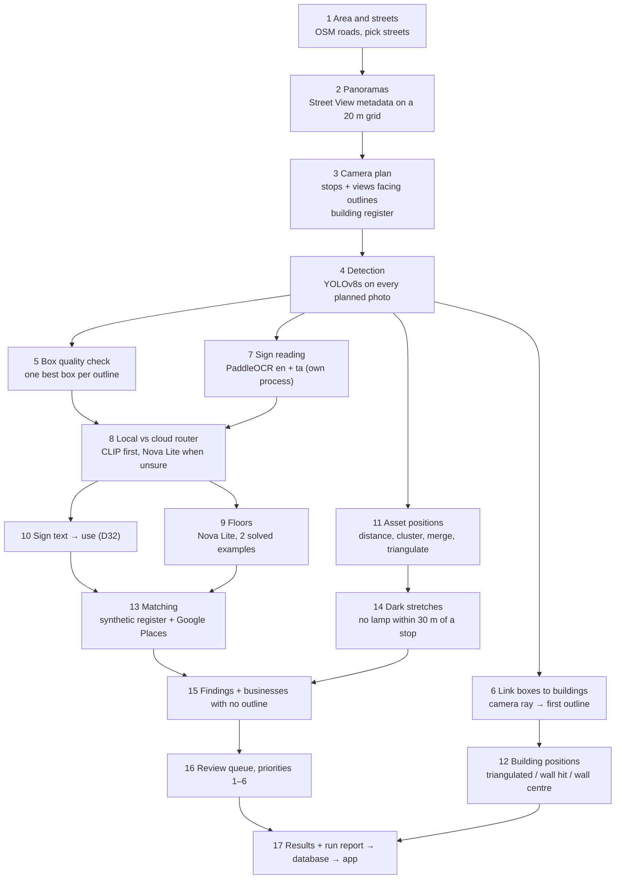

# GEO-CASCADIA explainer · 02 — Pipeline and accuracy

**What's in this file**
- The pipeline, step by step, with Ward 29 numbers, a worked example and the error owner for each step ([§7](#7-the-pipeline-step-by-step)).
- Every method compared, with numbers and sample sizes ([§8](#8-methods-compared)).
- Accuracy and honesty: every measured number, the Gate 1 tables, stored-vs-computed, and known building errors ([§9](#9-accuracy-and-honesty)).

[← 01 What and why](01_WHAT_AND_WHY.md) · [Start here](00_START_HERE.md) · [03 App and flows →](03_APP_AND_FLOWS.md)

---

## 7. The pipeline, step by step

One pipeline function runs all the steps. Each stage saves its results, so a stopped run **resumes** from the last saved stage.

### 7.1 Area and streets
- **Input:** a polygon: the Ward 29 study area, or a 45 m buffer around a clicked street.
- **What happens:** the pipeline reads every road in the polygon from OpenStreetMap, plus shop/amenity/office points and the building outlines (Microsoft's outlines too where OpenStreetMap has few, [§5.3](01_WHAT_AND_WHY.md#53-microsoft-global-ml-building-footprints)). In Coimbatore, Trichy, Tiruppur and Madurai these come from the app's monthly copy, through the app's server (D53); elsewhere from OpenStreetMap's public servers and Microsoft's download site, as before. Roads with the same name are joined. Each street gets:
  - a length;
  - its number of panoramas within 15 m;
  - "coverage" = panoramas × 20 m / length;
  - a kind: *commercial* if it is a primary/secondary/trunk road or has ≥ 4 shop points within 30 m, else *residential*.
- **Choosing streets:**
  - Ward 29: streets with coverage ≥ 0.5 and length ≥ 120 m; up to 4 commercial, then residential up to 10 in total.
  - A live job passes the OSM IDs of the clicked street's road pieces.
- **Naming:** unnamed OSM streets get a name from Google Geocoding, by majority vote of up to 9 camera positions. Under 50% agreement adds "(approx.)"; two names that share ≥ 70% become "A / B".
- **Output:** the street list and the street names.
- **Ward 29:** 10 streets, 4,829 m. Sathy Main Road is the longest (951 m) and is stored as separate one-way carriageways. 7 unnamed OSM streets got Google names, e.g. "(unnamed residential #134792895)" → "8th Street, Ganapathy"; "2nd Street, Ganapathy Gardens (approx.)"; "4th Street, Tatabad / Vinobaji Street".
- **Can fail:**
  - Outside the four cities, OpenStreetMap's map server busy → the pipeline tries 4 copies of it up to 6 times; the worker then retries after 30, 60 and 120 s (D39). Inside them the public servers are not asked at all.
  - **Time:** for one 276 m street in Coimbatore this step took 487.9 s on Colab (2 Oct). Measured again on the laptop with nothing cached: 466 s, of which 441 s was downloading Microsoft's tile and index, 19 s the three OpenStreetMap questions and 5 s the work itself (D53). From the app's copy: see [§13.2](04_BACKEND_DB_WORKER.md#132-speed).
  - No road in the polygon → the job ends as "No Street View" (reason: no streets).
- **Error owner:** OSM (roads, names), GOOGLE (geocoded names), OUR RULES (selection, naming votes).

### 7.2 Panoramas
- **Story:** the pipeline lays a 20 m grid over the polygon. At each point it asks Google "is there an outdoor panorama within 15 m?". It keeps each unique panorama whose camera is inside the polygon.
- **Output:** the panorama list (Google ID, camera position, date, Google car or user).
- **Ward 29:** 733 panoramas (731 Google car, 2 user photospheres).
- **Can fail:** no imagery → "No Street View". Until D40, a *refused key* looked exactly the same, because the pipeline treats every non-"OK" answer as "no panorama". The worker now counts every Google answer and reports the real cause ([§12.6](04_BACKEND_DB_WORKER.md#126-testing-without-colab)).
- **Error owner:** GOOGLE (coverage, camera GPS, dates).

### 7.3 Camera plan and building register
- **Story:** instead of taking all 12 directions at every panorama, the planner walks along each street piece:
  - It keeps a camera stop only when it is at least **12 m** further along than the last one and at least **6 m** from any kept stop. Street pieces shorter than 25 m are skipped.
  - Each panorama is assigned to the nearest street piece within **15 m**.
  - A stop whose camera stands **inside** a building outline is dropped (bad GPS or a bad outline).
- **At each stop, for the left and the right side:**
  - It shoots a straight-across ray. If the ray hits an outline within **40 m**, it plans a level photo facing that building.
  - If the building is closer than **15 m**, it adds a photo tilted up 22° for the roofline.
  - It adds two oblique photos at ±35° when they also hit an outline.
  - A side with no outline within 40 m still gets one photo ("unmapped"), because poles, lamps and signs are still worth reading there.
- **Building register:** every outline that at least one planned photo faces. **This is what "a building" means in the app.**
- **Output:** the photo plan, the plan anomalies (dropped cameras) and the building register.
- **Ward 29:**
  - 203 camera stops. 13 were dropped for standing inside an outline. Of the other panoramas, 443 lie more than 15 m from the analysed streets and 74 were thinned.
  - 1,154 photos: 142 left, 153 right, 537 oblique, 211 tilted, 111 facing no outline.
  - **381 registered buildings.**
- **Why it matters:** the notebook measured the plan against a naive 12-direction sweep on 15 cameras: **60% fewer photos at 48.3% of the objects** (history chat 1).
- **Can fail:** a camera inside an outline; a missing outline (the side becomes "unmapped"); "no camera stops" when panoramas exist nearby but none on the street.
- **Error owner:** OUR RULES (spacing, 40 m range), OSM (outlines), GOOGLE (camera positions).

### 7.4 Object detection
- **Story:** each planned photo is downloaded from Street View (640×640) and YOLOv8s draws boxes for four classes: pole, lamp head, signboard, building.
  - Thresholds: pole 0.25, lamp head 0.20, sign 0.30, building 0.30; NMS IoU 0.45 across classes.
  - Sign boxes are cut out as small images for OCR.
  - A box counts for positioning only if the photo is **level** and from **Google's car**.
- **Output:** every box with its photo, the list of photos already fetched, and the sign crops.
- **Ward 29:** 5,554 boxes (2,411 building, 2,065 sign, 958 pole, 120 lamp head). 4,617 usable for positions; 839 from tilted photos; 98 from user photospheres.
- **Accuracy (model card, 150 hand-labelled Ward 29 images, IoU 0.5):**

| Class | Precision | Recall | n |
|---|---|---|---|
| pole | 0.738 | 0.579 | 209 |
| lamp head | 0.500 | 0.429 | 49 |
| signboard | 0.397 | 0.558 | 104 |
| building | 0.681 | 0.706 | 296 |

  Weighted F1 0.625; 17 ms per photo on a GPU, 320 ms on a CPU.
- **Can fail:** misses (recall 0.43 on lamp heads), false boxes (a balcony railing read as "XXXX", a meter box read as "bRd", the Google watermark read as "Gcogle" in the notebook era), several boxes on one pole.
- **Error owner:** MODEL.

### 7.5 Box quality check (per building)
- **Story:** for each outline, the pipeline looks at every building box linked to it (step 6) and picks **one best box**. The ranking prefers, in order:
  1. a box that does not fill the whole photo;
  2. a box whose roof is not cut off at the top;
  3. a box about **55% of the photo wide**;
  4. then detector confidence.
- **The best box is rejected when:**
  - the roof is cut off (top within 2% of the edge);
  - the base is cut off;
  - it fills ≥ 92% of the photo both ways;
  - it is a **sliver**: it touches the left or right edge (3%) and is taller than 1.1× its width;
  - it is implausibly tall (more than 22 m, estimated from distance × pixel height).
- **Why:** in the notebook, implausible boxes were side-cut slivers. 72% of them touched a frame edge (history chat 2).
- **Output:** each building's best box, marked usable or not, with the reasons.
- **Ward 29:** 338 of 381 buildings have a box. **221 pass**; 117 fail (68 slivers, 36 roof cut, 10 base cut, 2 too tall, 1 full frame); **43 never got a box**.
- **Example:** Savitha Dry Cleaner (w1252504945, 8th Street, Ganapathy). Its best box (confidence 0.857) is a thin sliver at the photo edge. The app says: *"The box the analysis matched to this building failed the photo quality check (a thin sliver at the photo edge), so its use and floors were not read from it."*
- **Error owner:** OUR RULES (thresholds) on top of the MODEL's box.

### 7.6 Linking boxes to buildings: "which building in this photo is this one?"
- **Story (the camera-ray rule):**
  1. Take the horizontal middle of the building box.
  2. Turn that pixel into a compass direction: the photo's heading plus the angle of that pixel from the photo's centre.
  3. From the camera's position, draw a line (a "ray") in that direction, starting 2 m out and ending 40 m out.
  4. The **first** OSM outline the ray crosses (at least 1.5 m from the camera) is the building this box shows.
- **Output:** the link from box to outline (used by steps 5, 8, 9, 12).
- **Signs use the same rule, when it is clear (D44).** Before D44 a sign belonged to the outline the photo was aimed at, so a neighbour's sign in the same 90° photo was credited to the aimed building. Now each sign box casts its own ray (from its centre, allowing for a tilted photo). The sign moves to another outline only when its ray, and the rays 4° to either side, all hit that same outline first, and none of the three touches the aimed outline. Otherwise it stays with the aimed building.
  - Why the margin: the first version moved every sign to the first outline its ray hit (966 of 2,065 Ward 29 crops, 47%). Checked against Google's map pins for the same business names, those moves made things worse in Ward 29 (19 further from the pin, 15 closer). With the margin, 570 crops move (28%), and 14 get closer to the pin vs 6 further. Details in [§9.3](#93-what-is-not-verified).
- **Ward 29:** 2,003 usable building boxes; 1,878 hit an outline; 125 hit nothing within 40 m.
- **Example:** the "Front" photo of w1252504929 (Sathy Main Road, panorama 5iqy…, facing 130°) has 12 boxes. Five are buildings:

| Box, left to right | Its ray hits | Distance | In the 381? |
|---|---|---|---|
| x 0–107, conf 0.34 | w1252504180 | 31.5 m | yes (its own evidence photo is another one) |
| x 117–214, conf 0.30 | w1252505243 | 26.9 m | **no**: no planned photo faced this outline |
| x 234–322, conf 0.76 | w1252505552 | 24.2 m | yes (own photo elsewhere) |
| x 333–554, conf 0.33 | w1252504929 | 29.6 m | yes: **"This building"** |
| x 536–640, conf 0.56 | nothing within 40 m | — | no OSM outline behind it |

- **Can fail:** the ray passes a gap and hits the building behind; a wide box's middle lands on the neighbour; the outline is missing. The notebook checked this against triangulation: the two methods pick the same building 88.3% of the time (history chat 1).
- **Error owner:** OUR RULES (ray rule), OSM (outlines), MODEL (box edges).

### 7.7 Sign reading (OCR), in its own process
- **Story:** every sign crop is read by PaddleOCR with an English and a Tamil model, and the lines are ranked. Steps:
  1. A small box at the bottom edge (≤ 34 px tall, within 26 px of the bottom) is the **Google watermark** → tier 0.
  2. The crop is enlarged to 200 px high.
  3. Both engines read it. An engine that is unsure (< 0.55) tries again at 2× size.
  4. Lines are ranked: **the biggest text wins**. URLs, phone numbers, repeated letters and mIxEd-case garbage are pushed down.
  5. Fewer than 3 letters → tier 1 "no readable name". Confidence ≥ 0.55 → **tier 2 "read"**. Text present but unsure → **tier 3**, sent to the cloud model (step 8).
  - On a CPU worker the **fast mode** reads only the best 3 crops per building with small models.
  - On the worker, OCR runs in a **separate process** (D38). Paddle and torch crashed a Colab session twice when they shared one process.
- **Output:** every crop's reading (saved every 25 crops).
- **Ward 29:** 2,065 crops → 807 read (tier 2), 180 unsure (tier 3), 1,065 no readable name, 13 watermark.
- **Accuracy (model card):** names on 31 hand-checked crops: OCR first then cloud model 74%, OCR only 71%, cloud model on every crop 65%. Fast mode 0.34 s per crop vs 6.30 s full, routed accuracy 68% vs 65% (n=31). The 3-crop cap cuts 63% of crops and lost 5 of 107 names.
- **Examples:**
  - "COIMBATO" (w1251630445, Sathy Main Road), read at confidence 1.0: the word is cut off at the photo edge.
  - In the notebook, "STOP" was read at 1.00 on a sign the cloud model read as "Shriram Stationery". OCR confidence measures the letters it chose, not whether it read the right sign (history chat 2).
- **Error owner:** MODEL (OCR), plus how the photo was framed.

### 7.8 The local vs cloud AI router
There are two routers.

**a) Names**
1. For each building, the pipeline picks the one best text crop (tier 2 or 3; biggest × most confident).
2. The cloud model (Nova Lite) is asked: is it a sign, what type, which business name (Latin letters only), how sure.
3. **Name gate:** the cloud model's name is kept only if **at least 70% of its letters** (compared loosely, sound-alike) also appear in the OCR text of the same crop. Otherwise the OCR name is used. A cloud-only name is kept but flagged for review.
- Ward 29 name routes: 71 OCR alone, 73 cloud model with OCR agreeing, 1 cloud-only (to review). The cloud model's readings follow their sign to its building (D44, no new call).
- Why the gate: 0 of 8 cloud-only names were confirmed on Google, and the cloud model invented names on 6 of 15 non-business crops (model card, names).

**b) Building use** (only for buildings whose box passed step 5)
1. The photo is cropped around the box with 35% context and a **red rectangle** is drawn on the building.
2. A **local model** (a CLIP picture summary + logistic regression, trained on the cloud model's own answers) guesses the use. If it is confident enough, that answer is used: route "local model", no cloud call.
3. Otherwise the cloud model is asked with the red-rectangle prompt: wrong target?, roofline visible?, floors, use, shop units, facade condition, name → route "cloud model".
- **Ward 29:** 163 local, 58 cloud (counted from the results; the stored counter says 193/73, see [Appendix B](05_EXPLAIN_AND_DEFEND.md#appendix-b-conflicts-found)).
- **Accuracy (model card):** on 31 held-out Ward 29 buildings: cloud only 0.90, local only 0.94, routed 0.90, 23% sent on. On 12 Trichy buildings: 0.92 for all three. Full Ward 29 run: use accuracy 0.89 before and after (n=28). The model card's "cloud calls 782 → 339" is not like for like (the 339 leaves out 250 name and business-sign checks); like for like it is 782 → 589 ([§9.5](#95-the-fresh-full-ward-29-colab-run-vs-the-apps-numbers)).
- **Error owner:** MODEL (router and cloud model); OUR RULES (confidence threshold, 0.7 name gate).

### 7.9 Floors
- **Story:** for each building with a usable photo (and not "wrong target"), the cloud model is shown **two solved examples**, a 1-storey photo (w1236978105) and a 2-storey photo (w1247744938), plus a rule: "a storey counts only if it spans most of the width and has its own windows or doors; parapets, water tanks and sheds do not". It answers with one number.
- The count is **low confidence** if the model said the roofline was not visible or it was not confident. Otherwise it is **measured**.
- **Ward 29:** 217 measured, 4 estimated, 160 not known. Values: 1 floor 53, 2 floors 145, 3 floors 21, 4 floors 2.
- **Accuracy (model card):** exactly right 61%, within one floor 100%, n=36 (the plain prompt managed 42%). Trichy: 50% exact, 100% within one, n=6, with a mild under-count on 3+ storeys.
- **Map:** height = floors × 3.2 m, **display only**. Unknown floors = flat and hatched, never a guessed height (D9, D12).
- **Error owner:** MODEL.

### 7.10 Sign text → use (D32)
- **Problem found on 27 Sep:** use came only from the building photo (step 8). A building whose box failed step 5 stayed "use not known" **even with a readable shop sign**. Ward 29 had 59 such buildings.
- **Rule** (no model call, fills only unknown uses). A building becomes **commercial**, route "shop sign", when all of these hold:
  - it has a kept sign name supported by OCR;
  - an OCR read of its own sign has confidence ≥ 0.55 and supports that name (≥ 0.7);
  - the sign crop is at least 50 px wide and 3,000 px² (smaller = name plate);
  - the text reads as a business name or a business word, not one short word;
  - there is no house word ("illam", "nilayam", "nivas", "villa", "house", Tamil forms…);
  - the sign is not only generic words ("OPENING", "GRAND", "SALE", "WELCOME"…).
- **Ward 29:** use not known 160 → 135 with this rule (25 filled). After D44 (signs by their own line of sight, when clear) it is **139**, and **21** buildings get their use from a sign. Names read clearly 116 → 105 → **96** (the first D44 rule gave 142 and 84).
- **Examples:**
  - ✅ Savitha Dry Cleaner (w1252504945): sign read "SAVITHA" at 0.995; the cloud model read "savitha dry cleaner" and OCR agreed; Google confirms "SAVITHA DRY CLEANER" → commercial. The register (D42) copies that, so it matches.
  - ❌ "FOOTBALL COACHING" (w1236978198, 1st Street, P&T Colony): OCR read "COACHING" at 0.999, a business word → commercial. It is a **poster on a wall**, not a shop (D32 addendum).
- **Accuracy:** **not measured** (Trust says so). Trichy's 12 spot labels were unchanged (8/12 before and after).
- **Error owner:** OUR RULES.

### 7.11 Asset positions and pole merging
- **Story, one pole box at a time:**
  1. **Direction:** the ray from the camera through the middle of the box.
  2. **Rough distance:** where the pole's base touches the ground in the photo. The camera is about 2.5 m high, so the lower the base sits below the horizon, the closer the pole. Kept only up to **15 m**. Beyond that the guess explodes.
  3. **Point** = camera + distance along the ray.
- **Then:**
  4. One ray per camera and direction (duplicate boxes of the same pole in one photo count once).
  5. **Cluster:** points within **3 m** of each other form a group (DBSCAN).
  6. **Merge:** groups whose positions are within **5 m** are joined, repeatedly.
  7. **Position:** if the group's rays come from **2+ camera positions at least 30° apart**, the pole is **triangulated** (least-squares crossing point, residual as the uncertainty, floor 0.5 m). Otherwise it is the **average of the rough points**: "approximate", with a fixed ±3.5 m.
     - **Circle size (D45):** a single-camera asset's ±m depends on its distance from the camera: **±2.4 m within 8 m, ±5 m beyond**. Each band uses the larger of two measurements:
       - our own consistency check: for the 25 poles and streetlights two cameras pinpointed, each camera's own estimate vs the pinpointed spot (63 estimates): within 8 m n=20, median 1.28 m, 8 in 10 within 2.39 m; 8–11 m n=11, 1.93 / 3.51 m; 11–15 m n=32, 1.57 / 3.03 m. Poles two cameras agreed on lean small;
       - the notebook's surveyed check: median 1.64 m within 8 m, **4.55 m at 8–15 m** (H1).
       - Within 8 m the consistency value (2.4 m) is larger. Beyond 8 m the surveyed median is larger, rounded up to ±5 m. Because it is a median, about half of those poles fall inside the circle, not 8 in 10.
       - Before D45 every one-camera pole got ±3.5 m. Ward 29: 132 circles at ±2.4 m, 116 at ±5 m.
  8. **Streetlight:** a lamp head located within **1.5 m** of a pole turns it into a streetlight. So does a lamp ray from any photo that passes within **2 m** of the pole, up to 40 m away.
- **Ward 29:** 822 usable pole boxes. 453 get a distance; **369 do not** (base hidden, or more than 15 m away), so they place nothing. Result: **268 assets** (230 poles, 38 streetlights). 20 triangulated (9 streetlights, 11 poles); 248 approximate. Confidence: 157 low (seen once), 82 medium, 29 high.
- **Worked example: several poles become one.** One photo on 8th Street, Ganapathy (panorama 1RgV…, facing 307.6°) shows **5 pole boxes**.
  - 1 box at 10.9 m → asset-0048.
  - **4 boxes** at 3.4 m, 4.6 m, 6.9 m and 3.5 m, all to the right of the photo's centre → they land within a few metres of each other and merge into **one** pole, asset-0160 (7 detections, 1 camera, approximate ±2.4 m, "not in the register").
  - The photo may show a pole, its stay wire and a second pole close behind. The map says **"a pole here"**, not "exactly one pole".
- **Worked example: a pinpointed pole.** asset-0016 (8th Street, Ganapathy): 5 detections from 5 camera positions → triangulated, uncertainty ±0.61 m.
- **How close can two assets be?** The nearest-neighbour distance between Ward 29 assets is at least 5.1 m (median 9.3 m). Two real poles closer than ~5 m become one on the map.
- **Why these numbers (history chat 1):** a 40 m distance cap gave one pole every 16 m (impossible; real spacing is 25–30 m); 12 m lost triangulation; **15 m** gave 1 per 23 m. The notebook settled on "merge 6 m", because a wrong merge is an invisible undercount while a duplicate is caught in review. The code uses **5 m** ([Appendix B](05_EXPLAIN_AND_DEFEND.md#appendix-b-conflicts-found)).
- **Error owner:** MODEL (boxes), OUR RULES (distance cap, merge, streetlight fusion), GOOGLE (camera position).

### 7.12 Building positions (D25–D33): the Gate 1 point
Every registered building gets a predicted position by one fixed rule, tried in this order. Its map point stays the outline's centre.

1. **Triangulated: "where the camera views cross".**
   - The **left and right edges** of the building box are the two ends of its visible front wall.
   - Each edge is seen from several camera positions. Edges within 3% of the photo border are ignored (clipped).
   - Each end is triangulated separately (rays ≥ 30° apart, in front of the camera, ≤ 60 m). The point is **halfway between the two ends**.
   - Needs **≥ 2 camera positions** (rule B, D28).
   - **Plausibility:** a point more than **10 m** from the building's road-facing wall is rejected, and the reason is stored.
2. **Wall hit: "where one camera's line of sight meets the front wall on the map".** The most confident ray whose first hit on this outline is its **road-facing wall** (the edge whose middle is nearest the street line). The ray aims at the middle of the box, so the point is the middle of the *visible* front.
3. **Wall centre: "front-wall centre from the map"** (D33, organiser guidance). The middle of the road-facing wall. No camera line of sight is involved.
4. **Footprint centre:** only if no road-facing wall exists.

- **Ward 29:** 36 triangulated, 224 wall hit, 121 wall centre, 0 footprint centre. **11 triangulations rejected** as implausible.
- **Uncertainty (self-consistency):** for triangulated buildings with 3+ cameras, every camera pair that sees both ends makes its own estimate. The uncertainty is their median distance from the final point. Ward 29: 17 estimated, median 2.51 m, p90 7.46 m. Two-camera results say "not estimated", because two rays always meet exactly.
- **Examples:**
  - Hitech Gears (w1252503923, Sathy Main Road): triangulated from 5 cameras, ±1.86 m.
  - w1252505516 (sign read "RKURSI"): triangulated from 5 cameras, ±2.46 m.
  - w1247745245: triangulation rejected, 14.3 m off → wall hit (D27).
  - Savitha Dry Cleaner: no camera line of sight reached its wall → wall centre.
  - Tiruppur w344655428: triangulation rejected, 26.6 m from the road-facing wall of a huge outline → wall hit.
- **The 2-vs-3-camera A/B test (D28, Ward 29, distances to the road-facing OSM wall):**

| Variant | triangulated / wall hit / wall centre / rejected | triangulated vs OSM wall: n, median, p90, ≤ 3.5 m |
|---|---|---|
| A (≥ 3 cameras) | 28 / 232 / 121 / 11 | 28, 3.33 m, 9.29 m, 50.0% |
| **B (≥ 2 cameras), chosen** | 36 / 224 / 121 / 11 | 36, 3.48 m, 8.00 m, 50.0% |

  B gives more camera-only positions at the same pass rate. The check and the score use the same wall, so this is a comparison, not an accuracy.
- **Error owner:** OUR RULES (rule, 10 m check), OSM (the wall used by wall hit and wall centre), MODEL (box edges), GOOGLE (camera positions).

### 7.13 Matching to the register and to Google
**Register matching** (D43): records are first **paired with buildings by location**, one-to-one, never by ID ([§5.6](01_WHAT_AND_WHY.md#56-the-synthetic-register-synthetic)); then each pair is compared:

| Kind | Rule | Evidence type |
|---|---|---|
| Record missing | no register record was paired with this building | geometry |
| Pin in the wrong place | the paired record's pin is more than **15 m** from the building (front position or outline centre) | geometry |
| Area too small | record area below **75%** of the outline area | geometry |
| Use differs | the record's use and the observed use are both known and fall in different categories (commercial: shop, office, restaurant, clinic, bank, mixed… vs residential: house, apartment, vacant plot…) | photo (use) |
| Extra floor | floors **measured**, the record has a floor count, and the photo shows more | photo (floors) |

- **Severity:** *high* = no record, or ≥ 2 geometry kinds, or 1 geometry kind plus another; *medium* = any other difference; *none* otherwise.
- **Ward 29:** 304 matched (114 of them with use not known, shown as "Register entry exists — use not compared"), 50 differ, 27 not in the register. Kinds: missing record 27, area understated 22, location shift 14, extra floor 8, use change 6. Severity: 27 high, 50 medium. Pairing confidence: 334 high, 5 medium, 15 low. Before D42/D43: 245 / 117 / 19.
- **Google cross-check:** [§5.4](01_WHAT_AND_WHY.md#54-google-places-google). Ward 29: 25 names confirmed; 71 "sign name not on Google within 40 m"; 58 "Google lists a business, photo shows a home".
- **Error owner:** SYNTHETIC (the register), OUR RULES (thresholds), MODEL (observed use and floors), GOOGLE (Places).

### 7.14 Dark stretches
- **Story:** for each street carriageway, the camera stops are lined up along the road.
  - A stop is **lit** if a located streetlight is within **30 m** (half the 60 m interval).
  - A run of unlit stops whose length (+12 m of padding) is at least **60 m** is a **dark stretch**.
  - Poles within 15 m of the stretch are counted: "poles present, no lamp detected" vs "no pole or lamp detected".
- The pipeline also computes 40 m and 100 m but exports only 60 m. The app's server recomputes any interval with the same method (identical at 60 m, D23): Ward 29 at 100 m → 7 stretches.
- **Ward 29 (11 stretches, 2,019 m recorded):**

| id | Street | Recorded length | Poles inside |
|---|---|---|---|
| gap60-001 | Sathy Main Road | 376 m (≈ 424 m along the road) | 22 |
| gap60-003 | 8th Street, Ganapathy | 313 m (≈ 349 m) | 19 |
| gap60-006 | Sri Ganapathy Gardens 3rd Street (approx.) | 254 m ("check": 4 lit stops lie between its ends) | 21 |
| gap60-000 | 4th Street, Tatabad / Vinobaji Street | 211 m | 12 |
| gap60-005 | 2nd Street, Ganapathy Gardens (approx.) | 203 m (≈ 251 m) | 11 |
| gap60-004 | Ganapathy - Avarampalayam Road | 193 m | 10 |
| gap60-010 | Sakthi Main Road | 142 m | 8 |
| gap60-009 | 2nd Street, Gandhi Nagar | 99 m | 11 |
| gap60-007 | Korathottam Road | 83 m | 6 |
| gap60-008 | Korathottam Road | 78 m | 4 |
| gap60-002 | Sathy Main Road | 67 m | 5 |

- **Why "possible dark stretch" (P8) and "no visible streetlight", never "broken":** the detector finds 43% of lamp heads (model card, n=49); the card and the list say so. A dark stretch means *no lamp was seen*, not *no lamp exists*, and a photo can't tell whether a lamp works (D16).
- **Length caveat:** the pipeline measures length on a straight line fitted to the stops. On a bending street that is too short: Sathy Main Road 376 m vs ≈ 424 m along the road (D13).
- **Error owner:** MODEL (lamp recall), OUR RULES (30 m / 60 m rule, straight-line length).

### 7.15 Findings, including businesses with no outline
- A **finding** is anything worth attention: a building not in the register or differing from it, a dark stretch, a business with no outline, an asset not in the register or differing from it, or a register entry with nothing seen.
- **Businesses with no analysed building** (D44):
  1. Take read sign crops (tier 2 or 3) that are linked to no outline, or to an outline that is not one of the analysed buildings (by the sign rule of [§7.6](#76-linking-boxes-to-buildings-which-building-in-this-photo-is-this-one)).
  2. Place each where its ray meets that outline, or 12 m along the ray when there is no outline (approximate).
  3. Group repeated sightings of the same sign.
  4. Ask the cloud model whether it is a business.
  5. Keep it if the name passes the 0.7 OCR gate and is not a weak or place-like name. Merge duplicates within 40 m. Drop one-word names seen only once.
- **Ward 29:** 87 candidate signs, 35 not a business, **26 kept** (17 on an outline outside the 381, 9 with no outline). In the re-apply, 17 new candidates could not be checked without a cloud call (a live run checks them). Tiruppur: 14 (e.g. "mkm motors", OCR "MOTORS", seen 6 times).
- **Error owner:** OSM (the missing outline is why it exists), MODEL, OUR RULES.

### 7.16 The review queue and its priorities

| Priority | Reason (pipeline wording) | Shown as | Ward 29 items |
|---|---|---|---|
| 1 | high-severity discrepancy | "Not in the register" / the actual differences | 27 |
| 2 | attribute discrepancy — verify on imagery (use change / extra floor) | "Use differs from register", "Extra floor vs register" | 14 |
| 3 | name read by VLM only (not supported by OCR) | "Shop name read by the AI model only" | 1 |
| 4 | floor count low confidence (roofline not visible) | "Floor count is an estimate (roof not visible)" | 3 |
| 5 | building seen from one view only (and has a difference) | "Seen from one camera position only" | 16 |
| 6 | single-detection asset (pole/light seen once) | "Seen in one photo only" | 157 |

- A building takes the **most urgent** of its reasons. Total **218** (61 buildings, 157 assets); it was 260 before D32 and 276 before D42–D44.
- Reason counts across items: 14 attribute discrepancy, 29 seen from one view, 27 high severity, 4 low-confidence floors, 1 VLM-only name, 157 single detection.
- **Error owner:** OUR RULES.

### 7.17 Export, dashboard and run report
- The pipeline writes one record per building (attributes with routes, synthetic register, match, reasons, evidence views, cost, predicted position), per asset and per dark stretch, plus the review queue and a map file.
- It also makes the KPIs and charts. **The app recomputes them from the records** (D2, D11).
- A separate tool writes the run report (imagery, maps, detection, assets, buildings, signs, businesses, matching, review, cost and time, and a story in plain sentences). The app **rebuilds the story sentences** from computed numbers and lists every correction on Trust (D29).

---

## 8. Methods compared

Sources: **MC** = the model card, **D##** = the decision log, **H1/H2** = the first and second notebook-era history notes (their numbers come from earlier runs and may differ from today's results).

### 8.1 Detector

| Option | F1 | Pole recall | Lamp recall | CPU ms/photo | Source | Verdict |
|---|---|---|---|---|---|---|
| YOLOv8n (old) | 0.582 | 0.488 | 0.327 | 138 | MC | replaced |
| **YOLOv8s (production)** | **0.625** | **0.579** | **0.429** | 320 | MC | **chosen** |
| YOLO26n | 0.626 | 0.555 | 0.388 | 104 | MC | tried |
| YOLO26s | 0.624 | 0.627 | 0.490 | 281 | MC | rejected: the full Ward 29 run found 28 streetlights vs 38 with v8s, plus 45 unverified poles |
| YOLO11n | 0.529 | — | — | — | H1 | lost |
| Stock COCO YOLOv8n | — | — | — | — | H1 | has no pole/sign/building class; this is the argument for a custom model |
| YOLO-World (zero-shot) | not recorded | — | — | — | H1 | result not confirmed ([Appendix C](05_EXPLAIN_AND_DEFEND.md#appendix-c-open-questions)) |
| Test-time augmentation | precision 0.63 → 0.51 | — | — | 4.3× slower | H1 | rejected |
| Lower pole threshold 0.15 + TTA | 4–6 stacked boxes per pole | — | — | — | H1 | rejected after an image check |

Test set: 150 hand-labelled Ward 29 photos, never used for training (MC). Training: Roboflow data (2,277 train images after removing duplicates) + 712 hand-corrected Street View photos from four Coimbatore areas **outside** Ward 29 (H1).

### 8.2 Sign reading

| Decision | Options (numbers, n) | Chosen | Why |
|---|---|---|---|
| OCR engine | EasyOCR: 208 reads (19.5%), 56 buildings named. PaddleOCR en+ta: 700 reads (87.9%), 108 named. Same 1,562 crops (H1) | PaddleOCR | 3.4× more reads; EasyOCR's Tamil model is broken upstream |
| Which line is the name | confidence × length (picked URLs and phone numbers) vs **text height first** (H1) | text height | the business name is the biggest text ("BLESSING INDIA" beat its URL) |
| Full vs fast mode | full 6.30 s/crop, routed 65%; fast 0.34 s/crop, 68% (n=31, MC) | full on GPU, fast on CPU | speed on CPU at no loss |
| Crop cap in fast mode | best 3 crops per building: 63% fewer crops, 5 of 107 names lost (MC) | 3 | — |
| Junk-crop filter before the cloud model | junk and paid crops look alike: best rule saved 12 calls for 20 lost reads (n=1,744, H2) | no filter | junk is already free (discarded at the OCR gate) |
| Sign detection threshold | 0.40: 197 buildings with signs; 0.30: 227 (H1); low band gives names as reliably as the top band (H2) | 0.30 | downstream results, not per-box F1 |

### 8.3 Building use

| Option | Accuracy | n | Source | Verdict |
|---|---|---|---|---|
| Cloud model (Nova Lite) on hand-labelled buildings | 0.90 | 29 | MC | baseline |
| Google Places type as the use | 0.66 | 29 | MC | rejected |
| Local router only (CLIP + logistic regression), Ward 29 held out | 0.94 | 31 | MC | — |
| **Routed** (local when confident, else cloud), Ward 29 held out | **0.90** (23% sent to the cloud) | 31 | MC | **production** |
| Routed, Trichy (unseen city) | 0.92 (50% sent to the cloud) | 12 | MC | — |
| Full Ward 29 run: use accuracy 0.89 → 0.89; cloud calls 782 → 589 like for like (the model card's 339 leaves out the name and business-sign checks, D50) | — | 28 | MC | — |
| Sign text → use (D32 rule) | **not measured** | — | Trust | in use, flagged |
| Old "any sign ⇒ commercial" heuristic | flagged 142 of 381 buildings; precision 0.02–0.04 on planted use changes | 10 planted | H1 | abandoned |

### 8.4 Shop names

| Option | Accuracy | n | Cost | Source |
|---|---|---|---|---|
| **OCR first, cloud model when unsure, OCR gate** | **0.74** | 31 crops | $0.0079 (Ward 29 names) | MC |
| OCR only | 0.71 | 31 | — | MC |
| Cloud model on every crop | 0.65 | 31 | — | MC |
| Whole photos: routed vs cloud per photo | 0.56 vs 0.56 | 16 | 13× the cost | MC |
| Keep names the cloud model read alone | 0 of 8 confirmed; invented names on 6 of 15 non-business crops | — | — | MC → gate 0.7 |
| Google-confirmed names | Ward 29: 23 of 116; Trichy: 13 of 38; chance rate 2% (notebook-era run) | — | — | MC |

### 8.5 Floors

| Option | Exact | Within 1 | n | Verdict |
|---|---|---|---|---|
| Plain prompt | 0.42 | — | 36 | replaced (MC) |
| **2-image few-shot (1-storey + 2-storey examples)** | **0.61** | **1.00** | 36 | **production** (MC) |
| 3-example prompt | 0.56, bias worse | — | — | rejected (MC) |
| Zoom re-shoot | 44% → 22% | — | — | rejected (MC) |
| Prompt v4 | 0.49 | — | — | rejected (MC) |
| "Enumerate levels, then count" prompt | copied the example 20/20 | — | 20 | rejected (H2) |
| Height from monocular geometry | rho −0.09 vs the model's count; 47% implausible | — | 385 | rejected (H2) |

### 8.6 Streetlights

| Option | Result | Verdict |
|---|---|---|
| Cloud model checks each lamp | 0 of 20 "lamp" verdicts confirmed | rejected (MC) |
| **Detector only** | "no lamp" verdicts: 30 of 30 confirmed by eye | **production** (MC) |

### 8.7 Pole and streetlight positions (H1 unless marked)

| Decision | Options and numbers | Chosen |
|---|---|---|
| Distance cap for single-camera distance | 40 m → 1 pole per 16 m (implausible); 12 m → 1 per 26 m but only 13 multi-camera; 15 m → 1 per 23 m, 27 multi-camera | **15 m** |
| Clustering | DBSCAN 3 m + merge: 203 assets; merge only: 199; DBSCAN no merge: 248 (66 pairs under 5 m); HDBSCAN + merge: 149, but its ray residual p90 was 5.00 m vs 1.72 m | **DBSCAN 3 m + merge** |
| Merge radius | 2 / 5 / 8 m at 12 px noise → duplicates 23 / 14 / 4, wrong merges 0 / 0 / 1 | notebook: 6 m; **code: 5 m** ([Appendix B](05_EXPLAIN_AND_DEFEND.md#appendix-b-conflicts-found)) |
| Triangulation estimator | least squares vs RANSAC (synthetic, ~3.3 rays per asset): median 3.29 vs 2.71 m, worst 18.89 vs 38.03 m; real data identical (n=52) | **least squares** |
| Confidence tiers | residual-based tiers were non-monotonic; confirmation count is monotonic (n=240) | **confirmation count** |
| Camera calibration from data | fitted a 4.51 m camera height (real ≈ 2.5 m); held-out mean got worse | rejected |
| Independent camera check (MC, n=30) | triangulated: 3 of 4 on or near; single camera: 7 of 26 (27%) | single-camera assets shown as approximate and sent to review |
| Synthetic triangulation error (MC) | 0.36–0.74 m | — |

### 8.8 Building position (Gate 1)

| Decision | Options and numbers (Ward 29 unless noted) | Chosen |
|---|---|---|
| Aim point (D26) | box centre: n=171, median 4.07 m to the OSM facade, 45.0% ≤ 3.5 m; points fell *inside* buildings (67%). Wall corners: n=47, 5.26 m, 38.3%. Paired n=47: corners better on 25 of 47. Trichy paired n=23: 8.11 → 5.70 m, better on 20 of 23 | **wall corners** |
| Plausibility (D27 → D28) | reject a triangulated point > 10 m from the footprint → from the **road-facing wall** | road-facing wall |
| Cameras needed (D28) | A (≥ 3): 28 triangulated, 3.33 m, 50.0%; **B (≥ 2): 36, 3.48 m, 50.0%** | **B** |
| Fallback when no camera result (D33) | footprint centre (median 7.03 m from the front-wall centre, 6.8% ≤ 3.5 m) vs **front-wall centre** (organiser guidance) | **wall centre** |
| Reference | OSM front wall vs Google pins: the pins sit a median 7.7 m from the OSM wall (n=24) and cover only 24 buildings (D26) | OSM front-wall centre (organiser) |
| Notebook study (H1) | ray-cast to the footprint vs multi-view triangulation on n=671: "more cameras made triangulation worse" (box-centre aim) | led to the wall-corner method |

### 8.9 Maps, capture and matching (H1)

| Decision | Numbers | Chosen |
|---|---|---|
| Footprint source | OSM 2,183 vs Microsoft 1,942 outlines; ray coverage 79.0% vs 79.5%; buildings faced 381 vs 363; source agreement 95.8% | **OSM** (stable IDs); Microsoft only where OSM covers < 8% |
| Google Open Buildings | tile of several GB crashed Colab RAM twice | abandoned |
| Capture plan vs naive 12-heading sweep (15 cameras) | 72 vs 180 requests (60% fewer) for 80 vs 145 objects (48.3%); with road-parallel headings 43% fewer at 58.6% | **plan** |
| Matching: ideal (shared id) vs realistic (location + attributes) | 361 pairs, 353 correct = 97.8% precision; geometry F1 0.88 both; pin noise 0 / 5 / 10 / 20 m → 97.8 / 94.5 / 72.2 / 40.1% | **location only since D43**: 530 of 538 synthetic records paired right ([§5.6](01_WHAT_AND_WHY.md#56-the-synthetic-register-synthetic)) |
| Name matching in matching | 0 pairs helped: register names are "Owner 0001" | implemented, not evaluable |

### 8.10 Withheld results (MC)
- **Facade condition:** 53% vs 66% for always saying "good" (n=38) → **never shown** as a finding.
- **Door numbers:** 43% precision on 9 of 381 buildings → an "unverified" field only.

### 8.10b P7a choices (D42–D45, computed on this data)

| Decision | Options and numbers | Chosen |
|---|---|---|
| Synthetic register | random use and floor guess (Ward 29: 46 of 50 use and 30 of 36 floor flags not planted) vs **copy the observations + planted mistakes** (every difference explained) | copy + plant (D42) |
| Pairing records with buildings | shared OSM id (impossible for a real register) vs **location**: one-to-one, cheapest first, ≤ 50 m, area/use penalty | location (D43): 530 of 538 right; moved pins 18 of 26 |
| Linking a sign to a building | the outline the photo was aimed at vs the first outline the sign's own ray hits (966 of 2,065 Ward 29 crops moved; vs Google pins 15 closer, 19 further) vs **own ray only when clear**: the ray and ±4° all hit the same other outline and miss the aimed one (570 moved; 14 closer, 6 further; all areas 40 vs 20). 2° and 3° margins were also tried; 4° did best | own ray when clear, 4° (D44) |
| Single-camera circle | fixed ±3.5 m vs **by distance**: per band the larger of the 80th percentile of 63 two-camera checks and the notebook's surveyed median | ±2.4 m ≤ 8 m, ±5 m beyond (D45) |

### 8.11 Product-level choices (DECISIONS)

| Choice | Alternatives | Why (decision) |
|---|---|---|
| Rule-based question engine (the pipeline's own, plus synonyms) | an LLM | same question → same answer; nothing leaves the laptop; every step shown; nothing applied when a word is not understood (D17) |
| Counts computed from records | copying stored counters / story text | stored values were wrong in several places (D2, D29) |
| One map instance; mini-maps in SVG | a second Google map | memory ≤ 60 MB (D3, D21, D39) |
| Night map = roadmap only | hybrid satellite at area zoom (project brief) | Google's dark style doesn't apply to satellite (D15) |
| Offline mode from the saved results | none | demo safety when Supabase is paused (D4) |
| One street at a time; cost cap | unlimited | free-tier budget (D34) |

---

## 9. Accuracy and honesty

### 9.1 Every accuracy number (all from the model card)

| What | Result | n | Notes |
|---|---|---|---|
| Detector: pole / lamp head / sign / building | P 0.738 R 0.579 / P 0.500 R 0.429 / P 0.397 R 0.558 / P 0.681 R 0.706 | 209 / 49 / 104 / 296 objects on 150 photos | weighted F1 0.625 |
| Building use: cloud model | 0.90 | 29 | commercial vs residential |
| Building use: routed (production) | 0.90 (Ward 29 held out), 0.92 (Trichy) | 31, 12 | local-only 0.94 (n=31) |
| Building use: full run before/after router | 0.89 / 0.89 | 28 | — |
| Building use from a shop sign (D32) | not measured | — | Trust card says so |
| Floors | 0.61 exact, 1.00 within 1 (Ward 29); 0.50 / 1.00 (Trichy) | 36, 6 | baseline 0.42 |
| Names | routed 0.74; OCR 0.71; all-cloud 0.65 | 31 crops | whole photos 0.56 vs 0.56, n=16 |
| OCR fast vs full | 0.68 vs 0.65 routed | 31 | 0.34 vs 6.30 s per crop |
| Google-confirmed names | 23 of 116 (Ward 29), 13 of 38 (Trichy) | — | chance rate 0.02 |
| Streetlights | detector "no lamp" 30/30 by eye; cloud lamp check 0/20 | 30, 20 | — |
| Asset positions | synthetic 0.36–0.74 m; triangulated 3 of 4 on/near; single camera 7 of 26 | 30 | pin noise stress: 0.978 at 0 m, 0.72 at 10 m |
| Planted-error matching (notebook era) | property geometry P 1.00 R 1.00; asset location P 0.92 R 1.00; type P 1.00 R 1.00; missing asset P 1.00 R 0.90 | Ward 29 plants | against **synthetic** plants; the current register test is computed, not in the model card ([§5.6](01_WHAT_AND_WHY.md#56-the-synthetic-register-synthetic)) |
| Single-camera pole error by distance (D45) | within 8 m: median 1.28 m, 8 in 10 within 2.39 m (n=20); 8–11 m: 1.93 / 3.51 m (n=11); 11–15 m: 1.57 / 3.03 m (n=32). Surveyed check (notebook): median 1.64 m within 8 m, 4.55 m at 8–15 m | 63 estimates; 1,469 detections | circle = the larger per band: ±2.4 m / ±5 m |
| Condition (withheld) | 0.53 vs 0.66 baseline | 38 | never shown |
| Door numbers (withheld) | 0.43 precision | 9 buildings | unverified field |
| Gate 1 building position | status **"not verified"** | see 9.2 | — |

### 9.2 Gate 1: the tables

**Reference = the midpoint of the building's road-facing OSM wall** (organiser guidance, D33). Distances in metres; source: the model card's Gate 1 table "vs OSM front-wall centre".

| Ward 29 | n | median | p90 | ≤ 3.5 m |
|---|---|---|---|---|
| **Camera-derived (triangulated + wall hit): the fair number** | **260** | **2.80** | **7.52** | **60.4%** |
| Triangulated only (cameras alone) | 36 | 5.28 | 9.69 | 38.9% |
| Wall hit (camera ray on the map wall) | 224 | 2.58 | 6.86 | 63.8% |
| Wall centre (IS the reference point) | 121 | 0.01 | 0.01 | 100% (by construction) |
| All buildings (pooled) | 381 | — | — | not quoted (counts the 121 wall-centre points) |
| Baseline: outline centroid for every building | 381 | 7.03 | 14.19 | 6.8% |

| Other areas: camera-derived | n | median | p90 | ≤ 3.5 m |
|---|---|---|---|---|
| Trichy (unseen city) | 49 | 3.64 | 10.02 | 49.0% |
| Tiruppur | 1 | 18.44 | 18.44 | 0% (the 4,867 m² outline) |

**Why no pooled "all buildings" figure is quoted:** 121 of the 381 buildings use *wall centre*, which **is** the reference point, so they score 0 m by construction. Pooling them in would lift the pass rate above the camera-derived 60% without any camera measurement. The model card still stores the pooled row; Trust does not show it (P7 R3).

**Other tables in the model card, and why they are weaker:**
- **"vs OSM wall"** (distance to the nearest point of the wall): wall hit is on the wall by construction (0 m), so "all buildings 95.3%" is circular. Trust never shows a pooled "vs OSM wall" figure (D27; a regression that showed it was removed in P7 R3).
- **"vs Google pin"**: n=24 in Ward 29; production rule median 12.0 m (D26). The pins themselves sit a median 7.7 m from the OSM wall. The block was **computed before D33 and not re-run**.
- **Self-consistency** (a precision measure, not accuracy): Ward 29 17 buildings, median 2.51 m, p90 7.46 m; Trichy 9, 3.14 m, 5.45 m.
- **Status: not verified.** No reference accurate to about 1 m exists (surveyed points or hand-marked facade points). The owner ruled out manual labelling (D26). An evaluation tool is ready for surveyed points.

**What to say to a judge:** "Against the organiser's reference, the positions that come from our cameras have a median error of 2.8 m, and 60% are within 3.5 m. Where no camera line of sight exists we use the front-wall centre from the map, which is the reference itself, so we don't count those. Without surveyed ground truth we can't claim Gate 1 is met."

### 9.3 What is NOT verified
- Building positions against real-world truth (no surveyed reference).
- The sign-text → use rule (D32): no hand check yet. A random spot-check is planned ([§18](05_EXPLAIN_AND_DEFEND.md#18-still-to-do-p7)).
- Any "differs from the register" or "not in the register" as a **real-world** fact: the register is synthetic.
- Floors outside Ward 29 (Trichy n=6 only), and floors on 3+ storey buildings.
- The local router outside Ward 29 and Trichy.
- Names in Tamil ("Tamil, not checked": 5 in Ward 29) and fragments (44).
- Single-camera asset positions: the circle is now set by distance (±2.4 m within 8 m, ±5 m beyond, D45). Within 8 m it rests on a consistency check that leans small; beyond 8 m on the notebook's surveyed median (4.55 m), so only about half fall inside. The model card's camera check put 7 of 26 single-camera assets "on or near".
- The D44 sign moves. They were checked against Google's map pins for the same business names, not by eye, and Google's pins are not surveyed (they sit a median 7.7 m from the OSM wall, D26). Moves of read signs with a matching Google listing:

  | Rule | Area | Moves measured | Closer to the Google pin | Further | Same (±1 m) | Median change |
  |---|---|---|---|---|---|---|
  | First D44 rule (first outline hit) | Ward 29 | 35 | 15 | 19 | 1 | 3.7 m further |
  | First D44 rule | all six areas | 86 | 44 | 39 | 3 | 1.6 m closer |
  | **Own ray only when clear (±4°)** | Ward 29 | 21 | 14 | 6 | 1 | 3.5 m closer |
  | **Own ray only when clear (±4°)** | all six areas | 62 | 40 | 20 | 2 | 6.8 m closer |

  Most moves are small: in Ward 29, 248 of the 570 moved crops go to an outline less than 5 m from the aimed one (120 to one farther away; 202 come from a photo aimed at no outline). Moved signs sit near the photo's edge: a median 33° from the photo's aim, against 22° for signs that stay. A spot-check by eye is still on the to-do list.
- Whether a lamp works (a photo can't tell).
- The capture dates of the photos are shown (P8: "Photo from Nov 2022"; a missing / not-in-register finding whose newest photo is more than 3 years old is marked "imagery may be outdated"), but nothing checks them against the register's survey year.
- The Ward 29 hand-label sets themselves: they are not in the repository, only their numbers (D32).

### 9.4 Stored vs computed corrections (Trust › Stored vs computed; D2, D29)
The app recomputes every count from the records. Where a saved number disagrees, both are listed (44 rows across the 6 areas). The important ones:

| Area | Field | Stored | Computed | Why |
|---|---|---|---|---|
| Ward 29 | building use local / cloud (the run's counter and the model card's full-run block) | 193 / 73 | 163 / 58 | the counter counted cloud-stage records incl. outlines that are not registered buildings |
| Ward 29 | assets triangulated (run report + story) | 29 / 239 approximate | 20 / 248 | 29 = seen by 2+ cameras; only 20 triangulated |
| Ward 29 | "had a usable view" (story) | 266, 0 with no box | 221, 43 with no box | the report counted 80 unregistered outlines |
| Trichy | use route cloud | 44 | 41 (+11 from signs) | same |
| All | floors validation note in the results | n=33 | model card n=36 | the model card is the only accuracy source |
| Ward 29 | dark stretch lengths | 376 / 313 / 203 m | ≈ 424 / 349 / 251 m along the road | straight-line fit on a bending road (D13) |
| Ward 29 | gap60-006 | one 254 m stretch | 4 lit stops lie between its ends; the longest unlit run is ≈ 302 m | shown as "check" |
| Ward 29 | run time | 3.3 min (the run's stored total) | model card: 11.5 GPU min | the stored runs were **resumed** (D1) |

### 9.5 The fresh full Ward 29 Colab run, vs the app's numbers
- **The real full run (owner, D41):** 28 Sep 2026, Colab T4, **router on** (as set in the setup cell). **11.5 min**, **1,420 Street View images**, **cloud AI $0.0887**. These are the full-run time and cost to quote.
  - 11.5 min matches the model card's full-run GPU minutes.
  - 1,420 agrees with the saved run results: **1,154 planned photos + 266 building crops** re-fetched for the use/floors step. 266 is the number of usable best boxes, which include 45 unregistered outlines. 1,420 × $0.007 = **$9.94**.
  - **Cloud AI (answered in P8, D50):** The model card's "$0.056 with the router" counted only 339 of the run's 589 cloud calls: it is the cost counter of a resumed run, which re-used the 166 name checks and 84 business-sign checks from saved files. Its "$0.089 without" counts all 782. Recounted like for like from the saved calls (P8, D50): **$0.070 with the router (589 calls) vs $0.089 without (782 calls)**. The router saves 193 calls (25%) but only about $0.019 (21%), because the call it skips (building use, one photo, ~$0.0001) is cheap, while the floors call (three photos, ~$0.00019) is 70% of the bill and runs for every building either way.
  - **The fresh run's $0.0887** is the *without-router* figure, not a with-router one: like for like the router should have given about $0.070, and $0.0887 − $0.070 ≈ 190 extra use calls × $0.000097, i.e. almost every building's use went to the cloud. The likeliest cause: the router file was not found, and the pipeline then silently sent every building to the cloud model. It now prints a warning and records `use_router` in the run summary (D50). Not confirmed: that run's files are not in the repository (check: count `tier1_local_clip` in its `vlm_buildings.json`).
  - The per-call costs are consistent across runs: a use call ≈ $0.000097 (Ward 29) / $0.000098 (Vadakku Masi Veethi, measured); a floors call ≈ $0.000185 (Ward 29, derived) / $0.000187 (Vadakku, measured); a name check ≈ $0.000055 in both. Vadakku's own counter (123 calls, $0.0134) equals the recount exactly.
- **The app's numbers for Ward 29:**
  - Under the Hood's photo cost counts the run files' 1,420 photos (≈ $9.94, since P7.2), and its cloud-AI line the like-for-like $0.070 (P8). The new **Routing and cost** section shows each route's count, time per call and $, with the no-router ($0.089) and cloud-on-every-photo (≈ $0.112, an estimate) comparisons.
  - The run timings shown for Ward 29 (3.3 min, 187 s in the cloud stage) are marked **"resumed run, not representative"** (D1).
- **Live runs, by contrast, report their own real counters.** Vadakku Masi Veethi (383 m, not resumed): 162 photos ($1.13), 123 cloud calls ($0.0134), 35 Google look-ups, 4.0 pipeline minutes (6.2 min from claim to upload).

### 9.6 Results we trust, and why
- **Counts on the map and KPIs:** recomputed from the records and recounted independently by the automated tests; identical online and offline.
- **Evidence boxes:** every Ward 29 building photo (221) and sign photo (166), and all 30 business signs, match their stored box exactly (D18). 271 of 298 asset photos get a projected box (median 0.2° off centre); the other 27 show a labelled crosshair.
- **Geometry matching against planted mistakes:** 60 of 60 found, no false alarms (location, area, missing record).
- **Triangulated assets:** 17 of 20 have a residual at the 0.5 m floor; the rays genuinely cross.
- **Google-confirmed names (25):** an independent source, and the name matcher was validated 12/12 on a sample.
- **Queries:** a fixed rule engine; the four spec questions parse identically every time (tests).

### 9.9 Known building errors and limits
Stated honestly, with Ward 29 numbers. The full project-wide list is [§15](05_EXPLAIN_AND_DEFEND.md#15-limitations-and-known-issues).

| Error or limit | Size in Ward 29 | Example | Owner |
|---|---|---|---|
| Position vs the OSM front-wall centre | camera-derived median 2.8 m, 60.4% ≤ 3.5 m (n=260); Gate 1 not verified | Hitech Gears triangulated ±1.86 m but 12 m from its Google pin | OUR RULES + OSM + MODEL |
| Position with no camera measurement | 121 buildings use the map's front-wall centre | Savitha Dry Cleaner w1252504945 | OUR RULES (fallback) |
| Use not known | 139 of 381 | w1252506247 (never boxed) | MODEL + OUR RULES |
| Floors not known / only estimated | 160 / 4 | savitha: floors not known (sliver photo) | MODEL + OUR RULES |
| Photo failed the quality check | 117 (68 slivers, 36 roof cut, 10 base cut, 2 too tall, 1 full frame) | w1236978198 "COACHING" | OUR RULES |
| Never boxed by the detector | 43 | w1252506247 | MODEL (building recall 0.706) |
| Sign fragments / Tamil not checked | 44 / 5 | "COIMBATO", the name of w1251630445: a word cut off at the photo edge | MODEL + framing; OUR RULES flag them |
| OCR garble accepted as a name | not counted | "DEXENTERARSSES" was rated "good" before D44 (it no longer names w1236977910, now "Kanna Cater", Google-confirmed); the rule still has no dictionary | OUR RULES |
| Poster or advert read as a shop | not counted | "FOOTBALL COACHING" w1236978198 → commercial (no longer a fake "differs": the register copies it) | OUR RULES (D32) |
| Sign moves not yet checked by eye (D44) | 570 of 2,065 Ward 29 sign crops changed building; checked against Google pins only | "PK STYLE" moved from w1252504509 to w1252505525 | OUR RULES |
| Moved register pins paired with a neighbour (D43) | 5 of 17 Ward 29 moved pins | P-0061 → w1252504232 | OUR RULES (location pairing) |
| OSM outline problems | 13 cameras "inside" outlines; merged compounds | Tiruppur w344655428 (4,867 m²) | OSM |
| Buildings not analysed at all | ≈ 2,044 outlines in the ward, 381 analysed; 80 seen but unregistered | w1252505243 | coverage (OUR RULES + OSM) |

---

[← 01 What and why](01_WHAT_AND_WHY.md) · [Start here](00_START_HERE.md) · [03 App and flows →](03_APP_AND_FLOWS.md)
