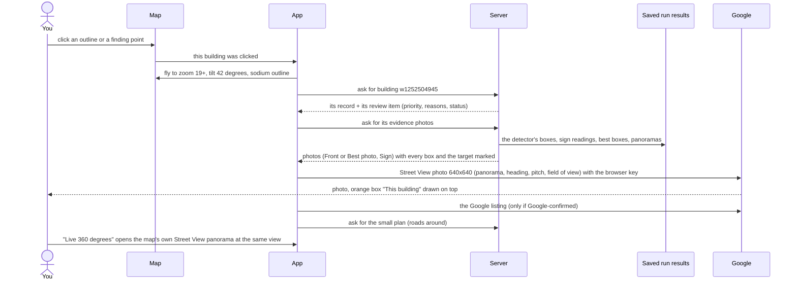
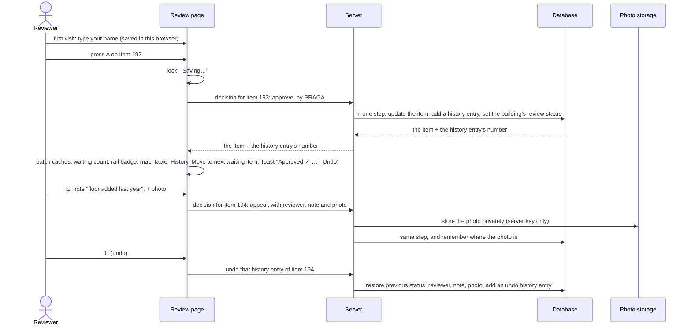

# GEO-CASCADIA explainer · 03 — App and flows

**What's in this file**
- The app page by page: every click at every zoom level, the building drawer, poles and the visual legend ([§10](#10-the-app-page-by-page)).
- Review, Jobs, Under the Hood and Trust, with the review flow diagram.
- Where every UI item comes from and who owns an error, plus 12 traced examples ([§9.7](#97-where-every-ui-item-comes-from-and-who-owns-an-error), [§9.8](#98-traced-examples-real-ids)).

[← 02 Pipeline and accuracy](02_PIPELINE_AND_ACCURACY.md) · [Start here](00_START_HERE.md) · [04 Backend, database and worker →](04_BACKEND_DB_WORKER.md)

---

## 10. The app, page by page

### 10.1 The shell
- **The map is home.** One Google map stays mounted under every page (D3). Explore, Analyse and "Drive the street" are **modes** of the map. Review, Under the Hood, Trust and Jobs are drawn over it.
- **Left rail (64 px):** Explore · Review (with a badge = items waiting in this area) · Under the hood · Trust · Jobs · **Tour (?)** · Night/Daylight.
- **Guided tour (P7.5):** seven plain steps on the real data (the key numbers → a building's evidence → Review → Analyse a street → Jobs → Trust, Gate 1 "Not verified" → done). It opens by itself once on the first visit; Esc closes it; ← → step. It works with no worker and says so.
- **When something is missing (P7 R3):** with no Google browser key the app opens without the map ("The map can't be shown") and Review, Under the Hood, Trust and Jobs still work; if the API stops answering, a banner says so and what is on screen stays.
- **Top bar:**
  - area switcher (originals first, a "new" tag on live streets);
  - the **ask bar**;
  - Ctrl+K command palette: Places search to jump anywhere ("powered by Google"), questions, pages;
  - the **analysis indicator**: "Analysis on" with the current stage, or "Analysis off" (D48 plain words);
  - the offline badge.
- **Map controls:**
  - band pills City / Area / Street / Object (fly to that zoom);
  - **3D switch** (on by default; OS "reduce motion" starts in 2D);
  - compass and tilt reset;
  - **Layers** (on by default: buildings, streetlights and poles, approximate positions, dark stretches, businesses with no analysed building, "in the register, not seen"; off by default: waiting for review, where findings cluster, road colour by findings, Street View coverage, minimap);
  - **Key**: the legend. It is collapsed and lists only what is on screen.
- **At most one right-hand panel** at a time (D15): a selection's evidence › a drive › a question › a key number's list › a selected street › "What stands out".
- Every page and section has its own web address, so a link can open Review, a Hood chapter, a Trust section or Jobs directly.

### 10.2 Explore: clicking the map at each zoom level (For users)

Zoom bands (D12): **City** below zoom 13.5 · **Area** 13.5–16.5 · **Street** 16.5–18.5 · **Object** from 18.5.

| Band | What is drawn | Hover | Click → what happens |
|---|---|---|---|
| **City** | Every analysed area as a sodium-orange glow with a dark ink outline and a badge ("Ward 29, Coimbatore · 381 buildings · 11 dark stretches"); a pulsing dot for a running job | Area card: buildings checked, dark stretches, businesses with no building | Another area → it becomes the app's area and the map flies there; the same area → fly to it |
| **Area** | Analysed roads glowing orange (lit); **black bands** for dark stretches; streetlights glowing; **only finding points** for buildings (pink = not in register, glacier = differs). Poles, matched buildings and business rings are hidden (declutter, D15) | Street: its buildings, not-in-register and differing counts, streetlights, dark metres. Point: title, status, use and floors | A **road** → selects that street and filters everything (KPIs, map, table); the street panel opens; clicking again clears it. A **finding point** → selects it, flies to object zoom (≥ 19, tilt 42°), drawer opens. A **dark band** → dark-stretch drawer (no flight). A **streetlight** → its drawer |
| **Street** | Map tilts to 40°. Buildings **extruded** by floors × 3.2 m in their status colour; buildings with unknown floors flat and **hatched**; poles as small dots; streetlights glowing; dashed uncertainty rings; hollow business rings; missing-record icons | as above | Any building, pole, light, ring or icon → drawer + fly to object zoom |
| **Object** | as Street, plus for the **selected building** its **predicted position** (orange dot) and uncertainty circle, when estimated | as above | as above |

- An empty click clears the selection. In **Analyse** or **Drive** mode a map click never selects (Analyse uses it to pick a street).
- **Data behind it:** loaded once per area, not per click. The app asks the server for the list of areas, this area's summary, its map shapes (buildings, poles and lights, dark stretches, businesses, missing records, streets), its building, pole and business records, and its review queue.
- The map layer checks a 6 px circle around the pointer to tell the app which object is under it. The hover card follows the cursor. The pointer turns into a hand.
- **Error owners:** outlines OSM; everything else [§9.7](#97-where-every-ui-item-comes-from-and-who-owns-an-error).

### 10.3 Clicking a building: from click to drawer (For users)

**How the evidence photo is chosen** (by the server):
1. **"Front"**: the pipeline's own best building photo for this outline ([§7.5](02_PIPELINE_AND_ACCURACY.md#75-box-quality-check-per-building)). It exists only if the box **passed** the quality check and the use step ran. It shows the photo's panorama, heading, pitch and field of view.
2. **"Sign"**: the photo of the sign read best (tier 2 before tier 3, then highest confidence).
3. **"Best photo"**: no Front photo, but the pipeline did match a box. It is shown with the reason it failed, e.g. Savitha: *"…failed the photo quality check (a thin sliver at the photo edge)…"*. Ward 29: 117 buildings.
4. **"Nearest camera"**: no box was ever matched. The first planned photo facing the building is shown with **no** orange box and the sentence *"The detector found no box for this building in any photo…"* Ward 29: 31 buildings have no matched box and no sign photo (D31).

**How the "This building" box is chosen:**
- Front / Best photo: the detection whose box overlaps the stored box by **IoU ≥ 0.5**.
- Sign: the signboard whose OCR text equals the building's read text. Its label becomes "This building's sign".
- Fallback: the most confident detection of that class that was planned to face this outline.
- If nothing matches, the stored box itself is drawn, with a note.

**How the app knows which building in a busy photo is this one:** the camera-ray rule of [§7.6](02_PIPELINE_AND_ACCURACY.md#76-linking-boxes-to-buildings-which-building-in-this-photo-is-this-one). The box's middle becomes a direction; the first OSM outline on that line (2–40 m out) is the building. A box is only ever called "this building" if the **pipeline itself** made that link (D31). Before D31 the app sometimes marked "the most confident box in a photo aimed at this outline", which was wrong.

**Distance and quality checks you can see:** "How do we know? (everything the detector found)" draws **every box** with its class and confidence ("building 33%"):
- solid boxes were used for positions; dashed boxes were not (tilted photos, public photospheres);
- class chips toggle each class;
- a fact line says whether this is the analysis's own photo or a re-aimed one.

**What the drawer shows:**
- **Header:** the name if read clearly, else "<Use> on <street>"; the status dot ("Differs from the register").
- **What we saw:** Use, Floors, Sign, Google Maps name.
- **How do we know? (building):**
  - a plain summary ("We looked at this building in 2 street photos. There is no clear photo of the building, but its readable shop sign shows it is a business. Its position is the centre of its front wall on the map…");
  - the route of use, floors and name with the model card's accuracy line;
  - the sign text and OCR confidence; door numbers (unconfirmed); "Condition: not shown";
  - Google flags; cloud calls and cost; the map position (outline centre); the ID;
  - **"Where it stands"**: a small plan with the outline, its centre (+), the predicted point, the uncertainty circle or "not estimated", and the method badge.
- **What the register says (synthetic register (demo)):** "Listed as a shop or business, floors not recorded." plus the reasons in plain words ("The register's pin is 36 m away from the building"). Its How do we know? lists the record number, **"Paired by: Location: the record's pin is 0.0 m from this building, so the pairing is clear (the next building would fit 12.3 m worse)"**, what the record says (empty fields read "not recorded (not compared)"), the pin distance and the result.
- **Review:** "A person should check this because: use differs from register". Approve / Reject / Appeal buttons (the reviewer name is asked once). "Not waiting for review" when the building is not in the queue.

**The mini-map** (a drawing, not a second Google map, D39): the object, its street with its name, building outlines within 70 m, the evidence cameras and a **dashed line of sight** from each, OSM roads around (fetched once per area and kept), north arrow and scale bar. At most 3 labels.

**Live 360°:** the map fades (250 ms veil) into its own Street View panorama at the same panorama, heading and pitch. Pins for the object stay attached while you look around. Single-camera assets are labelled "approx.". "Back to map" or Esc reverses it. On Review, the panorama shows through the middle column.

### 10.4 "The photo shows 4–5 buildings but the map highlights only 1–2": why

**Short answer:** the photo shows **detections**, and the map shows **registered buildings**. They are different things, on purpose.

1. **Only the selected building is highlighted.** On the map the selected outline gets a sodium outline. In the photo only its box is orange unless you open "How do we know?". The neighbours are separate buildings with their own drawers.
2. **A box is linked to an outline by its camera ray ([§7.6](02_PIPELINE_AND_ACCURACY.md#76-linking-boxes-to-buildings-which-building-in-this-photo-is-this-one)).** Two boxes can link to the same outline (a wide building split in two). A box can link to the neighbour behind a gap.
3. **Some outlines in the photo are not registered.** "Registered" means *a planned photo faced it* ([§7.3](02_PIPELINE_AND_ACCURACY.md#73-camera-plan-and-building-register)). An outline that only appears at the side of an oblique photo, or is set back more than 40 m, is not one of the 381. Ward 29: **80 outlines** had a box in some photo but are not registered (Hood › "Floors and use").
4. **Some buildings have no OSM outline at all.** A box whose ray hits nothing within 40 m links to no building. Ward 29: 125 of 2,003 usable building boxes hit nothing. With three or more cameras agreeing, the pipeline can compute a point for such a building, but these points are **not exported** (they stay in the run's saved building positions).
5. **Some boxes failed the quality check** (slivers, cut roofs). The building still exists on the map, but its use and floors come only from signs, or stay unknown.
6. **Some buildings are seen only in another photo:** their own "Front" photo is a different panorama.

**Worked example (Ward 29, w1252504929, Sathy Main Road, Front photo: panorama 5iqy…, facing 130°):**
- The photo has 12 boxes; 5 are buildings.
- 1 is **this building** (orange). 2 are **other registered buildings**, w1252504180 and w1252505552, whose own Front photos are taken from another camera. 1 is an **OSM outline that is not registered** (w1252505243). 1 has **no OSM outline** behind it.
- The map highlights 1 building (the selected one); the 2 registered neighbours are visible in their status colours; the other two are not in the app.

**Is it correct?** Yes, by design. Each registered outline gets exactly one record, with its best photo, and every other box is still visible under "How do we know?". The **limit** is coverage: unregistered outlines and buildings missing from OSM are not analysed as buildings ([§10.5](#105-are-all-buildings-mapped-no-here-is-exactly-what-the-381-are)).

### 10.5 "Are all buildings mapped?" No. Here is exactly what the 381 are
- **The 381 in Ward 29** are OSM outlines that **at least one planned photo faced**:
  - the photo was taken from a camera stop on one of the **10 analysed streets** (4,829 m);
  - the camera stop is inside the Ward 29 study area (1.12 km²);
  - the photo's straight-across or ±35° ray hit the outline within **40 m**.
- **How many outlines exist:** about **2,044** OSM outlines have their centre inside the study area (today's saved OSM download; the notebook counted 2,183). So the app analyses about **19%** of the ward's outlines: the ones along the chosen streets.
- **Why some visible buildings are not included:**
  - they stand on streets that were not analysed (the ward has about 145 street pieces, 21,210 m, H1);
  - they are behind other buildings or more than 40 m from the road;
  - they appear only at the edge of a photo planned for a neighbour (80 such outlines had boxes);
  - OSM has no outline for them (111 of 1,154 photos faced no outline).
- **Also on the map:** Google's own 3D buildings are **hidden** by the Cloud map style, so the buildings you see drawn are ours. In Daylight with satellite, roofs you see in the photo layer are not necessarily in the app.
- **How to check coverage yourself:**
  1. **Under the Hood › "Coverage and the run in brief"**: "full: footprints on most frontages" (Ward 29: 9.6% of photos face no outline).
  2. Hood › **Camera positions / Photos fetched** chapters, with example photos where the map has no outline.
  3. Explore › Layers › **Street View coverage** (Google's blue lines) vs the lit analysed roads.
  4. The **area card** shows "few buildings on the map here" for low coverage (Trichy 33%, Tiruppur 90% of photos facing no outline).
  5. Compare with openstreetmap.org around the same street.
- **Honest limit:** the app answers "what's wrong along *these* streets", not "every building in the ward".

### 10.5b Photo dates, front wall and old imagery (P8)
- **Every evidence photo** (Explore drawer, Review) carries a badge **"Photo from Nov 2022"**: Google's capture month of that panorama, which the analysis stored; nothing is fetched. Older than 3 years, it reads "· over 3 years old" in orange.
- **"Imagery may be outdated"**: a *not in the register* building, a pole or light *not in the register*, a *register entry not seen* or a *possible dark stretch* whose **newest** photo is more than 3 years old gets this note at the top of its drawer (the street may have changed since). Ward 29: 4 buildings, 4 poles/lights, 1 dark stretch, 1 register entry.
- **Frontage** in "What we saw" (D51): the length of the building's street-facing wall on the OpenStreetMap outline (the same wall whose centre is the building's position), with its source in "How do we know?". The old "frontage" figure was the longer side of the outline's rectangle, whichever way it faces; it is now called **longest side** and shown only as a note there (for 119 of Ward 29's 381 buildings the frontage is under 60% of it).
- **Under the Hood › Coverage** says when the photos were taken ("Jun 2018 to Feb 2026 · 40 camera positions of 203 with photos more than 3 years old"); Compare shows each area's range.

### 10.6 Poles, streetlights and dark stretches on the map
- **"The photo shows 4 poles close together but the map has 1."** This is expected; see asset-0160 ([§7.11](02_PIPELINE_AND_ACCURACY.md#711-asset-positions-and-pole-merging)).
  - Each pole box becomes a point from its direction and base-to-ground distance.
  - Points within 3 m cluster; clusters within **5 m** merge.
  - Close poles, a pole and its stay wire, or the same pole boxed twice become **one** asset. Boxes more than 15 m away or with a hidden base place **nothing** (369 of 822 Ward 29 pole boxes).
- **What the map means:** **"a pole here"**, not an exact count. A single-camera pole (dashed ring) is shown ±2.4 m within 8 m of the camera and ±5 m beyond, and may be further off.
- **Wording to use (recommended; not yet in the UI, [§18](05_EXPLAIN_AND_DEFEND.md#18-still-to-do-p7)):** *"Pole (1 or more) seen here"* in the drawer, and "Seen 7 times from one camera position; poles closer than about 5 m are shown as one" in How do we know?.
- **Streetlights:** a lamp head fused with a pole within 1.5 m, or a lamp ray passing within 2 m of the pole. They glow orange. Pinpointed (2+ cameras) vs approximate (dashed ring).
- **Dark stretches:** "no streetlight seen within 60 m", measured between camera stops. They say nothing about lamps that are off or broken. Poles inside are counted ("22 poles stand here, but no lamp was seen on them").

### 10.7 Every visual encoding (legend)
Colours come from the app's design system (Night Survey). At night, status marks are lifted 18% toward white.

| Mark | Night | Daylight | Meaning | Source → owner |
|---|---|---|---|---|
| Page / panel background | near-black indigo | warm paper | surfaces | design |
| **Sodium orange** (accent) | bright orange with a soft glow | deep orange | lit roads, streetlights, selection outline, primary buttons, predicted point, running job | design |
| Analysed road | orange line + soft additive glow (brightens as the lights "turn on") | orange line | a street the pipeline analysed | OSM geometry |
| **Black band** with blue-indigo edge | black + indigo edge | heavy ink | dark stretch: no streetlight seen in 60 m | MODEL + OUR RULES |
| Dotted chalk edge on a black band | grey dotted | same | "check": lights were seen part way along (road bends) | OUR RULES |
| Chalk outline around a band | ink | ink | a question's answer | — |
| Sodium outline around a band | sodium | sodium | selected dark stretch | — |
| Streetlight | glowing orb: warm white core, halos | sodium dot with paper ring | streetlight located | MODEL + OUR RULES |
| Small grey dot | light grey | dark grey | pole, no lamp seen (street zoom only) | MODEL |
| Dashed circle around a pole | grey dashed | same | approximate (one camera); radius = ±2.4 m within 8 m of the camera, ±5 m beyond (D45) | OUR RULES |
| Solid circle around a pole | grey solid | same | triangulated; radius = residual (≥ 0.5 m) | OUR RULES |
| Pink ring on a pole | peony | rose | not in the (synthetic) asset register | SYNTHETIC |
| Glacier ring on a pole | glacier | teal | differs from the register (moved / wrong type) | SYNTHETIC |
| **Pink / peony** building or point | soft pink | deep rose | not in the register | SYNTHETIC |
| **Glacier / teal-blue** | pale glacier blue | teal | differs from the register | SYNTHETIC + OUR RULES + MODEL |
| **Dusk slate** | slate blue | light slate (with ink outline) | in the register, no difference found ("matches") | SYNTHETIC |
| Extruded 3D building | status colour, height = floors × 3.2 m | same | floors known (display scale only) | MODEL |
| Faded 3D building | half transparent | same | floor count is an estimate (roof not visible) | MODEL |
| **Hatched flat building** | dull indigo fill + status-coloured hatching | stone grey | floors not known, never a guessed height | MODEL + OUR RULES |
| Dashed chalk outline | chalk white dashed | ink dashed | waiting for review (layer off by default) | review |
| Hollow ring | grey ring, dark fill | same | business with no analysed building (on an unanalysed outline, or no outline: approximate spot) | OSM + MODEL + OUR RULES |
| Pink dashed square icon | peony | rose | in the register, nothing seen (within 25 m) | SYNTHETIC |
| Grey road | dull indigo | same | a street with no joined stats ("no data"), never "healthy" | — |
| Road colour ink → peony | 0 / 10 / 20 / 40 findings per km | same | road colour by findings (layer off) | computed |
| Pink hexagons | — | — | where findings cluster (area zoom, layer off) | computed |
| Blue lines | — | — | Google Street View coverage (Analyse, or layer on) | GOOGLE |
| White line + orange end dots | ink line, sodium ends | same | Analyse: the exact street you picked; faint = the rest when trimmed | OSM |
| Still dashed line | grey dashed | same | queued or paused job street | jobs |
| Orange sweep + pulsing head | sodium | same | running job: progress along the street | jobs |
| Pulsing orange dot | sodium | same | a job, seen from city zoom | jobs |
| Orange glow + badge | sodium | same | an analysed area (city zoom) | — |
| Orange dot + orange circle (object zoom) | sodium | same | selected building's predicted position + uncertainty | OUR RULES |
| Orange wedge + arrow | sodium | same | Drive the street: you and your view | — |

**Photo overlay colours** (fixed, on photos, both themes): **orange** = this object (4 px, faint fill); building pale grey; pole white; lamp light orange; sign glacier blue; **dashed** box = not used for positions (tilted or public photo); crosshair = aimed direction with no box.

**Badges and text colours:** status dots use the same pink / glacier / slate. Job statuses: Queued / Running / Needs approval / Paused: key expired in sodium; Done in slate; Failed in pink; Cancelled grey; No Street View glacier; Interrupted sodium glow. "synthetic register (demo)" tags are neutral. Reviewer status: "Waiting for review" in sodium.

### 10.8 The rest of Explore (For users)

**Key numbers (KPI ribbon).** Five numbers, then "More". Computed in the browser from the records with the dashboard's formulas; with no filter they equal the server's dashboard (D14).

| KPI | Ward 29 | Click does |
|---|---|---|
| Buildings checked | 381 | overview |
| Not in register | 27 | filter to no-record buildings, list in the panel, map dims the rest, frame them |
| Differ from register | 50 | filter discrepancies |
| Dark stretches ("no streetlight seen in 60 m") | 11 | dark stretches list |
| Use not known | 139 | buildings with no use |
| *More:* Streetlights 38 · Poles, no lamp seen 230 · Shop names read clearly 96 · Also on Google Maps 25 · Signs to double-check 49 · Waiting for review 218 · Businesses with no analysed building 26 · Streets 10 | | each filters |

A selected street keeps its filter: the KPIs then count that street only.

**"What stands out"** (sentences computed from the records in the browser, Ward 29):
- "27 buildings are not in the register", 6 of them on 2nd Street, Gandhi Nagar.
- "50 buildings differ from the register", most often: bigger than recorded (22).
- "2,019 m of road has no visible streetlight": 11 stretches; longest 376 m on Sathy Main Road.
- "26 businesses have no analysed building."
- "Use not known for 139 buildings", of 381: no clear photo of the front.
- "218 items are waiting for a person to check."

Each sentence is clickable (KPI filter or Review).

**The ask bar** (rule-based, no LLM). The app sends the question, the area and any selected street to the server, which answers with the understood filters and the results. On focus it shows **six** example questions built from this area's streets (busiest with findings first), plus "Build a question by clicking" and "How questions are understood". Ward 29 answers, computed by running the real engine:

| Example question | Parsed chips | Answer |
|---|---|---|
| Commercial buildings with more than 2 floors and no record | use commercial · floors > 2 · no record | **0 rows**, with the why-empty funnel: 381 buildings → 27 no record → 5 commercial/mixed → 2 floor count measured → 0 with > 2 floors |
| Streets where no streetlight is detected within 60 m | dark stretches · 60 m | 11 stretches, shown in lighting-priority order ("Fix first"; "Longest first" switches to Sathy Main Road 376 m, 8th Street, Ganapathy 313 m, Sri Ganapathy Gardens 3rd Street (approx.) 254 m, …; see [06](06_updates.md)) |
| Chart of unmatched buildings by street | no record · by street | bar chart: 2nd Street, Gandhi Nagar 6, 4th Street, Tatabad / Vinobaji Street 4, 2nd Street, Ganapathy Gardens (approx.) 4, Korathottam Road 4, Ganapathy - Avarampalayam Road 3, and 2 each on 3 more; a bar click zooms the map to that street |
| Low-confidence floor counts for review | review · low-confidence floors | 4 buildings (e.g. w1252504103, w1252504515); "Send 4 to Review" opens Review with just those |
| Not-in-register buildings within 50 m of a possible dark stretch | not in the register · dark stretch within 50 m | **15** of the 27 not-in-register buildings (D53) |
| Buildings that differ from the register on 2nd Street, Gandhi Nagar | street · differs | 8 buildings |

- The spec wording ("Show commercial buildings with more than two visible floors that do not have a matching property record") parses to the same chips.
- Other intervals work: "…within 100 m" gives 7 stretches, labelled "computed by the app with the pipeline's method".
- **Distance to a dark stretch (D53):** "… within N m of a possible dark stretch" (or "near a dark stretch" = 50 m) keeps the buildings whose outline lies within N metres, on the ground, of a possible dark stretch as the map draws it. The database measures it; the chip "Dark stretch · within 25 / 50 / 100 m" changes N; the answer says "15 of 27 matching buildings are that close". "Poles on Sathy Main Road" still works; it is no longer one of the six examples.
- **Tamil works for the main words (P8):** shop, building, house, pole, light, street, floors, register, review, chart, "not in the register", "more than two floors", "within 60 m", "by street" (e.g. "பதிவேட்டில் இல்லாத கடைகள்" = shops not in the register). The four spec questions and "poles on Sathy Main Road" asked in Tamil give exactly the same answer as in English.
- If a word is not understood (e.g. Tamil "மரங்கள்", trees), the panel says "partly understood", lists the ignored word, offers close questions, and **applies nothing** until you accept or edit the chips.
- Loose street names work: "sathy road" → Sathy Main Road.
- An object ID typed in the bar (e.g. w1252504945) opens that object.

**Findings table.** Columns drop by panel width: id · name/street · register, then use and floors, then review. Row tooltips carry location and routes.

**Charts.** One chart per question: building use (with "not classified" shown), floors (measured only, with n), asset type, match status, **unmatched by street** (bar → zoom), discrepancy types.

**Street panel** (click a road): "Korathottam Road: 9 buildings not in the register", its dark stretches, and "N buildings checked · N streetlights and N poles seen". Button: **Drive this street**.

**Other drawers:**
- **Pole / streetlight:** photos "Camera 1, 2…" re-aimed at the asset (fov 60°). For a single-camera asset the position line reads "Approximate: about ±2.4 m (one camera, 4 m away)" (D45). Boxes are **projected** from the same panorama's planned photos; the pole box nearest the aimed direction (≤ 6°, lamp ≤ 12°) is "This pole". Then "Pinpointed: seen from N camera positions" or "Approximate: seen from one camera position", the register line, How do we know? ("Found 7 times in the photos… About ±2.4 m: one camera, 4 m away. At that distance, 8 in 10 single-camera estimates of poles that two cameras pinpointed were within 2.4 m (a consistency check)." For a pole more than 8 m away: "About ±5 m… An earlier surveyed check found a typical error of 4.55 m for poles 8–15 m from the camera, so about half of such poles fall inside this circle."), and a mini-map with lines of sight.
- **Business with no analysed building:** the sign photo, and either "A shop sign was read here, on a building outline that is not one of the analysed buildings…" (placed where the sign's line of sight meets that outline) or "…OpenStreetMap has no building outline at this spot…" (about 12 m along the camera's line of sight). Seen in N photos.
- **In the register, not seen:** "The register lists a pole or light here (EB-G01), but none was seen in the photos within 25 m" (synthetic).
- **Possible dark stretch (P8 wording):** "376 m of Sathy Main Road has no visible streetlight. Possible, not certain: the detector finds about 43% of lamp heads in a photo (checked by hand on 49 lamps). 22 poles stand here, but no lamp was seen on them." Plus the "check" note where relevant, and recorded vs along-road length.

**Drive the street** (D20; the server sends the street's camera stops in driving order):
- A scrubber moves through the pipeline's **real camera stops** in driving order (strictly forward, per branch).
- A road strip shows lit and dark, lamps, buildings on each side, and stops.
- Forward / Left / Right Street View photo; each stop you settle on loads **one billed photo**, debounced 350 ms.
- "Passing now" lists objects within 20 m.
- Example: Sathy Main Road has branches of 803 m (34 stops), 111 m (6 stops) and 37 m (not offered).

**Analyse a street:** see [§12](04_BACKEND_DB_WORKER.md#12-live-analysis-and-the-worker). In Explore: Analyse → the "flashlight" shows Google's blue coverage lines in a 150 px circle around the pointer → click a street → confirm sheet → Start.

### 10.9 Review (For users)

**Layout:** queue | evidence photo with its box | decision. Filters: street, reason, priority, status (they combine; each option shows a live count). Keys: **J/K** next/previous, **A** approve, **R** reject, **E** appeal, **U** undo, **?** shortcuts.

**What each action changes:**

| Action | The review item | Its history | The building's or pole's review status | Rules |
|---|---|---|---|---|
| Approve ("the finding is right") | approved, reviewer, time | +1 "approve" entry with the previous values | approved | reviewer required |
| Reject ("the finding is wrong") | rejected | +1 "reject" entry | rejected | no note or photo allowed (refused) |
| Appeal ("needs more") | appealed, note, photo | +1 "appeal" entry (+ the photo) | appealed | note required; photo JPEG/PNG/WebP up to 8 MB, else refused |
| Undo | restored to exactly the previous values | +1 "undo" entry naming the decision it undoes | restored | newest decision first; refused if already undone or a later decision is live |

**What changes on screen, and what doesn't:**
- **Changes:**
  - the Review header "N waiting";
  - the rail badge;
  - the **"Waiting for review" KPI** (pending only, D29);
  - the findings table's review column;
  - the dashed chalk "waiting for review" outline (the Review layer);
  - the drawer's review section and the item's History panel (who, what, when, undone; appeal photos through links that expire after 10 minutes);
  - a flash on the Review mini-map.
- **Does not change:**
  - "Buildings checked", "Not in register", "Differ from register", "Dark stretches", "Use not known";
  - the charts;
  - the building's match status, differences, colour, use, floors or position;
  - the area's saved results, the model card and the pipeline.
  - Rejecting "not in the register" does **not** make the building matched. Decisions are never fed back into the models.
- **The reviewer name** is asked once, kept in the browser, and saved on every decision and undo. There is **no login**: anyone who can reach the server can decide.
- **Offline:** items have no ids, so the buttons are disabled ("Offline — read-only").
- **Today:** all 364 items across 6 areas are waiting. The P7a reload removed 145 waiting items and added 58; the reload with the safer sign rule removed 4 more and added 1. No decided item was affected, and a reload now lists any decided item that leaves the queue instead of losing it. 1,038 history rows exist, all but 2 written by automated tests on throw-away copies (reviewer "test").

### 10.10 Jobs (For users)
- **Worker line:** whether a worker is connected (seen in the last 45 s), its device (GPU/CPU) and the street it is on; when none is connected, new streets stay queued until the Colab worker runs.
- **Pre-computed runs:** Ward 29, Trichy, Tiruppur, with counts and buttons **Open on the map** / **Under the hood**.
- **Started from this app:** each job with its street, stage ("Stage 6 of 10 · Reading signs · 120 of 654 signs"), time so far, an honest time left ("taking longer than the estimate" once past it), its mini-map and actions:
  - **Approve and run** (needs approval);
  - **Retry** (failed with a real error; continues from saved progress);
  - **Cancel**; **Remove from list**; **Open**;
  - **Delete this analysed area…** (never the 3 originals).
- **Clear test jobs…:** lists first, then removes only test jobs and their test areas, plus jobs cancelled before any worker started them.
- **Estimate** with "How is this estimated?" ([§13](04_BACKEND_DB_WORKER.md#13-costs-and-performance)).

### 10.11 Under the Hood (For anyone digging deeper)
- **One area at a time.** Tabs switch the whole app's area.
- **"Coverage and the run in brief":** the coverage verdict; one line of time and cost. For the originals, timings are greyed with "resumed run, not representative" (D1). Live runs show their real minutes, photo count × $0.007, cloud calls and cost.
- **Ten chapters.** Each has a big counted-up figure, one plain sentence, a visual and example buttons. Ward 29:

| # | Chapter | Figure | Sentence (short) | Visual |
|---|---|---|---|---|
| 1 | Streets planned | 10 streets | 4,829 m of road chosen | mini-map with camera ticks |
| 2 | Camera positions | 203 | 13 dropped inside an outline; 443 panoramas off the streets; 74 thinned | kept / idle / dropped bar |
| 3 | Photos fetched | 1,154 | 1,043 face a mapped building; 111 (9.6%) face no outline | bar |
| 4 | Objects detected | 5,554 boxes | 2,411 buildings, 2,065 signs, 958 poles, 120 lamp heads; 937 from tilted or public photos not used for positions | bar |
| 5 | Signs read | 2,065 crops | 807 read, 180 to the cloud, 1,065 no name; 145 buildings named, 96 clearly, 25 on Google; 26 businesses with no analysed building; a sign moves off the photo's aim only when its own line of sight clearly hits another building (570 do) | funnel |
| 6 | Local or cloud AI | 163 / 58 | use: 163 local, 58 cloud, 21 from a shop sign, 139 not known | two donuts (use, names) |
| 7 | Floors and use | 221 of 381 had a clear photo | 117 poor photos, 43 never seen; floors measured 217, estimated 4 | bars |
| 8 | Positions | 20 / 248 | assets pinpointed / approximate (circle grows with camera distance: 132 within 8 m at ±2.4 m, 116 farther at ±5 m); buildings 36 corners, 224 wall hit, 121 wall centre; 11 rejected | bars |
| 9 | Matched to map and register | 381 compared | records paired by position (never by ID); 304 entry with no difference (114 use not compared), 50 differ, 27 no entry | bar |
| 10 | Findings | — | 218 items for a person, 218 waiting | findings summary |

- **Examples:** up to 3 real items per branch, each with its photo and a small plan. Examples: a dropped camera inside an outline; a photo facing no outline; a thinned panorama with its distance to the nearest chosen stop; a rejected building photo with its reason; a pinpointed vs approximate pole with lines of sight.
- **Street by street:** each street among the others, with its buildings coloured by status, lights, poles, dark stretches and stops.
- **Story sentences** are rebuilt from computed numbers. Corrections live on Trust.
- Sources: the server computes every number from the records and the run's saved results, and says where each comes from. The automated tests recount them from the raw results.

### 10.12 Trust (For anyone digging deeper)
Sections (sticky navigation), every number quoted from the model card with where it sits in it, and "Source: the team's model card, checked by hand on n examples":

1. **What each result is worth**: cards: Building use (routed 90% of 31, same as cloud-only, 92% of 12 in Trichy); Number of floors (61% exact of 36, 100% within one; plain prompt 42%); Shop names (74% of 31 vs 65% all-cloud); **Building use from a shop sign** (accuracy "not measured"; known limits: posters such as "FOOTBALL COACHING", OCR garble; spot-check planned); Possible dark stretches (streetlight seen / not seen: 43% of lamp heads found, n=49, "a possible dark stretch: no streetlight was seen, not proof there is none"); Building position (status "not verified").
2. **Tried and dropped**: lanes Detector (v8n replaced, v8s production, YOLO26n tried, YOLO26s rejected), Floors (plain replaced; 3-example, zoom re-shoot, v4 rejected), Building use (Google Places type rejected; every building to the cloud replaced), Shop names (every photo to the cloud rejected; cloud-only names rejected), Streetlights (cloud lamp check rejected), Withheld (condition, door numbers).
3. **Detector · YOLOv8s**: per-class precision/recall with n, benchmark chart.
4. **Positions of poles and streetlights**: synthetic error, camera check, pin-noise stress, and the **single-camera error by distance** table (D45: camera-to-pole band, n, median, 8 in 10 within, the surveyed check's median, and the circle the map draws with which of the two it came from). The notes say the consistency check leans small, and that beyond 8 m the circle is the surveyed median, so about half of those poles fall inside it.
5. **Register tests: planted mistakes and pairing by location** (D42/D43, computed): caught / missed / false alarms per planted kind for all areas together, how many records paired with their own building (530 of 538; moved pins 18 of 26), and a per-area table. Note: "This tests the comparison logic end to end on made-up data; real accuracy needs a real register." Then **Register matching (planted errors, notebook era)** from the model card.
6. **Cost and accuracy: routed vs all-cloud** (§10 test 6): model card use $0.056 vs $0.089 at 0.89 accuracy (the $0.056 leaves out the name and business-sign checks; like for like $0.070, Under the Hood › Routing and cost and Trust › Stored vs computed); names $0.0079 vs $0.105.
7. **Stored vs computed**: every mismatch ([§9.4](02_PIPELINE_AND_ACCURACY.md#94-stored-vs-computed-corrections-trust--stored-vs-computed-d2-d29)) with a jump link.
8. **Gap length checks**: recorded vs along-road lengths.
9. **Limits of this data**: use not classified, low OSM coverage, single-camera positions, lamps can't be judged working, synthetic registers.
10. **How questions are answered: rules, not an AI model.**
11. **Position accuracy — target ≤ 3.5 m (FarmwiseAI Gate 1)**: the rule, method counts, the tables of [§9.2](02_PIPELINE_AND_ACCURACY.md#92-gate-1-the-tables) with "wall hit is on the wall by construction". The pass-rate note: "rose mainly because implausible points were rejected, and the check and the score use the same wall, so this is a comparison, not accuracy" (D28).

---

## 9 (continued). Where everything comes from, and who owns an error

*These two sub-sections of [§9](02_PIPELINE_AND_ACCURACY.md#9-accuracy-and-honesty) live here because they explain what you see in the app.*

### 9.7 Where every UI item comes from, and who owns an error

| UI item | Source | Error owner | How to fix |
|---|---|---|---|
| KPI "Buildings checked" (381) | OSM outlines faced by the camera plan | OUR RULES (40 m / plan) + OSM | more streets, longer range, fix outlines in OSM |
| KPI "Not in register" (27) | no record paired by location: a planted missing record, or a moved pin taken by a neighbour | SYNTHETIC + OUR RULES (pairing) | real register |
| KPI "Differ from register" (50) | planted mistakes in a register that copies the observations (D42), paired by location (D43) | SYNTHETIC + OUR RULES | real register |
| KPI "Dark stretches" (11) | located streetlights + 60 m rule | MODEL (lamp recall 0.43) + OUR RULES | better lamp detector; more photos per stop |
| KPI "Use not known" (139) | quality check + detector + sign rule | MODEL + OUR RULES | better framing (another photo), detector |
| "Streetlights" / "Poles, no lamp seen" (38 / 230) | detections → merging → fusion | MODEL + OUR RULES | detector; merge radius |
| "Shop names read clearly" (96) | OCR/cloud model + name gate + our name-quality rule | MODEL + OUR RULES | OCR; dictionary for garble |
| "Also on Google Maps" (25) | Places Nearby + strict name matcher | GOOGLE + OUR RULES | — |
| "Signs to double-check" (49) | names that are fragments / Tamil / cloud-only | OUR RULES | — |
| "Waiting for review" (218 pending) | review queue + people's decisions | OUR RULES + reviewers | — |
| "Businesses with no analysed building" (26) | read signs linked to no outline or to an outline outside the 381 + cloud check + gate | OSM + coverage + MODEL + OUR RULES | add outlines / analyse more streets |
| Building title (name or "Commercial on <street>") | name quality "good" only | MODEL + OUR RULES | — |
| Use label | router / cloud model / sign rule | MODEL / OUR RULES (sign) | — |
| Floors "2 floors (estimate)" | cloud few-shot; "estimate" when the roof isn't visible | MODEL | — |
| "Register entry exists — use not compared" | matched + use unknown | OUR RULES wording; MODEL (unknown use) | — |
| "Paired by location … the pairing is clear / likely / uncertain" | the record's pin distance and match confidence (D43) | OUR RULES | — |
| Status colour (pink / glacier / slate) | the building's match status | SYNTHETIC + OUR RULES | — |
| Hatched flat building | floors unknown | MODEL + OUR RULES (quality check) | — |
| Building height | floors × 3.2 m, display only | OUR RULES (display) | — |
| Faded building | low-confidence floors | MODEL | — |
| Dashed chalk outline | review status pending (Review layer) | OUR RULES | — |
| Outline shape | OSM (or Microsoft) | OSM | edit OSM |
| Selected building's predicted point + circle | D33 rule | OUR RULES + OSM + MODEL | surveyed reference |
| Pole dot / streetlight glow | detections + merging | MODEL + OUR RULES | — |
| Dashed ring around a pole | single-camera approximate position; radius by camera distance (D45) | OUR RULES (consistency check within 8 m, surveyed median beyond) | more cameras |
| Status ring on a pole | synthetic asset register | SYNTHETIC | real register |
| Dark band on a road | 60 m rule | MODEL + OUR RULES | — |
| Dotted "check" edge on a dark band | lit stops inside a recorded stretch (D13) | OUR RULES (straight-line length) | pipeline length fix (not planned) |
| Hollow ring (business, no analysed building) | where the sign's ray meets an unanalysed outline, or 12 m along it | OUR RULES + OSM | — |
| Missing-record icon | synthetic "ghost" pole | SYNTHETIC | — |
| Street name | OSM → Google Geocoding → our "Unnamed road between/off/near" rule | OSM / GOOGLE / OUR RULES | — |
| Road lines | OSM | OSM | — |
| Evidence photo | Street View Static, live | GOOGLE (photo, date, camera GPS) | — |
| "This building" box | pipeline's box-to-outline link | MODEL (box) + OUR RULES (ray link) | — |
| Every box with % | detector | MODEL | — |
| Google business name | Places, looked up live | GOOGLE | — |
| "How do we know?" route + accuracy line | route from the record; accuracy from the model card | MODEL (route) / measured numbers | — |
| Hood / Trust numbers | computed from records and the runs' saved results; the model card | OUR CODE / measured | — |
| Job estimate | the real camera plan (pipeline stages 1–3, no photo bought) × measured rates | OUR RULES (photos a few % high; time high on a large area) | [§13.3](04_BACKEND_DB_WORKER.md#133-how-the-estimate-is-made-p72-p7-r2) |
| Hood photo cost for Ward 29 ($8.08) | planned photos × $0.007 | OUR CODE (misses 266 building crops) | use the real full-run count, 1,420 ([§18](05_EXPLAIN_AND_DEFEND.md#18-still-to-do-p7)) |

### 9.8 Traced examples (real IDs)

**1. Savitha Dry Cleaner: "use not known" fixed by our sign rule (D32), and no more fake "differs" (D42).** w1252504945, 8th Street, Ganapathy.
- The detector did box the building (confidence 0.857), but the box is a **sliver at the photo edge**, so the quality check (OUR RULES) rejected it. No use or floor call was made.
- The sign was read: OCR "SAVITHA" at 0.995. The cloud model read "savitha dry cleaner", and OCR supports it. Google confirms "SAVITHA DRY CLEANER".
- Before D32 the drawer said "Use not known". Now the use is **commercial via the shop sign**.
- Before D42 the synthetic register had invented "house" for it, so it showed a fake "Differs: used differently". Now the record (P-0005) copies "commercial" and leaves floors empty: **"Matches the register"**, paired by location with high confidence.
- Position: wall centre (no camera line of sight reached its front wall).

**2. The Tiruppur building's odd OSM outline.** w344655428, Uthukuli Road.
- OSM has one 4,866.8 m² outline with a 123.4 m front and a 39.5 m depth (4 corners): a whole compound drawn as one building (OSM).
- Triangulation from the cameras was **rejected**: the point sat 26.6 m from the road-facing wall (our plausibility rule working). The fallback wall hit lies 18.44 m from the front-wall centre, and the centroid 61.6 m.
- The sign "BAZAAR" is a fragment. With 1 outline on 662 m of road, 14 shops became "businesses with no analysed building".
- Owner: **OSM**.

**3. A planted register mistake found.** P-0013 → w1252504646, 8th Street, Ganapathy. The generator moved the record's pin 36 m; pairing by location still found its building (match confidence **low**), and the app says "The register's pin is 36 m away from the building" (SYNTHETIC, correctly found by OUR RULES).

**4. A planted mistake missed, and two false alarms.** P-0061 → w1252505875, 4th Street, Tatabad / Vinobaji Street: its pin was moved 32 m. The nearest free building was the neighbour w1252504232, whose own record (P-0041) was planted missing. So the moved record paired with the neighbour (confidence medium): the neighbour now "differs: bigger than recorded" and w1252505875 shows "Not in the register". Owner: OUR RULES (location pairing; 18 of 26 moved pins pair correctly).

**5. A detector miss.** w1252506247, 8th Street, Ganapathy. Two planned photos faced it, but the detector found **no building box** in either. The drawer shows "Nearest camera" with no orange box and says so. Use and floors are not known; position is wall centre. Owner: **MODEL** (building recall 0.706).

**6. The OCR fragment "COIMBATO".** w1251630445, Sathy Main Road. OCR read "COIMBATO" at 1.0: the word is cut off at the photo edge (MODEL + framing). Our name-quality rule rates it a **fragment**, so it is never used as the building's title and it is counted under "Signs to double-check" (OUR RULES caught it). The first D44 rule had moved another sign ("ganu mobiles") onto this building; with the safer rule that sign stays on w1251630440, the building its photo was aimed at.

**7. The poster read as a shop sign.** w1236978198, 1st Street, P&T Colony. OCR read "COACHING" (0.999) from a "FOOTBALL COACHING" poster on a wall. The building box failed the quality check (sliver), so the D32 rule made it **commercial**. Before D42 the register (an invented "vacant plot") then showed a fake "differs"; now the register copies "commercial", so the error stays visible only as the use. Owner: **OUR RULES** (D32 accepted a poster). Fix: the planned spot-check; an advert/poster filter.

**8. "No Street View" that was really a refused key (D40).** On 28 Sep the jobs for Sanganur Road, Sakthi Main Road and Bharathiar Road (twice) ended "Google has no outdoor Street View imagery".
- From the laptop, the browser key answered OK at the same points. The server key answered **REQUEST_DENIED**: its API restrictions did not include the Street View Static API.
- The pipeline treated every non-OK answer as "no panorama" (OUR CODE); the key setup was ours too (GOOGLE's answer was correct).
- Confirmed by the owner (D41): it was the refused **server** key, the same key used by the server, Colab and the worker. It worked after the **Street View Static API** was added to that key's allowed APIs.
- Code fix: the worker now counts every Google answer and fails with the real cause ("HTTP 200 REQUEST_DENIED — … This is not a lack of imagery"), and Retry searches again.

**9. Four poles in one photo, one pole on the map.** asset-0160 ([§7.11](02_PIPELINE_AND_ACCURACY.md#711-asset-positions-and-pole-merging)): 4 of 5 pole boxes in one photo landed within a few metres and merged. Owner: OUR RULES (5 m merge). The map means "a pole here". Its camera is 4 m away, so its circle is ±2.4 m (D45; ±3.5 m before).

**10. A confident position that disagrees with Google.** Hitech Gears w1252503923: triangulated from 5 cameras, self-consistency ±1.86 m, yet its Google pin is 12.0 m away (Google-pin table, D26). Owner: probably **GOOGLE** (pins sit at entrances or are geocoded). It shows why pins can't be the Gate 1 reference.

**11. A generic word that is not a name.** OCR "OPENING" (0.999), read from a photo aimed at w1252505516 (Sathy Main Road). After the D32 addendum, "OPENING" is a generic sign word: not a name and not evidence of a business. Its own line of sight, and the lines 4° either side, all hit the neighbour w1252503777 (17.4 m away) and miss the aimed building, so with D44 it hangs on that neighbour (whose name stays "the coffee & drinks"). OUR RULES working.

**13. A sign that moved to its real building (D44).** OCR "PK STYLE" (0.981) was read in a photo aimed at w1252504509 (Sathy Main Road, named "chris"). Its own line of sight, with 4° either side, clearly hits w1252505525 at 16.8 m and misses the aimed building, so it moves there. Another photo aimed straight at w1252505525 reads the same sign, and that building is named "P4 Style Care". The earlier example of the first D44 rule, "RAAJ UTO", no longer moves: its line of sight was not clear, so it stays on w1252504180. Moves are checked against Google pins ([§9.3](02_PIPELINE_AND_ACCURACY.md#93-what-is-not-verified)), not yet by eye ([§18](05_EXPLAIN_AND_DEFEND.md#18-still-to-do-p7)).

**12. A name from the street, not the picker.** The job "Unnamed road off 4th Street" (named by the picker's D36 rule) produced records whose street is "3rd Street, Sridevi Nagar", a Google Geocoding name chosen by the pipeline. Both are real names from different sources (OSM rule vs GOOGLE); the app shows both in different places ([Appendix B](05_EXPLAIN_AND_DEFEND.md#appendix-b-conflicts-found)).

---

[← 02 Pipeline and accuracy](02_PIPELINE_AND_ACCURACY.md) · [Start here](00_START_HERE.md) · [04 Backend, database and worker →](04_BACKEND_DB_WORKER.md)
