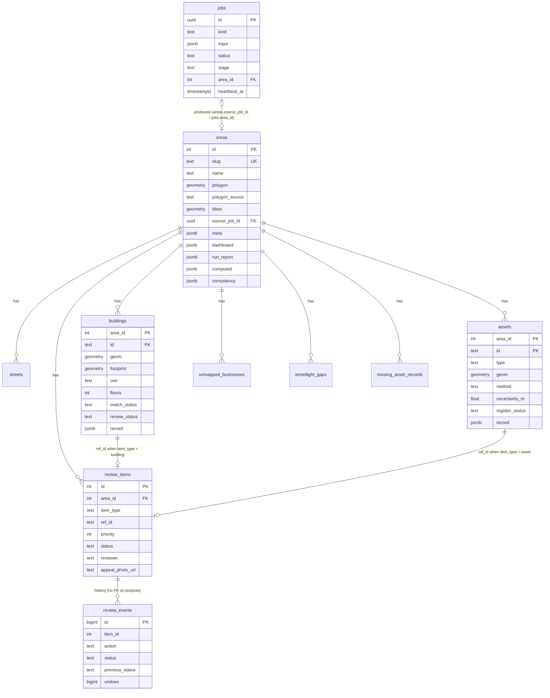
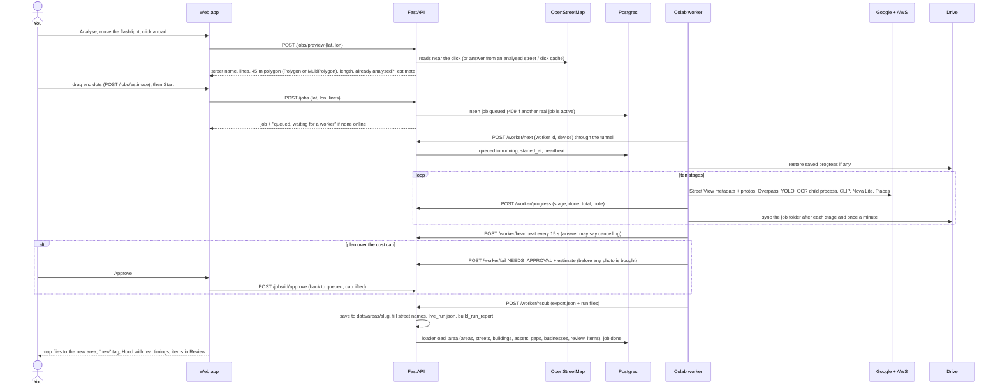
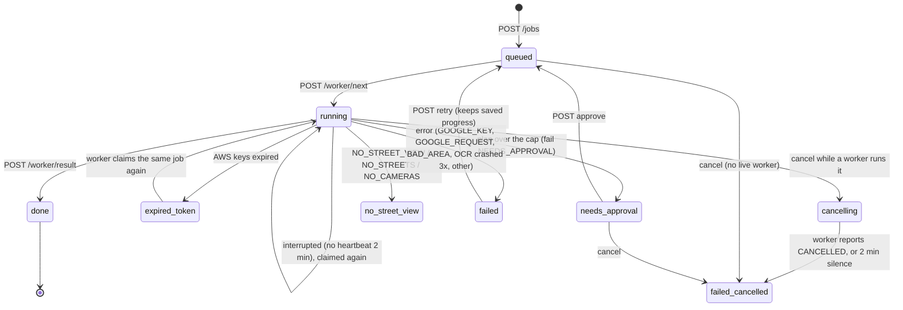

# GEO-CASCADIA explainer · 04 — Backend, database and worker

**What's in this file**
- Every API endpoint and how errors reach the browser ([§11](#11-backend)).
- The database: every table and column, migrations, offline fallback, what is stored where ([§6](#6-the-database)).
- Analysing a new street end to end, the worker and Colab, real-run problems and fixes, costs and performance ([§12](#12-live-analysis-and-the-worker), [§13](#13-costs-and-performance)).

[← 03 App and flows](03_APP_AND_FLOWS.md) · [Start here](00_START_HERE.md) · [05 Explain and defend →](05_EXPLAIN_AND_DEFEND.md)

---

## 11. Backend

FastAPI app `backend/app/main.py` (start: `backend\.venv\Scripts\python -m uvicorn app.main:app --app-dir backend --port 8000`; Swagger at `/docs`). Every JSON answer carries `"offline"`.

### 11.1 Every endpoint

| Method + path | What it does, in plain words | Who calls it |
|---|---|---|
| GET `/health` | is the DB reachable, which settings are present (never values), worker online? | checks, tools |
| GET `/config/public` | the browser Maps key (referrer-restricted) and Map ID, never the server key | web app at start |
| GET `/model-card` | `data/model_card.json` | Trust, cost panel, estimates |
| GET `/areas` | one card per area: name, outline, box, counts, coverage | area switcher, map (city zoom), Jobs |
| GET `/areas/{slug}` | meta, dashboard recomputed from records, run report, summary, stored-vs-computed list, cost block | Explore, Hood |
| DELETE `/areas/{slug}?confirm={slug}` | delete an area made by a job (rows, job, folder); originals → 403 | Jobs |
| GET `/areas/{slug}/geojson?layers=…&bbox=` | map features: buildings (outlines), assets, gaps (display path), businesses, missing records, streets (with stats) | map |
| GET `/areas/{slug}/buildings?street&status&use&q&…&page_size` | building records, filterable | Explore, Review |
| GET `/buildings/{area}/{id}` | one building + its review item | drawer |
| GET `/areas/{slug}/assets?…` | pole/streetlight records | Explore |
| GET `/assets/{area}/{id}` | one asset + review item | drawer |
| GET `/areas/{slug}/unmapped` | businesses with no outline | Explore |
| GET `/areas/{slug}/evidence/{kind}/{id}` | the evidence photos of one object with every detector box and the object's box marked; camera position | drawer, Review |
| GET `/areas/{slug}/drive?street=` | the street's real camera stops in driving order with everything placed along it | Drive the street |
| GET `/areas/{slug}/minimap` | OSM roads around the area (one cached Overpass query) + camera stops | mini-maps |
| GET `/areas/{slug}/hood` | every Under the Hood number with its source | Under the Hood |
| GET `/areas/{slug}/hood/examples?key=` | up to 3 real examples for one story branch | Hood example sheet |
| GET `/trust` | Trust cards and "tried and dropped", each number with its model_card path | Trust |
| GET `/trust/consistency` | stored vs computed rows for all areas | Trust |
| GET `/trust/register` | D42/D43 per area: planted-mistake recovery (caught / missed / false alarms) and register pairing by location, computed from the records and the run's files | Trust › Register tests |
| POST `/query` | a question (text) or edited chips (filters) → chips, rows or groups, why-empty funnel, what was understood | ask bar, palette |
| GET `/review?area&status&item_type&street&priority&reason` | the review queue, most urgent first | Review, rail badge, Explore |
| GET `/review/{id}` | one item | Review |
| PATCH `/review/{id}` (form: action, reviewer, note, photo) | approve / reject / appeal; returns `event_id` | Review, drawer |
| POST `/review/{id}/undo` `{item_id, event_id, reviewer}` | undo exactly one decision | Review, drawer |
| GET `/review/{id}/events` | the item's history | Review › History |
| GET `/review/{id}/events/{event_id}/photo`, GET `/review/{id}/photo` | 10-minute signed URL for an appeal photo | Review › History |
| POST `/jobs/preview` `{lat, lon}` | resolve a click to a street (no job): name, lines, polygon, length, "already analysed in", estimate | Analyse |
| POST `/jobs/estimate` `{length_m}` | estimate for a trimmed stretch | Analyse (dragging end dots) |
| POST `/jobs` `{lat, lon, lines?}` or `{polygon}` | queue an analysis (409 if another real one is active; drawn areas ≤ 1.5 km²) | Analyse |
| GET `/jobs?active=1` | job list + worker status | Jobs, top bar, map |
| GET `/jobs/{id}`, GET `/jobs/{id}/minimap` | one job + its estimate; its mini-map | Jobs, job card |
| POST `/jobs/{id}/cancel` / `approve` / `retry` | cancel (handshake if running); lift the cost cap; re-queue a failed job | job card, Jobs |
| DELETE `/jobs/{id}` | remove a job that ended without a result | Jobs |
| POST `/jobs/clear-test` `{dry_run, ids}` | list, then remove test jobs and their areas | Jobs |
| GET `/worker/status` | connected?, device, current job | top bar |
| POST `/worker/next` 🔑 | claim the oldest claimable job (or a named one) | worker |
| POST `/worker/known` 🔑 | which saved Drive folders are still needed | worker at start |
| POST `/worker/heartbeat` 🔑 | "I'm alive"; answers "cancelling" to stop | worker every 15 s |
| POST `/worker/progress` 🔑 | stage, done, total, note | worker |
| POST `/worker/fail` 🔑 | end or pause a job with a code | worker |
| POST `/worker/result` 🔑 | upload `export.json` + run files → saved, report built, loaded | worker |

🔑 = needs the `X-Worker-Token` header (compared in constant time; missing or wrong → 401; not configured → 503).

P8 endpoints: `GET /areas/{slug}/imagery` (capture-month range and per-object `{date, newest, outdated}`, `backend/app/imagery.py`);
`GET /areas/{slug}/hood` adds `routing` (`backend/app/routing.py`: per-route counts, tokens × the pipeline's Nova Lite prices,
median `lat_s`, with status measured / derived / estimate / not recorded) and `imagery`; `GET /buildings/{area}/{id}` adds
`front_wall` (`backend/app/frontwall.py`, the pipeline's `buildloc.road_facing_edge` + `front_wall_length`). Since D51
`export.json` `footprint.frontage_m` is that frontage and the old value is `footprint.longest_side_m` (`tools/frontage_fix.py`); evidence
views carry `date`. `tools/review_route.py <slug>` writes the waiting review items as an ordered walking route
(`data/exports/review_route_<slug>.csv / .geojson`; nearest neighbour + 2-opt, straight lines).

### 11.2 How errors reach the browser
- **Offline:** writes → **503** `{"detail": "offline data mode — read only", "offline": true}`; the UI says "Offline — read-only. Nothing was saved."
- **Validation:** 422 with a plain message ("an appeal needs a note", "a reviewer name is needed", "give {lat, lon} or {polygon}").
- **State conflicts:** 409 ("“Sanganur Road” is still being analysed. One street at a time…", "this decision was already undone…").
- **Storage:** 502 with a plain message; photo type 415, size 413.
- **OpenStreetMap busy** on preview: 503 "OpenStreetMap is busy — try again". The browser gives up at 18 s.
- **A server bug (D40):**
  - Before D40, Starlette answered an unhandled error *outside* the CORS layer. The browser saw no CORS header, `fetch` failed, and the app wrongly said "The API is not reachable".
  - Now the innermost middleware `ServerErrorsAsJson` returns `{"detail": "server error (<ErrorClass>)", "server_error": true}` **with** CORS headers. Only the error class is sent, because a message can hold a URL with a key; the traceback goes to the API console.
  - Analyse then reads "Couldn't prepare this street — server error". "The API is not reachable" is kept for a real connection failure.
- **Logs:** every fallback logs one secret-free line, e.g. "database unavailable - OperationalError on a reused idle connection: the server closed the connection (Supabase pooler idle timeout) - serving the offline JSON copy (read-only) for 30 s".

---

## 6. The database

### 6.1 Why Supabase + PostGIS
- **Free, hosted Postgres** with the **PostGIS** extension: points, lines and polygons in real coordinates (EPSG:4326), with spatial indexes (GiST) for "what is inside this box" questions (`GET /areas/{slug}/geojson?bbox=`).
- It comes with **Storage** (the private `appeal-photos` bucket) under the same account.
- Nothing heavy runs on the 8 GB laptop: no Docker, no local database (CLAUDE.md §2).
- PostGIS lives in the `extensions` schema, so every connection sets `search_path = public, extensions`. Connections use the **session pooler** (IPv4) (D6).
- Every connection sets `extra_float_digits = 3` so coordinates come back exactly as in the JSON files (D11).
- **Row-level security** is on for every table with **no policies**. The backend connects as the table owner and bypasses it; Supabase's public "anon" key is blocked (D10).

### 6.2 Entity diagram



### 6.3 Every table, every column

**`areas`**: one row per analysed area. Written by the loader. Read by every page.

| Column | Type | Meaning | Example (Ward 29) |
|---|---|---|---|
| id | serial PK | internal id | — |
| slug | text, unique | URL name of the area | `ward29` |
| name | text | name from the export (shown without "(v2)", D36) | "Ward 29, Coimbatore (v2)" |
| polygon | geometry(MultiPolygon, 4326) | outline of the area | the study area |
| polygon_source | text | how the outline was made | `study_area` (Ward 29), `streets_buffer_40m` (every other area) |
| bbox | geometry(Polygon) | box around polygon + every object | — |
| created_at / updated_at | timestamptz | load times | — |
| source_job_id | uuid → jobs | the job that made it (null for the 3 originals) | null |
| meta | jsonb | export `meta` (pipeline versions, counts, run stats) | `{"area": …, "run": {…}}` |
| dashboard | jsonb | stored dashboard (the API recomputes it from records) | — |
| run_report | jsonb | `run_report.json` | — |
| computed | jsonb | counts computed from the records (D2) | `{"assets_triangulated": 20, …}` |
| consistency | jsonb | stored-vs-computed mismatches (Trust) | `[{"field": "meta.run.buildings_use_local", "stored": 193, "computed": 163}]` |

**`buildings`**: one row per registered building. Primary key (area_id, id).

| Column | Type | Meaning | Example |
|---|---|---|---|
| area_id | int → areas (cascade) | area | Ward 29's id |
| id | text | OSM way (`w…`), relation part (`r…_k`) or Microsoft (`ms_lat_lon`) | `w1252504945` |
| street | text | display street name | "8th Street, Ganapathy" |
| geom | Point | **footprint centroid** (not the Gate 1 position) | 11.03… , 76.97… |
| footprint | Polygon | the OSM outline | — |
| use | text | observed use; **null = not known** (D9) | `commercial` |
| use_route | text | who decided it: `tier1_local_clip`, `tier3_vlm`, `sign_text` | `sign_text` |
| floors / floors_status | int / text | floors seen; `measured`, `low_confidence`, `not_measured` | null / `not_measured` |
| name / name_quality / name_route | text | sign name; `good`, `fragment`, `tamil_unverified`; `tier2_ocr`, `tier3_vlm+ocr_gate`, `tier3_vlm_unverified` | "savitha dry cleaner" / good / tier3_vlm+ocr_gate |
| google_confirmed | bool | the name was found on Google within 40 m | true |
| match_status / severity | text | `matched`, `discrepancy`, `no_record`; `none`, `medium`, `high` | discrepancy / medium |
| discrepancies / reasons | text[] | the kinds and the pipeline's sentences | `{use_change}` / `{"record says house, imagery shows commercial"}` |
| google_flags | text[] | Google cross-check flags | `{}` |
| attrs / register / evidence | jsonb | attributes, the paired register record (incl. `match_confidence`, `match_margin_m`, D43), evidence views | `register.property_id = P-0005`, `match_confidence = high` |
| review_status | text | mirrors the review item (null = not in the queue) | `pending` |
| record | jsonb | the **full export record**, incl. `predicted_position` | — |
| ord | int | position in export.json (same order online and offline) | — |

**`assets`**: poles and streetlights. PK (area_id, id).

| Column | Meaning | Example |
|---|---|---|
| id | `asset-NNNN` | `asset-0160` |
| type | `pole` or `streetlight` | pole |
| street, geom | display street; position | 8th Street, Ganapathy |
| confidence | `high` (≥ 2 cameras), `medium` (≥ 2 detections, 1 camera), `low` (1 detection) | medium |
| method | `triangulated` or `rough_mean` (approximate) | rough_mean |
| cameras_used | camera positions used | 1 |
| uncertainty_m | triangulation residual (≥ 0.5 m), or for one camera ±2.4 m within 8 m / ±5 m beyond (D45, `config.single_cam_unc_bands`; `record.camera_distance_m` holds the distance) | 2.4 |
| register_status / flags | `matched`, `discrepancy`, `unrecorded_asset`, `unconfirmed_detection`; `location_shift`, `type_mismatch` | unrecorded_asset |
| evidence, review_status, record, ord | as for buildings | — |

**`unmapped_businesses`**: read shop signs on no analysed building (no outline, or an outline outside the analysed ones, D44; `record.on_outline` names that outline). Columns: id (`ub-0000`), name, ocr_text, street, geom (approximate, 12 m along the camera ray), sightings, evidence, record, ord. Example (Tiruppur): `ub-0002` "mkm motors", OCR "MOTORS", seen 6 times.

**`streetlight_gaps`**: dark stretches. Columns: id (`gap60-001`), street, geom (the recorded straight segment), length_m (recorded), interval_m (60), poles_inside, gap_type ("poles present, no lamp detected" / "no pole or lamp detected"), record, **display** (jsonb: `along_road`, `check` or `straight`, with the path to draw, D13), ord. Example: `gap60-001`, Sathy Main Road, 376 m recorded (≈ 424 m along the road), 22 poles inside.

**`missing_asset_records`**: register entries with nothing detected within 25 m. Columns: asset_no (`EB-G01`), street, geom, why, ord. Ward 29: 9.

**`streets`**: the analysed street lines. Columns: name (display), osm_name (raw OSM label, e.g. "(unnamed residential #907980850)"), geom (MultiLineString), length_m, road_type, kind (commercial/residential), panos, coverage, way_ids (bigint[]), ord. PK (area_id, name).

**`review_items`**: the review queue.

| Column | Meaning | Example |
|---|---|---|
| id | serial PK (the number in `/review/{id}`) | 193 |
| area_id, item_type, ref_id | which object (`building` + `w…` or `asset` + `asset-…`); unique per area | building, `w1252504945` |
| street, geom | where | — |
| priority | 1 (most urgent) … 6 | 2 |
| reasons / discrepancies | pipeline reason strings; difference kinds | `{"attribute discrepancy — verify on imagery"}` |
| status | `pending`, `approved`, `rejected`, `appealed` | pending |
| reviewer / note | who decided; appeal note | "PRAGA" |
| appeal_photo_url | the **storage path** (not a URL) of the appeal photo | `ward29/review-193-<10 hex>.jpg` |
| updated_at, ord | — | — |

**`review_events`**: append-only history (migration 004).

| Column | Meaning |
|---|---|
| id (bigserial) | event id (the `event_id` Undo needs) |
| item_id, area_id, ref_id | which item (no foreign keys: history outlives items and areas) |
| action | `approve`, `reject`, `appeal`, `undo` |
| status / previous_status | status after / before |
| previous_reviewer / previous_note / previous_photo | what an undo restores |
| reviewer / note | who and why |
| undoes | for an undo: the event it reverted |
| photo | the photo uploaded with this decision (migration 005) |
| created_at | when |

A trigger `review_events_no_change` refuses every UPDATE and DELETE.

**`jobs`**: analysis requests ([§12](#12-live-analysis-and-the-worker)).

| Column | Meaning | Example |
|---|---|---|
| id | uuid | `f17937b8-…` |
| kind | `street_click` or `polygon` | street_click |
| input | the click, resolved street, OSM way ids, job polygon (Polygon or MultiPolygon), trimmed lines, length, output slug | `{"street": "Vadakku Masi Veethi", "slug": "vadakku_masi_veethi_f17937", …}` |
| status | `queued`, `running`, `done`, `failed`, `expired_token`, `no_street_view`, `needs_approval` | done |
| stage / done / total / message / note | progress and texts for people | `ocr`, 120, 654 |
| area_id | the area it produced | — |
| created_at / started_at / finished_at / heartbeat_at | times | — |
| worker_id / device | which worker, `gpu` or `cpu` | gpu |
| is_test | made by a test or the fake worker | false |
| approved / estimate | cost cap lifted by a person; the plan-time estimate | — |
| cancel_requested | a cancel handshake is in progress | false |

**`schema_migrations`**: name + applied_at (written by `backend/migrate.py`).

**Indexes:** GiST on every geometry column; `buildings (area_id, street, match_status, use)`; `assets (area_id, street, type, register_status)`; `review_items (area_id, status, priority)`; `jobs (status, created_at)`; `review_events (item_id, id desc)`.

### 6.4 Who writes, who reads

| Table | Written by | Read by |
|---|---|---|
| areas, streets, buildings, assets, unmapped_businesses, streetlight_gaps, missing_asset_records | `backend/load_area.py` / `loader.load_area` (idempotent upsert; also called by `/worker/result`) | `DbStore` → every page |
| review_items | loader (membership, priority, reasons; **never overwrites a decision**) + `PATCH /review/{id}`, `POST /review/{id}/undo` | Review, Explore (drawer, rail badge, KPI) |
| review_events | the same SQL statement as each decision or undo | Review › History, `GET /review/{id}/events` |
| buildings/assets.review_status | the same SQL statement + loader | map "Review" layer, findings table |
| jobs | `POST /jobs`, cancel/approve/retry/delete, `/worker/*` | Jobs page, job card, top bar |

### 6.5 How Undo works in the database
- A decision runs **one** SQL statement (`review.DECIDE_SQL`): it locks the item, updates it, inserts the event with the previous values, updates the building's or asset's `review_status`, and returns the new version.
- Undo (`UNDO_SQL`) only accepts an event that belongs to that item, is a decision (not an undo), is not undone already, and has **no later live decision** on the same item. It writes back `previous_status/reviewer/note/photo` and logs an `undo` event with `undoes = <event id>`. Otherwise the API returns 409 (or 422 when the ids don't match).
- So undo steps back one decision at a time, newest first, and nothing else is touched (D24).

### 6.6 Migrations, and why each exists

| File | Date applied | Why |
|---|---|---|
| `001_init.sql` | 25 Sep | All tables, GiST indexes, RLS (CLAUDE.md §6 + D10) |
| `002_order.sql` | 25 Sep | `ord` columns so DB and JSON return rows in the same order; `real` → `double precision` so 0.97 stays 0.97 |
| `003_street_names_gap_display.sql` | 25 Sep | `streets.osm_name` and `streetlight_gaps.display` (D13) |
| `004_review_events.sql` | 26 Sep | Append-only history + trigger (D24), after decisions were lost |
| `005_p5_review_jobs.sql` | 26 Sep | `review_events.photo`; `jobs.is_test` (D29) |
| `006_p6_worker.sql` | 27 Sep | `needs_approval` status; `jobs.approved/estimate/device` (D34) |
| `007_p6_cancel_note.sql` | 27 Sep | `jobs.cancel_requested/note` (D35) |

### 6.7 What is in the database today (read-only check, 30 Sep)
- 6 areas: the 3 originals plus 3 live runs (Sanganur Road, Unnamed road off 4th Street, Vadakku Masi Veethi).
- After the P7a reload (1 Oct): 574 buildings, 454 assets, 70 businesses with no analysed building, 25 dark stretches, 15 missing asset records, 15 streets, 367 review items, 3 jobs (all done, GPU).
- Every review item is `pending`. Of the 1,038 history rows, 2 are by "PRAGA" and the rest by automated tests on throw-away areas (reviewer `test`). The one-time reset of 27 Sep (D30) removed all earlier history.

### 6.8 The offline JSON fallback (D4, D11)
- The API builds the same **area bundle** from either store:
  - `DbStore`: records from the `record` columns plus live review state;
  - `JsonStore`: `data/areas/<slug>/export.json` + `run_report.json` + `streets.json` + `street_names.json` + `plan.json`.
- `Data.read()` tries the database. On failure it serves JSON for 30 s, then tries again. A failure on a reused idle connection (the Supabase pooler closes idle ones) is retried once, quietly (D23).
- Every JSON response carries `"offline": true|false`. The UI shows "Offline — read-only".
- **Writes never fall back:** decisions, jobs and worker calls return **503 "offline data mode — read only"**.
- **Offline differences:** review items have no ids (so no decisions), the jobs list is empty, and review statuses are the export's (all pending). pytest compares all three original areas in both modes (`test_offline.py`).

### 6.9 What is stored where

| Place | What | Example |
|---|---|---|
| **Supabase Postgres** | the findings (one row per object, with the full record), review queue, review history, jobs | `buildings.record` for `w1252504945` |
| **Supabase Storage** | appeal photos, private, read by 10-minute signed URLs | `ward29/review-<id>-<hex>.jpg` |
| **`data/areas/<slug>/`** | every run file (P7a adds `sign_links.json`, `planted_register_mistakes.json`, `register_synthetic.json`; an imported register adds `register_imported.json`): `export.json`, `export.geojson`, `run_report.json`, `panos.json`, `plan.json`, `plan_anomalies.json`, `_views_done.json`, `detections.json`, `ocr.json`, `building_views.json`, `building_positions.json`, `buildings.json`, `assets.json`, `final_attributes.json`, `vlm_names.json`, `vlm_buildings.json`, `vlm_unmapped.json`, `places_cache.json`, `street_names.json`, `streets.json`, `coverage.json`, `dashboard.json`, `unmapped_businesses.json`; Gate 1 files (`gate1_eval.json`, `gate1_places.json`, `rule_variants.json`); for live runs `live_run.json` and `worker_run.json` | Ward 29 `detections.json` is 2.5 MB |
| `data/model_card.json` | measured accuracy, benchmarks, costs, Gate 1 tables | `floors.ward29.exact = 0.61` |
| `data/study_area/Study_area.geojson` | Ward 29 outline | — |
| `data/cache/` | Overpass answers (`overpass_cache/`, `p45_overpass/`), Microsoft tiles (`ms_cache/`), picker answers (`streetpick/overpass`, `picks2/`, `google_route/`), the pre-P7a files (`p7a_before/<slug>/`) | — |
| `data/registers/` | imported real registers, normalised (`tools/import_register.py`) | — |
| **Google Drive** (worker account) | the pipeline package, weights, floor examples, router; per-job progress `MyDrive/gc_worker_jobs/<job id>/` while a job is unfinished | `training_runs/v8s_640_s2/weights/best.pt` |
| **Colab session** | the working folder `gc_jobs/<slug>`, sign crops, building crops; keys in memory only. `forget()` deletes the folder (and its Drive copy) once the result is delivered, prints "deleted N Street View photo crops (X MB)" and checks none is left (P8). Kept only for a retryable failure or expired keys (Retry / resume reuse them) | — |
| **Browser `localStorage`** | preferences: area, Night/Daylight, 3D switch, layer toggles, minimap, reviewer name (keys `gc.*`) | reviewer "PRAGA" |
| **Browser `sessionStorage`** | small session state (e.g. the lights-on intro) | — |
| **API process memory** | which workers were seen in the last 45 s; cached area bundles | — |
| **Nowhere** | Street View photos (fetched live by the browser, never stored or re-hosted); Places coordinates | — |

---

## 12. Live analysis and the worker

### 12.1 Setup (worker/README.md)
- **Laptop (every session), three terminals:**
  1. API on :8000;
  2. web on :5173;
  3. `cloudflared tunnel --url http://127.0.0.1:8000` (not `localhost`: Windows may resolve it to IPv6, P7 R3). It prints a new `https://….trycloudflare.com` each time.
- **Colab (T4 GPU):**
  - **S0** installs the pipeline package from the newest zip in `/MyDrive/alldataset` (it deletes `geo_cascadia_pkg/` there
    first, then extracts). The zip's entries must be `geo_cascadia_pkg/geo_cascadia/<file>.py`. Build it with
    `backend\.venv\Scripts\python tools\build_pkg_zip.py` (writes `geo_cascadia_pkg_p7b.zip` at the repo root: every `.py` of
    `pipeline/geo_cascadia`, no `__pycache__`, entry names checked), then upload it to `/MyDrive/alldataset`. The worker
    refuses an older package copy.
  - **S1a** installs dependencies, with these fixes:
    ```
    !pip install -q "transformers==4.57.6"
    !pip uninstall -y tensorflow tf-keras tensorflow-hub
    %env USE_TF=0
    %env TRANSFORMERS_NO_TF=1
    ```
    Then Runtime → Restart session and run S0/S1a/S1b again.
  - **S1ba** puts the keys in the environment (Colab secrets: fresh AWS SSO keys, the Google server key) and **S1bb** builds `cfg` and imports `run_area`. `worker/colab_setup_cells.md` describes every cell (S0, S1a, S1ba, S1bb, worker cell); the exact text of S0 / S1a / S1ba / S1bb is not in the repository yet and is marked "PASTE CELL HERE" there.
  - **Worker cell:** paste all of `worker/colab_worker.py`. It asks (hidden input): pipeline + weights (Enter = from the setup cells, or a shared Drive link), AWS keys, Google server key (Enter keeps the setup cells' key), backend URL (the tunnel), worker token. It never prints or stores them. Pasted values lose spaces and quotes (D37).
  - At start: prints the transformers version (warns if not 4.57.6); warns if TensorFlow is installed; a `[mem]` line; the optional **OCR self-test** (loads the reader in a child process, reads a drawn "HOTEL", frees memory); a free Street View metadata call to test the key (D39, D40).
- **Kaggle:** same cell; pipeline from the Drive link; it offers to install packages.
- **Laptop CPU:** a separate Python env; sign reading in **fast** mode; backend URL can be `http://localhost:8000`.
- **Keys (owner, D41):**
  - **One Google server key.** Its API restrictions allow **Street View Static API + Places API (New)**, plus **Geocoding API** if enabled. Its application restriction is **None**.
  - The same key is used in three places: `backend/.env` as `GOOGLE_PLACES_SERVER_KEY` (street picker names, Gate 1 tools), the Colab secret `GOOGLE_MAPS_KEY` (setup cells, read by the pipeline's `Config`), and the worker cell (press Enter to keep the setup cells' key).
  - The **browser key** is only for the map (referrer-restricted to `http://localhost:5173/*`, served by `GET /config/public`) and is never given to the worker. A browser key in the worker gives Places 403 "Requests from referer <empty> are blocked" (D39).
  - The D40 "no Street View" incident was this server key being refused (REQUEST_DENIED). It worked after the Street View Static API was added to its allowed APIs.
  - If Geocoding is not enabled, unnamed roads keep the "Unnamed road between / off / near" rule names and the pipeline's street naming cannot call Google.
  - AWS keys stay in Colab.
  - The worker token is any long random string, in `backend/.env` and typed into the cell.
- **Shared Drive folder:** `geo_cascadia/` (the package), `training_runs/v8s_640_s2/weights/best.pt`, `crops_building_v1/w1236978105.jpg` and `w1247744938.jpg` (the floor examples), `models/use_router.joblib` (optional: without it every building goes to the cloud).

### 12.2 Analyse a new street, end to end



**Step by step:**
1. **Pick the street.** Analyse mode shows Google's blue coverage lines in a 150 px circle around the pointer. Click a road.
2. **Preview** (`POST /jobs/preview`, `backend/app/streetpick.py`, a port of the pipeline's picker):
   - a click within 15 m of an already analysed street answers from that area's `streets.json` (no Overpass);
   - otherwise the disk cache (`data/cache/streetpick/picks2/`) or Overpass: two mirrors, 6.5 s per call, 14 s in total. The browser shows elapsed seconds and gives up at 18 s;
   - if Overpass is busy, the nearest analysed street within 60 m is offered with a note;
   - OSM pieces with the same name are merged into the street; the job polygon is the street buffered by **45 m**;
   - **Gaps (D40):** a street whose pieces are more than 90 m apart becomes a **MultiPolygon** (before the fix, `/jobs/preview` crashed with "'MultiPolygon' object has no attribute 'exterior'");
   - **Naming (D36):** OSM name; else "Unnamed road between A and B" / "off A" / "near A" from real roads at its ends (Google's name for an unnamed end road via Geocoding, if the key allows it); never invented;
   - "Already analysed in <area>" when OSM way ids are shared or ≥ 30% lies within 15 m of an analysed street;
   - the **estimate** ([§13](#13-costs-and-performance)).
3. **Confirm sheet:** the exact street drawn as a white line with orange end dots (the flashlight turns off). Drag the dots or use arrow keys (±10 m, Shift ±50 m) to trim; the estimate updates. Minimum 20 m; the stretch must lie on the street (≤ 8 m).
4. **Start** → `POST /jobs`: one real street at a time; the job row is inserted `queued`. With no worker: "Queued, waiting for a worker", with a still dashed line on the map.
5. **Worker claims** (`POST /worker/next`): the oldest queued job, a job waiting for fresh AWS keys, or a running job whose worker has been silent 2 minutes ("interrupted"). Never a test job without its id. `resumed_claim` says whether an earlier attempt started it.
6. **Progress:** 10 stages, "Stage 3 of 10 · Planning camera stops". On the map the street sweeps with overall progress. The top bar shows "3/10".
   - The stages: Finding Street View, Reading the map, Planning camera stops, Looking at photos, Placing objects, Reading signs, Cloud model, Google check, Register check, Saving results.
7. **Cost cap** (`plan_check`, before any photo is bought): photos = planned views + one building crop per faced outline; cost = photos × $0.007 + buildings × ($0.056 / 381). Over **300 photos or $1.00** → **Needs approval** with the estimate. Approve → queued with the cap lifted.
8. **Drive progress:** after every stage (and once a minute) the job folder is copied to `MyDrive/gc_worker_jobs/<job id>/`. A new session on the same account continues from it ("Continuing from the progress saved on Drive"). Another account starts again and says so.
9. **Heartbeat** every 15 s. A cancel sets **cancelling**: the heartbeat thread interrupts the running step, the worker deletes the job's files and reports CANCELLED (about 4 s with the fake worker). A silent worker's cancel completes after 2 min.
10. **Result** (`POST /worker/result`):
    - files are checked (names, ≤ 40 MB, valid JSON, `export.json` shape);
    - they are written to a temporary folder;
    - `fill_street_names` gives any unnamed street a plain name;
    - `live_run.json` is added (device, start, upload time, resumed?, attempts, OCR mode);
    - `build_run_report.py` runs; the folder is swapped in;
    - **`loader.load_area`** writes every table exactly like the originals;
    - the job becomes `done` with its `area_id`.
11. **In the app:** the job card turns Done and the map flies to the new area. The area appears in the dropdown with "new", Under the Hood shows its real timings and costs **without** the "resumed run" badge, its review items join Review, and Jobs shows **Open** and **Delete this analysed area…**.

### 12.3 The job lifecycle



- `cancelling` and `interrupted` are **display statuses** (running + a flag); "cancelled" is stored as `failed` + message "cancelled by user" and shown grey.
- Retry is allowed only for a real error: not cancelled, not "no Street View", no area.

### 12.4 The real runs

**Fresh full Ward 29 run (owner, D41):** 28 Sep 2026, run directly in Colab (not through the job queue), T4 GPU, router on: **11.5 min, 1,420 Street View images (≈ $9.94), cloud AI $0.0887**. The app still shows the original (resumed) Ward 29 files; this run's files are not in the repository.

**The three live runs from the app:**

| Street (area slug) | Where | Length | Attempts | Job time (claim → upload) | Pipeline time | Photos / cost | Cloud AI | Buildings / assets / review |
|---|---|---|---|---|---|---|---|---|
| Sanganur Road (`sanganur_road_086d14`) | Coimbatore | 392 m | 6, resumed | 8.7 min | 1.1 min (resumed) | not counted (resumed) | not counted | 52 / 33 / 32 |
| Unnamed road off 4th Street (`unnamed_road_off_4th_street_5772fa`) | Coimbatore | 232 m | 2, resumed | 3.6 min | 0.7 min (resumed) | not counted | not counted | 25 / 16 / 19 |
| **Vadakku Masi Veethi** (`vadakku_masi_veethi_f17937`) | Madurai | 383 m | 2, **not resumed** | **6.2 min** | **4.0 min** (OCR 118 s, cloud 74.5 s) | **162 photos, $1.13** | **123 calls, $0.0134** | 49 (48 Microsoft outlines) / 30 / 35 |

### 12.5 Every problem hit during real runs, and the fix

| Problem | Symptom | Cause | Fix | Decision |
|---|---|---|---|---|
| transformers 5.x | stopped at the use router: `'BaseModelOutputWithPooling' object has no attribute 'norm'` | CLIP functions return an object from 5.x | `localuse.feature_tensor` accepts both; S1a pins **4.57.6**; worker warns | D37 |
| OCR crash | whole Colab session restarted while loading Paddle models | likely RAM, or Paddle and torch/CUDA in one process (not proven) | OCR in its **own process**; YOLO freed first; retry once, then CPU quick mode; self-test; `[mem]` lines; `ocr.json` saved every 25 crops | D38 |
| TensorFlow | Paddle segfault, even on CPU | transformers 4.x imports TensorFlow when installed (Colab has it) | uninstall TF, `USE_TF=0`, `TRANSFORMERS_NO_TF=1`; worker warns with the exact fix | D39 |
| Browser key in the worker | Places 403 "Requests from referer <empty> are blocked" | website-restricted key used server-side | start-up key test; ask again; plain sentence on the job card; Retry | D39 |
| Overpass outages | area stage fails | public OSM server busy | worker retries after 30, 60, 120 s ("Map server busy (OpenStreetMap), retrying…"), then fails retryable | D39 |
| Streets with gaps | `/jobs/preview` 500 | 45 m buffer of distant pieces is a MultiPolygon | keep every piece; the pipeline already accepts MultiPolygon | D40 |
| "API not reachable" for a 500 | misleading message | 500 without CORS headers | `ServerErrorsAsJson` | D40 |
| **Refused Street View key** | "no outdoor imagery" on 4 jobs (28 Sep) | server key not allowed the Street View Static API → REQUEST_DENIED; the pipeline treated it as "no panorama" | `StreetViewTrace` counts every answer; only real "ZERO_RESULTS" = No Street View; refused → failed + retryable with Google's message; keys scrubbed from messages; empty `panos.json` dropped so Retry searches again | D40 |
| Retry bought photos again | — | the worker deleted a failed job's files | keep files; `/worker/known` prunes only finished jobs | D37 |
| Resume note said "started again" while continuing | wrong card note | two different checks | one value `continuing` (any stage file) | D37 |
| Tests claimed a real job | Sanganur Road job lost its start time | tests called `/worker/next` without an id | tests claim only their own jobs | D38 |
| Fake worker "480 photos / $3.41" | wrong estimate | a constant | computed from the replayed plan (Tiruppur 78 photos, $0.55) | D35 |

### 12.6 Testing without Colab
`worker/fake_worker.py` claims a job as a **test** job and replays a saved area with fake progress (Tiruppur in about 40 s). `--simulate needs-approval | expired | no-street-view | die`. The area is named "<street> (test)" and Hood says it is a replay. "Clear test jobs" removes it.

**Street View imagery on disk (P8 inventory, 2 Oct 2026).** Google's terms allow no stored copies outside its APIs.
| Where | Images | Size | What |
|---|---|---|---|
| `data/` (areas, cache, model card) | **0** | — | only derived JSON (boxes, text, positions, capture months); `data/cache/` is Overpass / picker / planner JSON |
| Colab `gc_jobs/<slug>/crops_signboard`, `crops_building` | per running job (Ward 29: 2,065 sign + 266 building crops) | — | deleted after delivery (`forget`); full photos stay in memory (`detect.py`) |
| Drive `MyDrive/gc_worker_jobs/<job id>/` | per unfinished / failed job | — | deleted on delivery, cancel, or at worker start when the job can't continue (`prune_drive`) |
| Drive `MyDrive/alldataset` (notebook era) | not visible from the laptop | ? | the owner checks: notebook-era crops / views, the floor-example photos (`floors_shots`) |
| `docs/screenshots/` (git-ignored, laptop only) | 92 PNG (+26 P8) | 41 MB (+P8) | app screenshots; those of the evidence drawer, Review, Drive and the tour's building step show Street View photos |
| Repository / git history | 0 | — | screenshots and caches are git-ignored |

---

## 13. Costs and performance

### 13.1 Cost (prices from model_card)

| Item | Price / amount | Source |
|---|---|---|
| Street View photo | $0.007 each | model_card |
| **Ward 29 full run (the real one)** | **11.5 min on a T4 · 1,420 photos ≈ $9.94 · cloud AI $0.0887** | owner's fresh run, 28 Sep 2026, router on (D41) |
| Ward 29 cloud AI, with / without the local router | model_card $0.056 (339 calls) / $0.089 (782); **like for like $0.0702 (589) / $0.0889 (782)** | model_card; recount `backend/app/routing.py` (D50) |
| Ward 29 cloud model on every photo | ≈ $0.112 (1,154 × $0.000097, ~7.5 min of calls) — an estimate | `routing.py` `every_view` |
| Ward 29 names: routed vs cloud on every photo | $0.0079 vs $0.105 | model_card |
| Ward 29 photos as Under the Hood counts them (since P7.2) | 1,154 views + 266 building photos = 1,420 × $0.007 ≈ $9.94, captioned "at Google's list price — Google's free monthly allowance may cover it" (P7 R3) | computed from the run files |
| Ward 29 photos, full run incl. building crops | 1,154 + 266 = 1,420: the run files agree with the owner's count | computed |
| **Ward 29 all-in, full run** | **≈ $10.03** (photos $9.94 + cloud AI $0.0887; Places not priced) | computed from the above |
| Vadakku Masi Veethi (383 m, live) | 162 photos $1.13; cloud $0.0134; 35 Google look-ups (price not in model card) | run counters |
| Imagery vs inference (notebook) | 385 building photos ≈ $2.69 vs about $0.03 of inference: **imagery costs ~100× the model** | history chat 2 |

- The Google Cloud project had **no billing account** in the notebook era, so dollar figures there are notional list prices (history chat 1).
- Places look-ups are capped at 300 per day per worker machine (`PLACES_PER_DAY`).

### 13.2 Speed

| Step | GPU | CPU | Source |
|---|---|---|---|
| Detector per photo | 17 ms | 320 ms | model_card |
| OCR per crop | full mode on GPU | full 6.30 s, fast 0.34 s | model_card |
| Minutes per average Ward 29 street (483 m) on CPU | — | 18 (full OCR), 3–5 (fast) | model_card |
| Vadakku Masi Veethi stage times (GPU) | panoramas 0.0 s (reported), area 0.9, plan 1.5, detect 10.8, geometry 8.0, **OCR 118.1**, **cloud 74.5**, Google 11.4, match 7.2 s | — | run file |

### 13.3 How the estimate is made (P7.2, P7 R2)
- **From the real camera plan.** Clicking a street starts the pipeline's own first three stages in the background on the
  laptop (Street View search, map outlines and streets, camera plan) with the pipeline's default settings. No photo is
  bought: Street View metadata look-ups are free (D46). The result is cached on disk per street, so the warm-up tool
  (`tools/warm_osm_cache.py`) can fill it the day before a demo.
- **Photos** = planned views + one building photo per building faced (the worker's cost-cap rule; an upper bound).
- **Cost** = photos × $0.007 (model card) + photos × the measured cloud-AI cost per photo of completed live jobs.
  Google business look-ups are counted, not priced.
- **GPU minutes** = start-up + photos × 0.49 s. The per-photo rate is the Ward 29 full run (11.5 min / 1,420 photos);
  the start-up (3.8 min) is the median of the completed live GPU jobs' time minus their photos at that rate (D47).
  Two measured inputs, one formula; not fitted.

| Street | Estimate | Real |
|---|---|---|
| Ward 29 (study area, 10 streets) | 1,505 photos · 16.0 min | 1,420 photos · 11.5 min (a pipeline run without job start-up) |
| Kattabomman Street Extention | 35 photos · 4.1 min | 33 photos · 3.1 min |
| Vadakku Masi Veethi | 167 photos · 5.2 min | 162 photos · 6.1 min |

- Photos come out a few per cent high (the building-photo count is an upper bound); time is within about ±1 min on
  short streets and high on a large area, where the fixed start-up counts once, not per street.
- **If Google can't be reached** while planning, the estimate fails with a plain message and is not cached (P7 R3:
  before this, a network failure could be cached as "no Street View, 0 photos"). With no Google server key the sheet
  says so; Start still works and the cost cap protects you.

### 13.4 Memory (D3, D21; production build, JS heap after GC)
- Target ≤ 60 MB in normal use.
- **Re-measured 1 Oct (P7 R3, after P6 and P7; `web/scripts/heap.ts`, Chrome DevTools Protocol, 2 runs):**
  Ward 29 loaded and idle 21.6 / 25.4 MB; the guided tour's building step (evidence at object zoom) 44.5 / 45.3 MB;
  after the whole tour (every page visited, back on the map) 45.6 / 46.3 MB.
- **What holds it** (sampling heap profiler, live objects after GC): at street / object zoom about two-thirds is Google
  Maps JS (its vector-tile data), 8–9% deck.gl, 2–4% React, the rest our own code and the UI kit; at area level Google
  Maps is 34–45%.
- Earlier (D21): evidence view 56.3–63.1 MB (60–63 accepted), Night ↔ Daylight while zoomed in 63.8–73.5 MB (accepted;
  the switch first flies out to area zoom). Device-pixel ratio capped at 1.5; the 2D switch saves memory.

---

[← 03 App and flows](03_APP_AND_FLOWS.md) · [Start here](00_START_HERE.md) · [05 Explain and defend →](05_EXPLAIN_AND_DEFEND.md)
